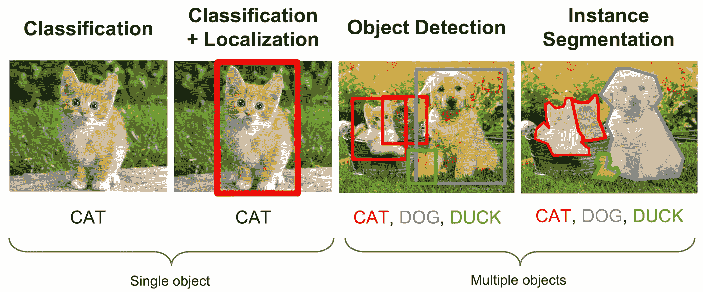

# 用于图像分割的深度学习

> 原文：<https://medium.datadriveninvestor.com/deep-learning-for-image-segmentation-d10d19131113?source=collection_archive---------2----------------------->

在本文中，我想谈谈计算机视觉和图像处理中一个重要而有趣的概念，即*。*

*我们中的大多数人对计算机视觉问题有一定程度的了解，能够理解两大类问题。*

1.  ***图像分类***
2.  ***图像检测***

*触及这些主题的外围——图像分类是一类问题，其中我们关注场景中图像的存在，然后是图像检测和定位，确定给定对象所在的区域，并在它们周围绘制边界框/椭圆，然而，它们有一个老大哥*

*3.**图像分割**，这是 3 类问题中最难的，也可能是最有用的一类。*

**

> *在进入应用程序之前，我想谈谈图像分割的深度学习概念，这是对通读理论的奖励！*

> *因此，用非常简单的术语来说，图像分割是一个与在给定场景中被分类到任何一类对象/成分中的每个像素相关联的问题。*

*有两种类型的图像分割—*

**1。语义分割**

**2。* *实例感知分割*，又称*同时检测*。*

*正如您可能已经从它们的名称中了解到的那样，这两种类型是相同的，不同之处在于，语义分割只涉及每个像素的分类，而实例感知分割找出每个对象的单个实例，因此，如果图片中有 3 只猫，语义分割涉及将所有猫分类为 1 个实例，但实例感知分割将单独识别它们中的每一只。*

*因此，像大多数传统的文本处理技术(if else statements)一样，图像分割技术也有其旧的学校方法，作为深度学习版本的前身。如你所料，这些技术效率很低，并不能完全达到真正的目的。*

> *深度学习让一切都变酷！*

*然后是深度学习，它一劳永逸地改变了一切，从那以后，许多不同的架构都被实验过。*

*让我们快速浏览一下其中的一些。*

1.  *卷积神经网络。—这就像是每个从事计算机视觉工作的人第一次使用的工具。因此，在这种图像分割方法中，发生的情况是图像的小块作为输入被馈送到卷积神经网络并被标记，然后在整个像素阵列上重复这一过程，然而，这种架构具有局限性，它只能在高度均匀的图像上执行，尽管它比传统管道要好，但由于像素数量大，效率仍然不高。*
2.  *卷积网络的完整图像。—这是对先前架构的改进，整个图像被传递到网络中，并且像素在一次拍摄中被标记，而不是多次迭代，然而，由于卷积和汇集，分割掩模的尺寸缩小，例如，如果输入是 512×512，则输出将仅为 28×28，为了解决这个问题，需要上采样，然而任意的上采样给出了实际预期的失真版本。*
3.  *完全 CNN——这是对以前架构的改进，卷积神经网络的最后一层是一个去卷积神经网络。从不同大小的特征图中对特征图进行上采样被设计为来自神经网络的不同级别的集合，与擅长定位的开始层和中间层相比，通常是擅长分割的最后几层。反卷积本质上是 CNN 反向传播中的反向传递，因此易于实现，汇集值和开关变量有助于执行反汇集操作。*
4.  *集合模型——上面的模型与众多的模型放在一起，给出了更好的结果，但是在生产环境中不可行。*
5.  *DeepLab 架构——这些复杂的架构旨在实现真正出色的性能，基于 VGG16 架构。他们的架构被定义为:*

> *deep lab Arch = CNN+阿特鲁卷积+CRFs*

*在这些模型中，输入进入 CNN，输出层的维数等于所需的类别数，即评分图，输出通过插值进行上采样，没有任何参数，与卷积网不同，卷积网随后通过完全连接的 CRF(条件随机场)进行后处理，CRF 是概率模型，它善于从不同的给定概率集预测给定集的概率，因此模型执行一些近似，这提供了相当准确的结果，而不影响过程中的可行性。*

*阿特鲁卷积——也称为带有孔洞的*卷积*,与常规 CNN 不同，在常规 CNN 中，点积是通过滤波器和连续输入获得的，而在阿特鲁 CNN 中，我们跳过了某些单元/像素，这在不牺牲性能的情况下扩大了视野，因此不需要像其他方法一样进行下采样，从而在输出中显示更多信息。使用阿特鲁 CNN 的 CRF 模型的图像分割非常清晰。*

*6.SegNet 架构—这是一种基于深度编码器和深度解码器的架构，与实际图像相比，输入图像被编码为非常低的维度，然后在解码器中利用方向不变性功能进行恢复，在解码器端生成分段图像。*

> *好吧！回到有趣的部分—应用程序*

*图像分割对于理解给定场景中各种对象所处的环境以及理解它们与其他对象的关系是极其重要的。它们的应用范围从车牌识别到卫星图像不等，因为它们在理解表面纹理方面表现出色，它们为整个研究领域、医学成像(如癌症细胞核检测、手术计划等)提供了镜头。面部检测和识别系统。它们是基于图像的搜索的重要组成部分，在零售和时尚行业有着众多的应用。不要忘记他们是自动驾驶汽车的主要驾驶员之一。*

*我个人已经在我工作的项目中看到了使用图像分割和深度学习带来的输出改善。此外，最近我在 Kaggle 上进行癌细胞核检测，在那里我应用了图像分割以获得更好的结果。*

*查看 Keras 实现的一些图像分割架构[这里](https://github.com/jibinmathew691993/image-segmentation-keras)。*

> *感谢使用深度学习的图像分割！*

*一个必须的要求，如果你对你所知道的感到满意，就拍拍手。！*

*如果你喜欢你读到的东西，并且想请我喝杯咖啡，你可以在这里[这样做。](https://www.buymeacoffee.com/jibinmathew)*