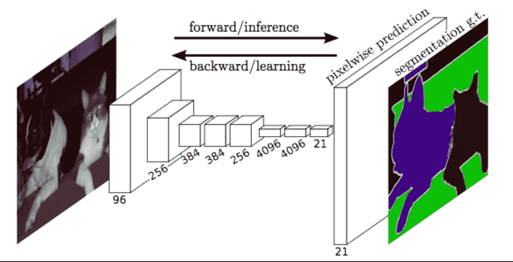

# 医学成像中的深度学习 I

> 原文：<https://medium.datadriveninvestor.com/deep-learning-in-medical-imaging-7b8b356a8493?source=collection_archive---------1----------------------->

Courtesy of [this paper](https://dl.acm.org/citation.cfm?id=3069246)

# 炒作还是希望？

数据是 21 世纪人类创造的主要资源。与大多数合成资源不同，数据随着时间呈指数级增长。如果未来的历史学家将这个时代称为“数据发现时代”，这并不奇怪。在美国，医学成像占产生的患者数据的 70%以上。在基因组学之后，成像是医疗保健领域增长最快的数据部门。据估计，全球每年产生 400 千兆字节的数据。然而，只有一小部分数据得到了分析。此外，图像处理算法仅应用于该百分比的一小部分。**这些未开发的像素代表着错过了推进医学和全球公共卫生的机会。**

医学成像中计算机辅助分析的目标是帮助临床医生**发现患者解剖中感兴趣的相关模式**。通常，这些模式对于人类来说太困难或太耗时，以至于无法进行常规解释，即使它们对社会有很大影响(例如乳腺癌)。让事情变得复杂的是，医学成像数据封装了各种独特的成像系统，每种模式(CT、MRI、超声、PET 等)都需要高水平的临床专业知识。

自 20 世纪 80 年代末以来，计算机科学家、生物医学工程学家和临床医生已经开发了用于各种医学成像任务的计算机辅助算法，包括计算机辅助诊断(CAD)、组织分类、2D 和 3D 解剖重建、图像配准、图像增强和感兴趣解剖区域(ROI) *分割。*结果喜忧参半。例如，在过去的 15 年里，用于数字乳房 x 线照相术的 CAD 系统一直被吹捧为已经准备就绪。然而，很少有卫生系统使用这种技术进行二次读取，更不用说作为乳房 x 光片的主要临床解释者了。另一方面，3D 图像重建工具通过为外科医生提供精确的虚拟解剖模型来帮助颅面重建手术，这些模型有助于术前规划并能够开发用于术中使用的精确解剖模板。

像许多技术一样，计算机辅助成像算法在医疗保健中的采用通常遵循 Gartner 炒作周期，即计算成像工具在多年内慢慢扩散到医学中，而不是立即“扰乱”临床实践。

考虑到公共健康问题和医学的复杂性，保守的采用是可以预期的。最新炒作的医学和非医学成像的成像技术是 **AI，具体是深度学习**。人工智能被誉为医学成像过载的解决方案，可能会改善疾病的管理和监测。单是 Medium 就充满了探索深度学习的历史、数学、应用和潜力的文章。我推荐 Adit Deshpande 在 Github 上的精彩教程:

 [## 理解卷积神经网络的初学者指南

### 卷积神经网络。听起来像是生物学和数学的奇怪结合，还有点 CS 的成分，但是…

adeshpande3.github.io](https://adeshpande3.github.io/adeshpande3.github.io/A-Beginner%27s-Guide-To-Understanding-Convolutional-Neural-Networks/) 

这个博客的目标有些不同。我将介绍我自己将深度学习框架(如 NVIDIA DIGITS 和 Tensorflow)应用于医学成像数据集的实验性试验的第一手资料。原因是个人的:我在芝加哥地区的学术健康系统做了 16 年的医学影像研究员。我已经将一些炒作的算法*应用到真正的医学成像应用中，却只能看到它们产生暗淡的结果。或者它们不可能扩展到临床工作流程中。或者它们太不可靠而不能部署，即它们产生了不可接受的假阳性率。*

**尽管如此，我相信深度学习将会彻底改变医学成像，原因我将在接下来的文章中讨论**。该去工作了！

