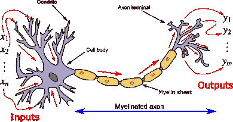
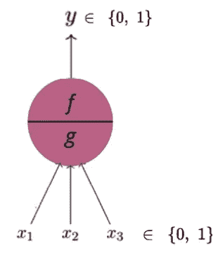

# 深度学习-Mc 库洛克皮茨神经元(MP 神经元)

> 原文：<https://medium.datadriveninvestor.com/deep-learning-mc-culloch-pitts-neuron-mp-neuron-e74b93d4377d?source=collection_archive---------6----------------------->

> *历史-* Mc CULLOCH PITTS *神经元是神经元的第一个数学模型。这个神经元分别以神经学家和逻辑学家的名字命名*沃伦·麦卡洛克 *&* 沃尔特·皮茨*。*

人工神经元-(" **深度学习的基本元素**")人工神经元的工作原理与生物神经元相同。在理解人工神经元之前，我们必须了解人类的生物神经元，因为它们的工作方式非常相似。*例如:当我们将手放入一桶热水中时，来自感觉神经的信号通过树突到达我们的大脑，作为(“输入”)，神经元然后从这些输入中做出决定(“功能”)，并给我们(“输出-y”)，然后我们将手从桶中移开，人工神经元也进行相同的过程。*

BIOLOGICAL NEURON IN HUMAN BRAIN

** *上图清楚地解释了人工神经元如何以生物神经元的形式工作*

**输入 x1、x2、x3 总是布尔的，充当生物神经元中的*【树突】***

**然后输入给功能“g”**

**把“g”的聚合交给“f”做决策，这就是*“生物神经元中的细胞核或胞体”***

**随后神经元发出输出“生物神经元中的轴突终末”**

AN ARTIFICIAL NEURON

“T**何六坛子”——了解一个 MP 神经元:**

(1) *****数据*****

在 MP 神经元中，作为输入和输出给出的数据总是 0 和 1，即**布尔**

(2)*** * *分类*****

该模型使用二元分类来对参数或值进行分类

(3)*** * *型号*****

该模型使用函数“g”来收集输入(x1，x2，x3 ),并且该函数的集合被提供给函数“f”作为输入，该函数 f 做出决定，然后预测输出

(4)*** * *损失*****

在这个模型中，我们使用由公式给出的损失函数，这里我们只考虑平方误差，因为它比绝对误差更合适，因为绝对误差是不可微的

**∑(易—y^i)2 {读作 yi 减 y hat i 全幂 2}**

(5)*** * *学习*****

模型的学习非常简单，只需从 0-n 中取“b”的所有可能值，必须考虑最小平方误差和最大准确度的 b 值

(6)*** * *准确度*****

这是通过使用公式来测试您的模型有多准确:**预测数/预测总数**

***“这些是 mp 神经元的基础。我将在下一篇博客中分享 mp 神经元背后的数学原理。你们的每一次掌声，对我写更多博客都将是极大的鼓励。”***

请关注更多更新……