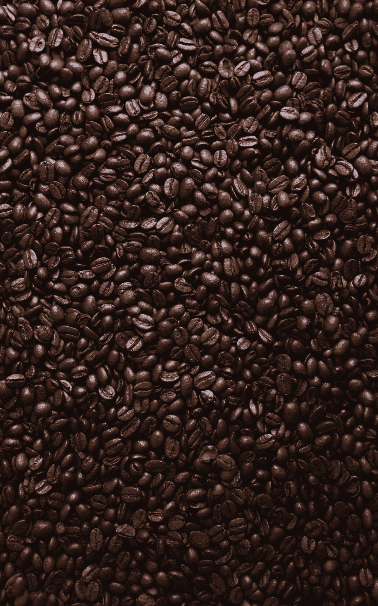

# 深度学习每周阅读清单#1

> 原文：<https://medium.datadriveninvestor.com/deep-learning-weekly-reading-list-1-b8d9423e8269?source=collection_archive---------9----------------------->

这是一个新的每周文章系列的开始，在这里我会解释这周我将阅读和回顾哪些研究论文以及为什么。我的研究兴趣目前围绕着元学习、生成对抗网络和 RL，这个阅读清单将反映这些主题。

Photo by [Patryk Gauza](https://unsplash.com/photos/vs0tzSHVcac?utm_source=unsplash&utm_medium=referral&utm_content=creditCopyText) on [Unsplash](https://unsplash.com/?utm_source=unsplash&utm_medium=referral&utm_content=creditCopyText)

# 神经结构搜索

在使用 RL 来设计神经网络方面，神经架构搜索是一篇非常著名的论文。我希望对他们如何设计搜索空间有一个更好的直觉，并将它与他们实验室的其他论文进行比较，如“搜索激活功能”和“自动增强”。我认为这些方法对于设计生成对抗网络以及图像分类器来说是一个非常有前途的研究领域。

 [## 具有强化学习的神经架构搜索

### 神经网络是强大而灵活的模型，适用于图像、语音和语言等许多困难的学习任务

arxiv.org](https://arxiv.org/abs/1611.01578) 

# 老化图像分类器的大规模进化

除了我对使用 RL 搜索神经网络架构和超参数的兴趣之外，我还想考虑另一种方法，看看进化算法在这项任务上能做得多好。本文还使用了一个有趣的“老化”机制来修改朴素进化算法。

 [## 图像分类器的大规模进化

### 神经网络已被证明在解决困难的问题上是有效的，但设计它们的架构可能是…

arxiv.org](https://arxiv.org/abs/1703.01041) 

# 理解和简化一次性架构搜索

我希望这篇论文将加强我对神经结构搜索单元的理解，以及如何设计离散搜索空间来自动寻找神经网络结构。

[http://proceedings.mlr.press/v80/bender18a/bender18a.pdf](http://proceedings.mlr.press/v80/bender18a/bender18a.pdf)

# 用回旋更深入

我一直对学习如何在 ResNets、Highway Networks 和 DenseNets 等论文中训练更深层次的神经网络非常感兴趣。我真的很期待看到增加网络宽度的最先进的方法。我简要地研究了 Wide ResNets，并期待着更好地理解是什么区分了 Inception 模型。

 [## 用回旋更深入

### 我们提出了一个代号为“Inception”的深度卷积神经网络结构，它负责设置…

arxiv.org](https://arxiv.org/abs/1409.4842) 

# 在深度 RL 中旋转(OpenAI 博客帖子)

在围绕 OpenAI 的 Gpt-2 模型的大肆宣传中，我很高兴在这篇博客中听到他们对 RL 的见解。他们最近围绕这一主题举办了一次研讨会。此外，这篇文章以一种非常容易理解的方式编写，并附有编码教程。

https://spinningup.openai.com/en/latest/

# 瓦瑟斯坦·甘

Wasserstein 损失函数旨在确保发生器可以在 GAN 训练期间从鉴频器中拾取信号，即使鉴频器对每个伪样本进行了正确分类。我还对这篇论文感兴趣，因为 Wasserstein GAN 应该能够在训练期间提供有用的损失信号，可以与上面讨论的元学习技术结合使用。

 [## 瓦瑟斯坦·甘

### 我们介绍了一种新的算法 WGAN，它是传统 GAN 训练的一种替代方法。在这个新模型中，我们表明我们…

arxiv.org](https://arxiv.org/abs/1701.07875) 

感谢您阅读这份每周阅读清单！这个周末我会有总结这些论文的博客文章和视频！