# 使用 Python 和 fast.ai 进行深度学习，第 1 部分:使用预训练模型进行图像分类

> 原文：<https://medium.datadriveninvestor.com/deep-learning-with-python-and-fast-ai-part-1-image-classification-with-pre-trained-model-cd9364107872?source=collection_archive---------2----------------------->

如何教电脑分辨猫和狗？

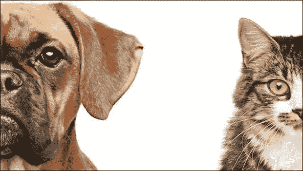

许多研究人员尝试了不同的方法。几年前，他们还在尝试手工进行特征工程，并使用简单的机器学习技术(如决策树或 SVM)来处理这个问题。

然而，手动生成特征是一项困难而乏味的任务。例如，考虑下面这张漂亮的图片。


你很容易就能猜出它是一只熊猫，但如何让电脑知道它是一只熊猫呢？

你可能想找到这个可爱的生物的一些特殊特征，比如描述它的身体形状和颜色，尤其是脸部。

然而，即使你仔细地做了所有这些事情，当电脑看到下面的熊猫图片时，它仍然会很容易迷路。

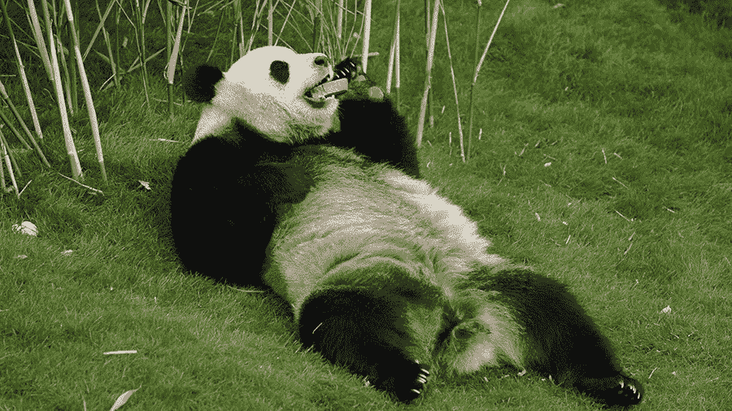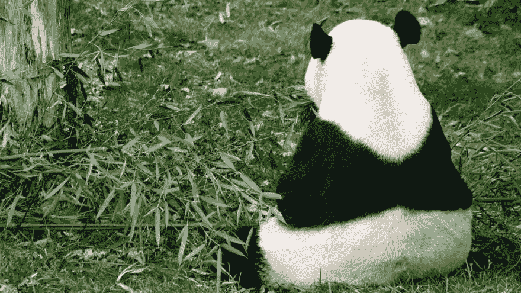

显然，你不可能穷尽照片拍摄时所有可能的角度，考虑熊猫在照片中可能出现的所有位置是不切实际的。

你陷入如此糟糕的境地，是因为你想告诉计算机如何工作。

一些聪明的家伙找到了另一种方法，那就是让计算机**学习**如何做。

在这种情况下，你不再需要给计算机任何如何做的规则和指令，而是需要向它展示大量的学习材料，让它一个案例一个案例地学习它们。

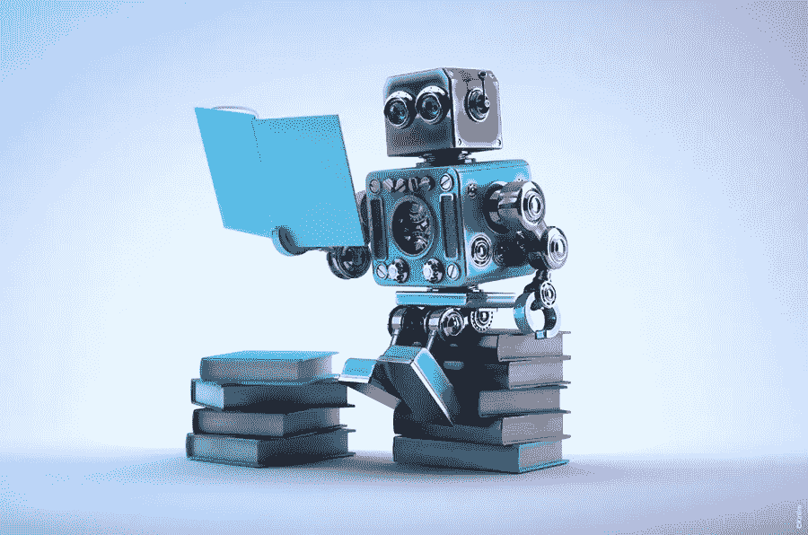

起初，结果可能非常低，然而，经过一定时间的迭代，事情会变得越来越好。

总的来说，正如杰瑞米·霍华德所说，如果你想让电脑学得更好，你需要告诉它三件重要的事情。

*   数据
*   体系结构
*   失败

架构是某种类型的模型的类型。例如，如果你想让计算机完成视觉任务，你需要从卷积神经网络开始。如果你想让它做问答，你需要使用序列模型。

损失度量将判断计算机是否学习良好。大损失值表明模型没有很好地学习。计算机将需要做一些调整(**学习**)，以便逐步将损失最小化。

这就是你要教计算机做的一切。之后它就可以独立处理任务了(希望如此)。

在本教程中，您将学习如何构建一个分类器，它可以区分两个不同的卡通人物。你不需要知道线性代数或微积分。在 Python 编程语言和 fast.ai 1.0 框架的帮助下，你会轻松搞定事情。

# 资料组

我已经把数据集放在 github 上了。可以去[这个链接](https://github.com/wshuyi/demo-image-classification-fastai)浏览一下。

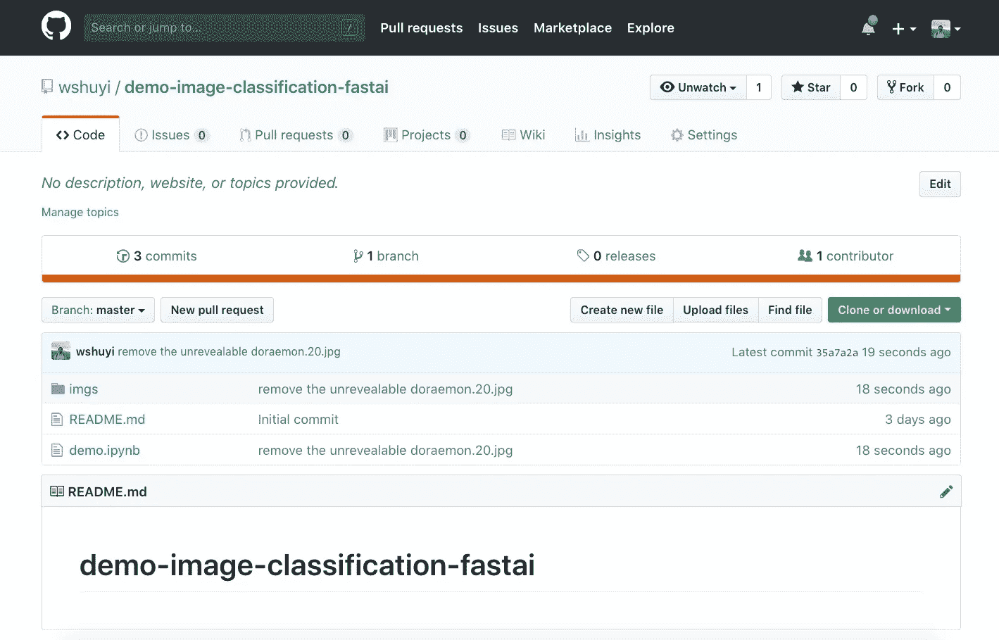

转到`imgs/train`文件夹。你会看到两个子文件夹，即哆啦 a 梦和 walle。

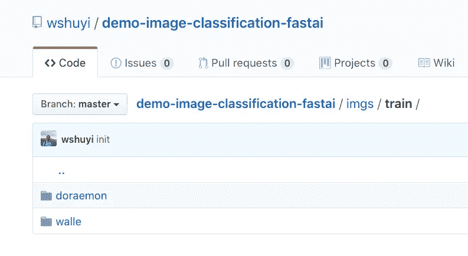

让我们打开哆啦 a 梦文件夹。

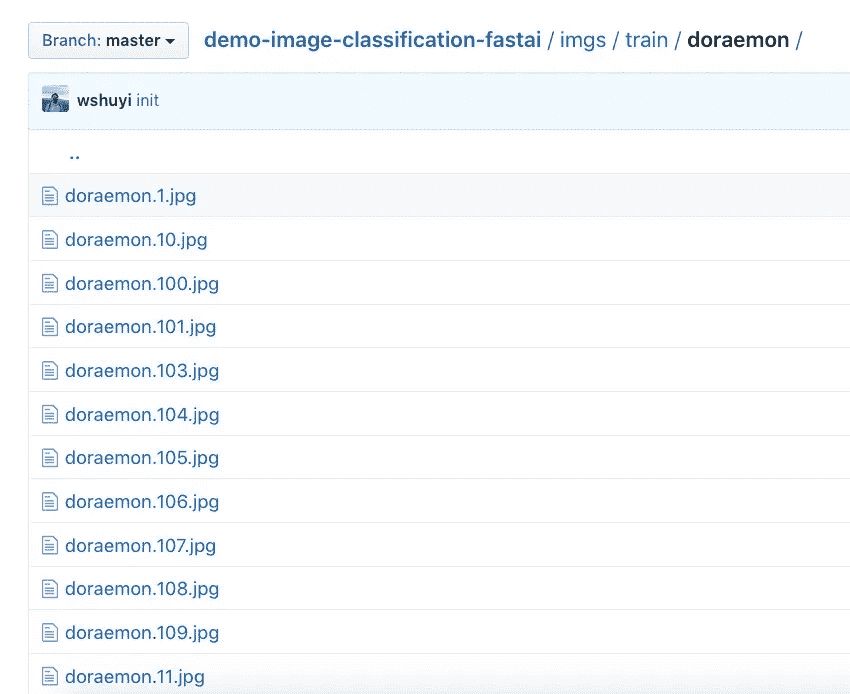

而我们点击打开`doraemon.1.jpg`。

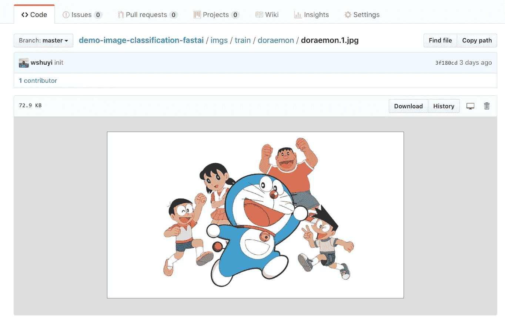

你可以浏览文件夹中的其他哆啦 a 梦图片，并潜入 walle 的文件夹中查看另一个机器人。


在本教程中，我们将使用这个数据集，训练计算机判断一张图片，看它是哆啦 a 梦还是瓦力。

想一分钟:如果你被分配这个任务。你能做什么？

好吧，让我们继续使用深度学习技术来解决它。

# 环境

你需要有一个安装了 fast.ai 1.0 框架的 GPU 就绪的 Google Cloud 虚拟机来遵循本教程。如果你不知道如何去做，请参考[上一篇](https://medium.com/@wshuyi/deep-learning-with-python-part-0-setup-fast-ai-1-0-on-google-cloud-c3d41aadbc8c)文章。


使用`gcloud`成功连接虚拟机后，会看到这个提示。

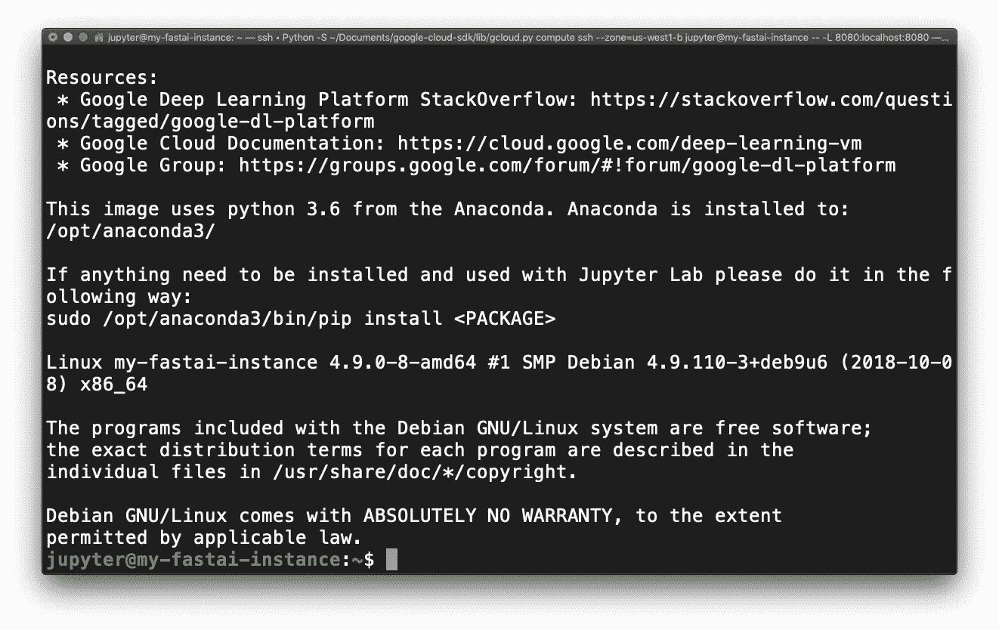

你需要从 github 获取代码和数据集。为此，请运行以下命令。

```
git clone [https://github.com/wshuyi/demo-image-classification-fastai.git](https://github.com/wshuyi/demo-image-classification-fastai.git)
```


现在您可以运行:

```
jupyter lab
```

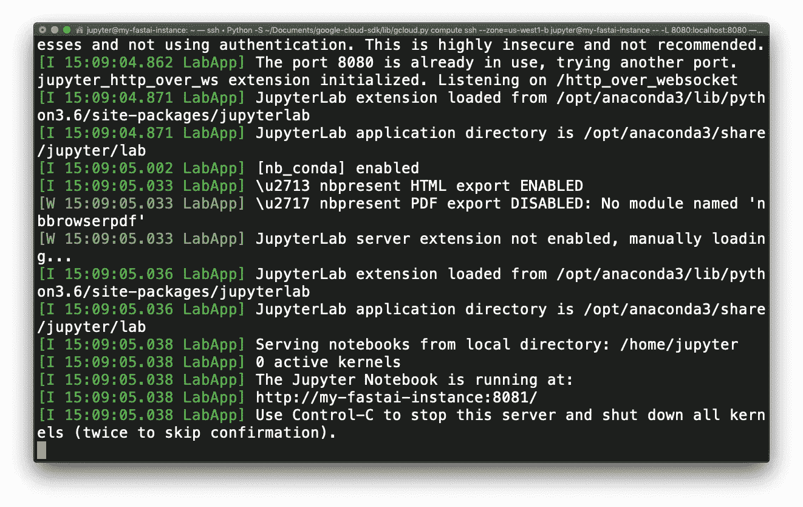

打开你的火狐浏览器，进入[这个网址](http://localhost:8080/lab?)。


从左侧栏打开 demo.ipynb。


现在代码已经显示在主窗口中，您可以通过点击`Run->Run All Cells`来运行所有的代码块。


然而，为了从本教程中获得更多，我建议您按照说明一步一步地运行它们，并仔细检查结果。

# 数据加载

第一步是加载数据集。在此之前，我们先来看看 fast.ai 框架中的一些导入和有用的模块。

```
from fastai import *
from fastai.vision import *
from fastai.core import *
```

现在我们将设置数据集路径。如你所见，所有的照片都在`imgs`文件夹里。

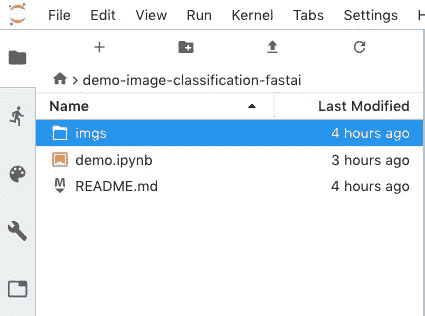

因此，我们将使用下面的代码行来这样做。

```
path = Path('imgs')
```

现在，我们可以要求 fast.ai 加载所有数据。注意我们使用来自类`ImageDataBunch`的`from_folder`函数。

```
data = ImageDataBunch.from_folder(path, test='test', ds_tfms=get_transforms(), size=224)
```

我们要求函数不仅加载数据，还要进行两次转换。

首先，它将通过水平翻转图片，进行一些旋转和缩放来增加数据。这样可以为模型提供**更多的**训练数据，防止模型过拟合。

其次，它会将每个图像的默认大小设置为 224 x 224，这样我们就可以应用某些预先训练好的模型，这些模型将这个大小作为它们的输入。

现在让我们看看这项工作是否做对了。

```
data.show_batch(rows=3, figsize=(10,10))
```

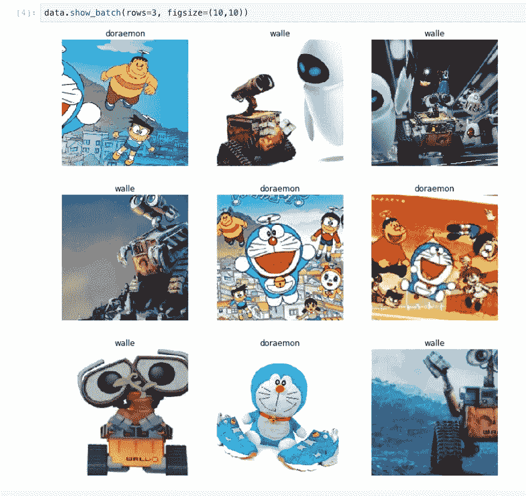

正如我们在这里看到的，图像和标签已经被正确读取。然后，我们可以开始训练阶段。

# 培养

记得吗？我们需要告诉模型三件事:数据、架构和损失指标。在这个阶段，我们将用一行代码**将它们全部告诉机器。**

```
learn = ConvLearner(data, models.resnet34, metrics=accuracy)
```

我们要求卷积学习者接收我们准备的`data`，架构将是一个名为`resnet34`的预训练模型，然后测量它是否学习得很好，度量标准将是准确性。

简单容易，对吧？现在我们都设置好了，可以要求计算机**学习**了。

```
learn.fit_one_cycle(1)
```

在这一行中，我们要求学员遵循**一个周期政策**。如果你想了解细节，可以参考[这个链接](https://medium.com/@nachiket.tanksale/finding-good-learning-rate-and-the-one-cycle-policy-7159fe1db5d6)。


5 秒钟，训练完成！

难以置信的快，对吧？准确度如何？嗯，是 **100%正确**。

该模型从未见过任何关于哆啦 a 梦或瓦力的图像。然而，在五秒钟内，它有信心将它们分类。

让我们看看验证集的结果。我们将获取有效集合上的预测和实际标签，并要求模型向我们解释结果。

```
preds,y = learn.get_preds()
interp = ClassificationInterpretation(data, preds, y, loss_class=nn.CrossEntropyLoss)
```

然后翻译可以告诉我们在哪些图片上犯了更严重的错误。

```
interp.plot_top_losses(9, figsize=(10,10))
```

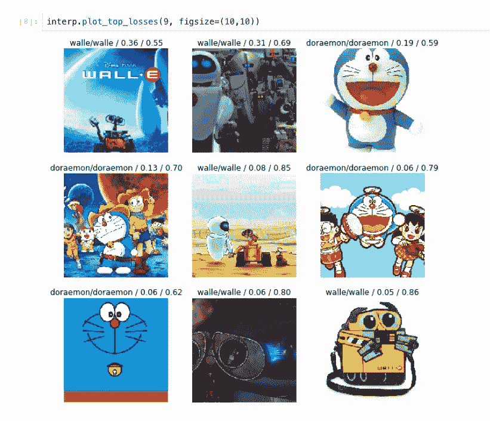

由于有效集的准确率已经是 100%，你看不到任何错误的预测。但是，您仍然可以看到不同的置信度。

你可以让翻译为我们绘制混淆矩阵。

```
interp.plot_confusion_matrix()
```


完美！

# 评价

我们的模式已经很完美了吗？嗯，很难说。我们已经对它进行了训练和验证。然而，我们需要让它看到一些完全看不见的图片，并仔细检查性能。

导航到测试集，您可以在那里看到 6 个图像。其中 3 部是关于哆啦 a 梦的，其他的是关于瓦力的。

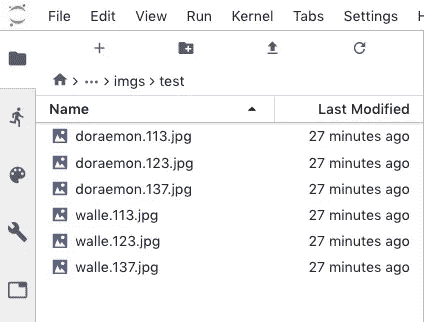

这一次，我们仍然使用`get_preds`功能。然而，我们将`is_test`标志设置为`True`，这意味着我们希望模型预测测试集中的事情。

```
preds,y = learn.get_preds(is_test=True)
```

我们需要理解这些图片在测试集中的顺序。因为当我们要求 fast.ai 加载数据集时，它会对数据进行洗牌，使排序随机化。

```
data.test_dl.dl.dataset.ds.x
```


现在我们知道了它们的顺序，让我们来看看预测。

```
preds
```

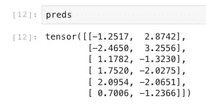

这是什么？！它显示了两个不同阶层的有利水平。左栏是哆啦 a 梦，右栏是瓦力。

我们可以使用`np.argmax`函数把它变成一个更容易理解的数组。

```
np.argmax(preds, axis=1)
```


让我们看看…瓦力，瓦力，哆啦 a 梦，哆啦 a 梦，哆啦 a 梦，哆啦 a 梦。

等等！出事了！最后一块应该是 walle 吧？

让我们打开`walle.113.jpg`。

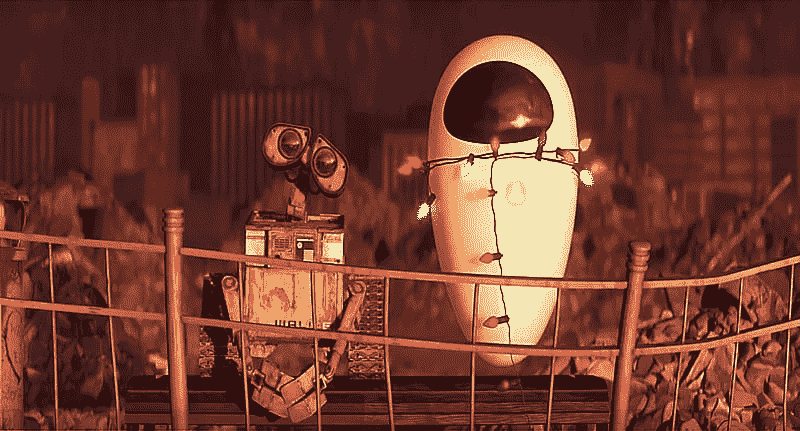

啊哈，另一个机器人也有圆头。也许这就是它被错误预测的原因。

我们该怎么办？干脆忽略错误？

# 微调

答案是**不**。

我们将通过微调来改进模型。

什么是微调？

嗯，我们用了一个叫做`resnet34`的预训练模型，对吧？

它是在一个完全不同的大型图像集上训练的。它为那个场景调得很完美，但不是专门为我们的场景调的。

所以我们可以使用我们自己的训练数据，对其进行微调。

但是等等！如果我们对它调得太多，它将丢失有价值的预先训练的信息，并且毁坏有用的架构。另一方面，如果我们调得太少，也无济于事。

如何解决这个问题？

幸运的是，有一个聪明的解决办法，叫做“区别学习率”。


对于输入层附近的层，它们捕获**微**尺度信息，例如边的形状。对于中间层，它们捕获**中的**尺度信息，比如简单的模式。而对于输出附近的图层，他们会抓取**宏**尺度的东西，比如某些物体的特殊特征。

在这种情况下，我们知道对于输入附近的图层，我们希望尽可能保持它们的当前状态。然而，对于输出附近的层，我们希望以更高的学习速率对它们进行调优，以便它们可以学习更多关于特定新任务的知识。

因此，让我们解冻预训练层，并与**判别学习率**一起调整模型。尽管如此，我们仍然使用一个周期策略，进行三轮。

```
learn.unfreeze()
learn.fit_one_cycle(3, slice(1e-5,3e-4))
```

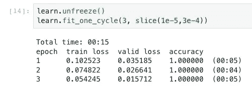

没什么好惊讶的，因为准确率仍然是 100%。

然而，如果你比较火车损失和有效损失，你会注意到不同之处。

有了微调后的模型，我们想在测试集上再做一次预测。

```
preds,y = learn.get_preds(is_test=True)
```

让我们再次检查测试数据排序。

```
data.test_dl.dl.dataset.ds.x
```


好的，顺序保持不变。

让我们看看预测。

```
np.argmax(preds, axis=1)
```

如你所见，所有的预测都是正确的！

# 摘要

在本教程中，我向您展示了如何训练一个图像分类器来区分哆啦 a 梦和 walle。在 Python 编程语言和 fast.ai 深度学习框架的帮助下，工作已经轻松完成。

你需要记住最重要的一点:要让机器学习，你需要给它数据、架构和损耗指标。

希望你能收集一些其他有标签的图像，用它们代替哆啦 a 梦和瓦力的。您可以为自己的任务运行代码，看看它是否仍然工作得很好。

如果你想了解更多关于 fast.ai 的信息，可以去[这个网站](http://course-v3.fast.ai/)。


由于新的 MOOC 要到 2019 年 1 月才会发布，你可能想看去年版本(v2)的**视频。你需要记住，那些视频和代码都是基于 fast.ai 0.7 的，所以你可能需要按照课程说明来使用一些旧模块。**

快乐深度学习！