# 用 Python 和 fast.ai 进行深度学习，第 0 部分:在 Google Cloud 上设置 GPU 虚拟机

> 原文：<https://medium.datadriveninvestor.com/deep-learning-with-python-part-0-setup-fast-ai-1-0-on-google-cloud-c3d41aadbc8c?source=collection_archive---------5----------------------->

[](http://www.track.datadriveninvestor.com/1B9E)

Fast.ai 是一个基于 PyTorch 的非常棒的深度学习框架。主要作者杰瑞米·霍华德已经在[官网](http://course.fast.ai/)发布了基于 fast.ai 的整个 MOOC。这个奇妙的 MOOC 帮助世界各地的学生更好地理解深度学习。

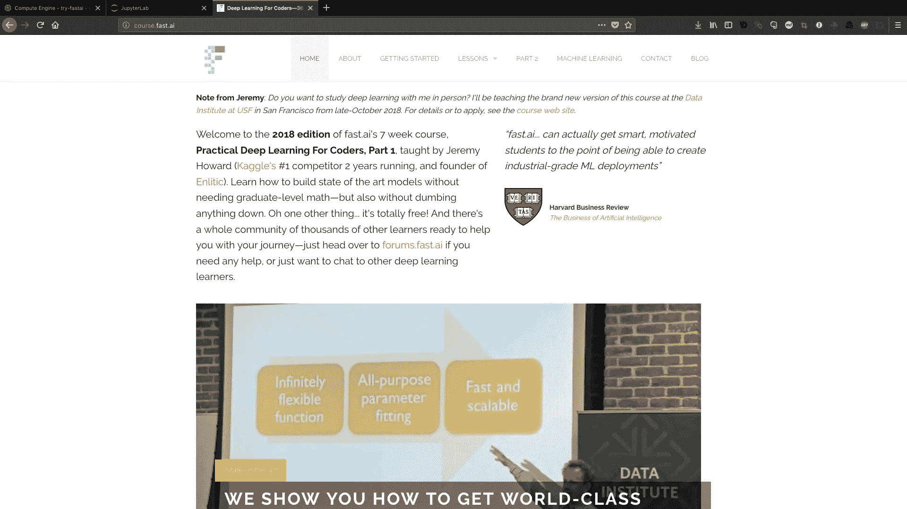

10 月 2 日，fast.ai 发布了 1.0 版本以及新的 PyTorch 1.0 预览版。在这个版本中，fast.ai 得到了很大的改进。

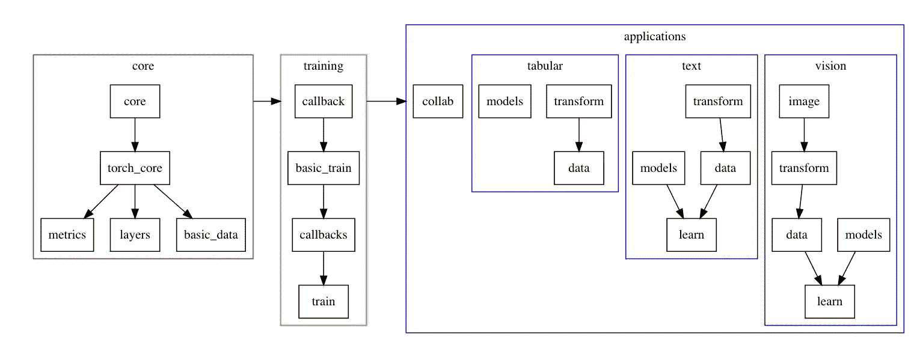

上图来自 fast.ai 的[文档](http://docs.fast.ai/)，展示了 fast.ai 1.0 框架的新架构。使用新的设计良好的模块，您可以更轻松地为图片分类、NLP 问题和表格数据任务训练模型。

由于 fast.ai 1.0 还处于早期，现在还没有那么多云 GPU 平台支持 PyTorch + fast.ai 1.0。如果想尝试一下，官网推荐了两种方式，分别是[蝾螈. ai](https://salamander.ai/) 和[谷歌云](https://cloud.google.com/)。


我都试过了。不过我发现[蝾螈. ai](https://salamander.ai/) 在稳定性和效率上还有待提高。当你开始运行笔记本时，需要很长时间才能准备好，可能会耗尽你的耐心。

另一方面，谷歌云是一个很好的选择。它比[蝾螈. ai](https://salamander.ai/) 更稳定，当你让它准备运行时，它相当方便。另一个好消息是，如果你是谷歌云平台的新用户，你将获得 300 美元。有了那笔钱，你可以练习几百个小时的深度学习！

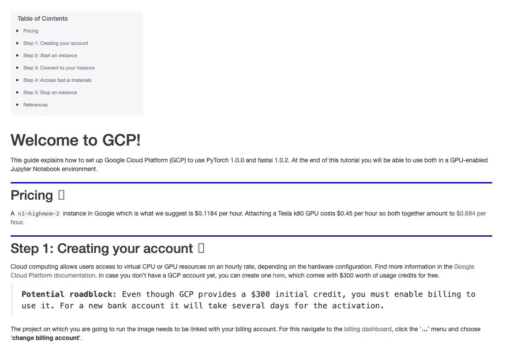

我试着按照说明操作，让虚拟机部署在谷歌云上。但是，我认为博客遗漏了一些步骤，可能会让新用户感到困惑。所以我决定为你提供这个循序渐进的教程。希望你能顺利设置一个 fast.ai 1.0 的 Google Cloud 虚拟机。

让我们开始动手吧。

首先，请导航至[谷歌云网站](https://cloud.google.com/)。


你需要注册一个新账户，然后登录。如果您遇到任何问题，可以参考本页。

首次使用 google cloud，您将被要求[提供有效的计费方式](https://cloud.google.com/billing/docs/how-to/modify-project)。你可以使用你的信用卡信息来这样做。

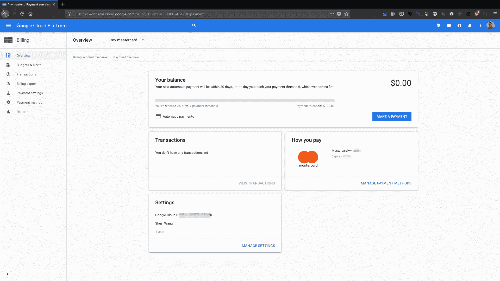

运行本教程附带的深度学习示例，只需不到一美元。所以不要担心。

转到[这个链接](https://console.cloud.google.com/projectcreate?previousPage=%2Fiam-admin%2Fsettings%3Fproject%3Dtry-fastai&organizationId=0)，创建一个名为“try-fastai”的新项目。并单击“创建”按钮。


打开[链接](https://console.cloud.google.com/marketplace/details/click-to-deploy-images/deeplearning)，点击蓝色按钮“在计算引擎上启动”。


在下面弹出的窗口中，点击“try-fastai”。

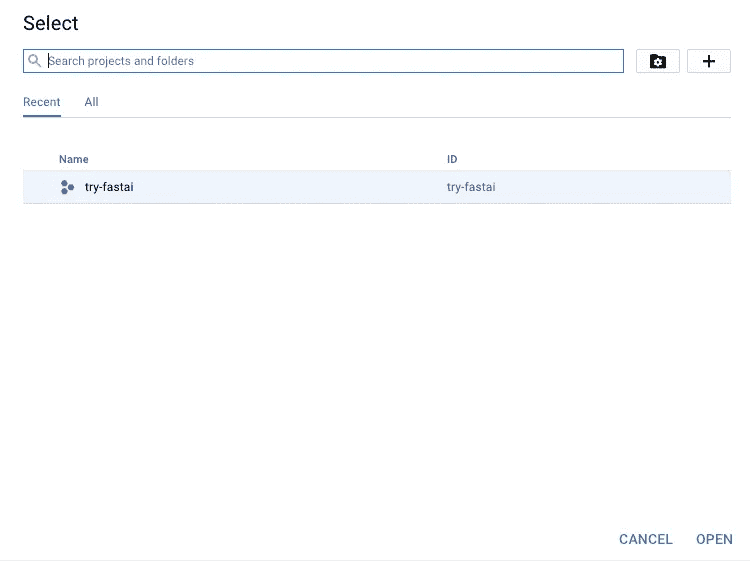

您将被导航到以下页面:


将部署名称更改为“fastai”。

将框架更改为“`Pytorch 1.0 Preview/FastAi 1.0 (CUDA 9.2) [EXPERIMENTAL]`”


确保选择了 GPU 选项。


将引导磁盘类型更改为 SSD(可选)。


配置应该如下所示:


现在点击左下角的`Deploy`按钮。


新的部署需要几分钟才能准备好。请耐心等待。

部署完成后，您将在此页面上看到以下信息:

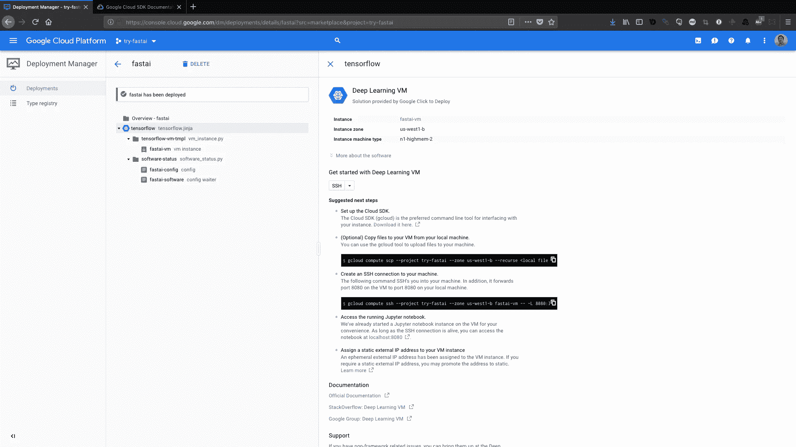

复制这一行:

```
gcloud compute ssh --project try-fastai --zone us-west1-b fastai-vm -- -L 8080:localhost:8080
```

粘贴到你喜欢的编辑器或笔记本应用程序中。

请注意，每次您想要使用 google cloud 深度学习实例时，都需要使用该命令。

在等待部署过程的同时，您可以前往[此链接](https://cloud.google.com/sdk/docs/#install_the_latest_cloud_tools_version_cloudsdk_current_version)安装您的 Google Cloud SDK。


谷歌将引导你到相应的操作系统标签。

根据您的操作系统下载安装包。比如我用的是 macOS，所以我会下载`macOS 64-bit`版本。

你会得到一个球。

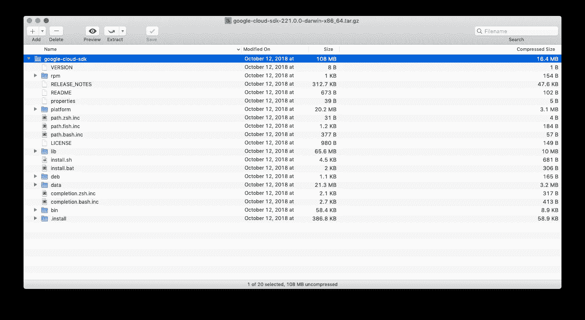

你可以把它解压到你的硬盘上。

使用终端和 cd 命令进入提取的目录。

```
./install.sh
```

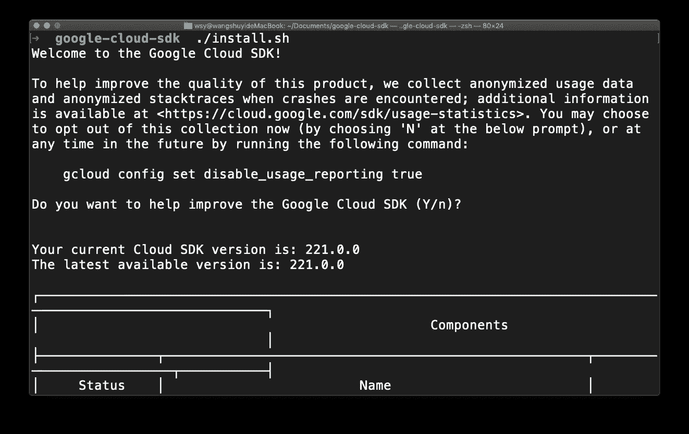

您可以通过输入“Y”继续安装。

启动一个新的 shell，并键入:

```
gcloud init
```

您将被要求登录。

在弹出的浏览器中选择您的帐户信息。

选择要使用的云项目:

选择`[1] try-fastai`

当要求您配置默认计算区域和分区时，选择“N”。

现在你都准备好了。

从您的编辑器或笔记应用程序复制命令，粘贴到您的终端。

```
gcloud compute ssh --project try-fastai --zone us-west1-b fastai-vm -- -L 8080:localhost:8080
```

首次运行此命令时，您将被要求输入密码。就写一首，保证能记住。建议你也保留在你的笔记 App 里。

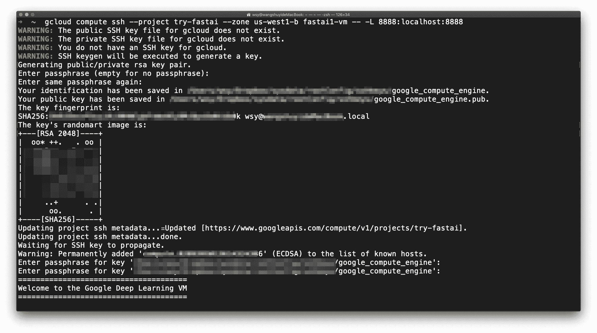

如果您需要新版本的 Fast.ai 1.0 (v3)课程材料，请运行:

```
git clone [https://github.com/fastai/course-v3](https://github.com/fastai/course-v3)
```

现在，您可以运行:

```
jupyter lab
```

复制提示消息中最后两行的 url。

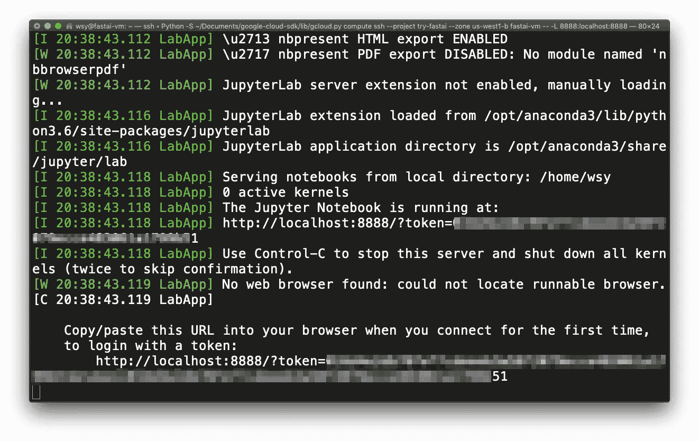

把它粘贴到你的浏览器中，然后点击回车。现在，您可以像在本地运行 Jupyter 实验室一样使用它。

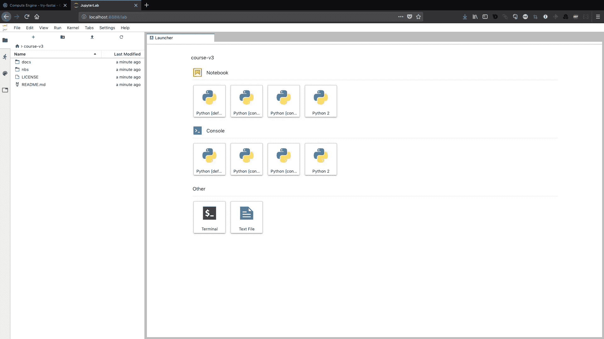

使用左侧窗格上的目录导航栏进入`course-v3/nbs/dl1`并打开`lesson1-pets.ipynb`。

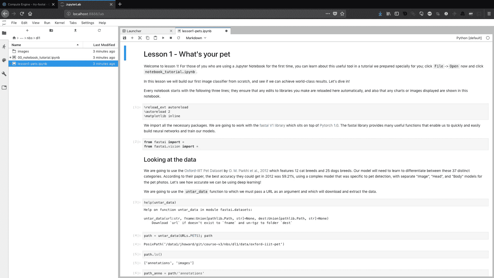

在菜单中选择`Run`，选择`Restart Kernel and Run All Cells`查看笔记本是否工作正常。

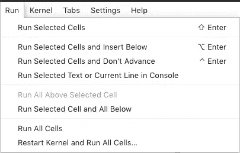

对我来说，一切都很顺利。


请记住，当您运行虚拟机时，将根据使用时间收费。所以当你不再需要 VM 实例的时候，一定要去[这个链接](https://console.cloud.google.com/compute/instances?project=try-fastai):

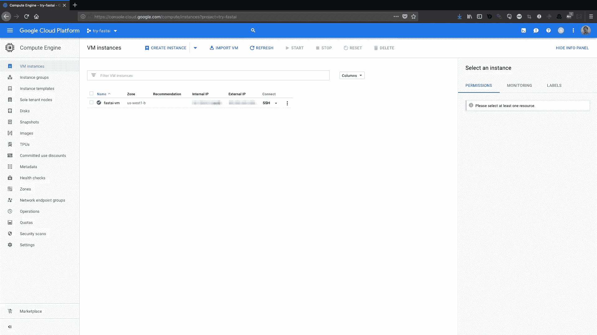

选择“停止”。

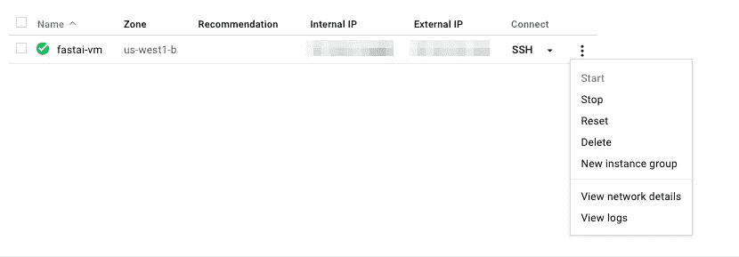

实例停止后，将不再向您收费。

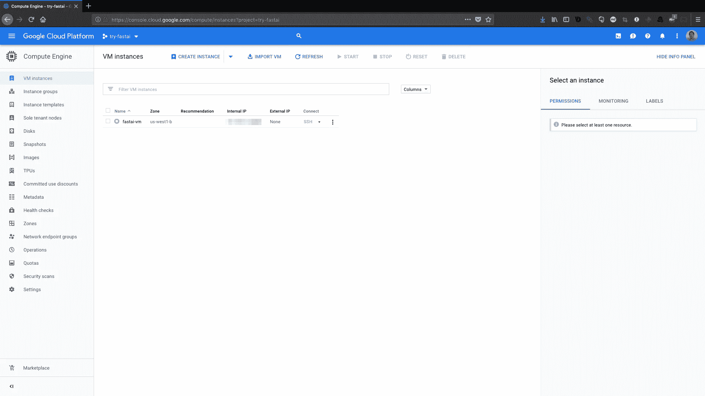

下次你需要使用虚拟机的时候，只要回到[这个链接](https://console.cloud.google.com/compute/instances?project=try-fastai)，再次启动虚拟机。

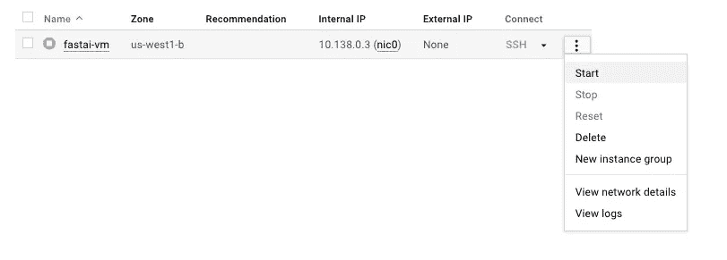

然后在您的终端中，重新运行:

```
gcloud compute ssh --project try-fastai --zone us-west1-b fastai-vm -- -L 8080:localhost:8080
```

然后，再次启动朱庇特实验室。你以前的作品都还在。

快乐深度学习！

# 来自 DDI 的相关帖子:

[](https://www.datadriveninvestor.com/2019/01/23/deep-learning-explained-in-7-steps/) [## 用 7 个步骤解释深度学习——数据驱动投资者

### 在深度学习的帮助下，自动驾驶汽车、Alexa、医学成像-小工具正在我们周围变得超级智能…

www.datadriveninvestor.com](https://www.datadriveninvestor.com/2019/01/23/deep-learning-explained-in-7-steps/) [](https://www.datadriveninvestor.com/2019/01/23/which-is-more-promising-data-science-or-software-engineering/) [## 数据科学和软件工程哪个更有前途？-数据驱动型投资者

### 大约一个月前，当我坐在咖啡馆里为一个客户开发网站时，我发现了这个女人…

www.datadriveninvestor.com](https://www.datadriveninvestor.com/2019/01/23/which-is-more-promising-data-science-or-software-engineering/)