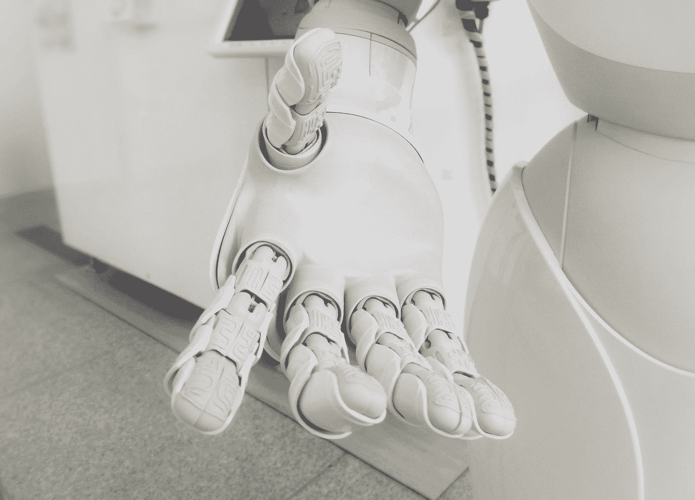

# 数字颠覆和设计

> 原文：<https://medium.datadriveninvestor.com/disruption-by-design-77a8347cbaa3?source=collection_archive---------18----------------------->

Photo by [Franck V.](https://unsplash.com/@franckinjapan?utm_source=medium&utm_medium=referral) on [Unsplash](https://unsplash.com?utm_source=medium&utm_medium=referral)

数字颠覆正在以前所未有的方式重塑我们的世界。许多组织追求数字计划，但很少有人将数字颠覆作为竞争优势的来源，也没有人敢于成为自己的颠覆者。因此，许多组织仍然处于防御模式，涉足技术和创新的边缘。这种犹豫的主要原因可能是不了解中断的紧迫性、破坏性风险、转型需求或复杂性。

犹豫是真的。我们确实需要采取额外的预防措施，不要以牺牲 IA(智能辅助)为代价来促进 AI(人工智能)。然而，通过这篇文章，我想和读者一起探索在日益数字化的世界中生存和发展的关键策略。或许有那么一瞬间，我们会把技术视为一种使能器，它可能会开启新的工作和经营方式，并把数据作为数字时代的货币。

一个考虑或建议是，我们不能仅仅通过*进行*数字化，如开发移动应用程序、数字化现有流程或在项目中使用社交媒体，而是通过*也进行*数字化来自给自足。这可能需要采用独特的文化、行为和能力，使项目在数字世界中脱颖而出。事实上，一些顶尖的数字公司使用软件管理策略，如敏捷性和持续创新，以及动态技能和决策标准。这也许就是乞求融入数字世界的数字 DNA。

在过去的几个世纪里，炼金术士梦想着把金属变成金子。从某种意义上说，他们的梦想终于在我们的现代世界中实现了，分析正在将休眠的原始数据转化为有价值的见解。这些见解即使不比黄金更珍贵，也是一样珍贵，因为它们使洞察力驱动的想法能够将战略制定和最佳执行提升到新的水平。数字数据正迅速变成货币，成为竞争优势的来源，就像黄金曾经是一样。

能够收集数据、获得对正确数据的特权访问以及分析正确方法的分析专业知识的组织可以在竞争中胜出并获得可持续的优势。一个洞察驱动的组织需要一个黄金团队，该团队拥有正确的分析技能组合(例如，软件开发人员、数据架构师、数据科学家和信息设计师)，以及具有业务和领导技能的人员、主题专家、导航员和设计思考者。这种类型的团队允许组织在不确定的情况下采取行动，并在面临障碍时进行创新。

在我看来，拥有黄金团队可以释放人工智能的力量，但这还不够。这是因为人工智能本身就有能力取代许多工作和人类的潜力。我的观点是，我们需要首先关心我们的幸福，然后才是人工智能。一旦可行和可持续的团队以多样化和包容性的标准形成，包括妇女和少数群体，那么 AI 就可以帮助解决核心组织优先事项。在黄金团队中使用 AI 之前的另一个考虑是管理隐私和安全法规，以保护人口和组织。一旦建立了坚实的基础，人工智能就可以带来从数据中释放洞察力的潜力，评估程序和服务资格，并通过自然语言或图像处理实现认知自动化。虽然监管对整个社会的福祉至关重要，但过度监管会削弱竞争力。更糟糕的是，监管漏洞和冗余会对合规性和公共资源的有效管理构成障碍。

有趣的是，人工智能还可以通过识别冗余、不一致和机会来帮助预测不同类型的法规的影响。利用这些强大的洞察力，可以做出明智而有根据的决策，并增强战略规划的能力。人类受 AI 支配吗？

为了解开人工智能的含义，一个定义可以是由机器学习或计算机通过数据分析进行学习的能力实现的决策。数据可以是音频、原始文本或照片的形式，深度学习利用计算机处理的能力来分析这些非结构化或模拟数据。这种分析可以导致语音识别或物体识别，这种认知人工智能可以模拟感知、记忆和判断。

人工智能不仅充分而且必要的一个例子是医疗保健行业。在医疗保健领域，人工智能不仅仅是一个技术故事，它是成功的重要组成部分，有利于缩短周转时间，提高诊断精度，个性化疗法和治疗，以及更有效地利用有限的资源(通过交付，减少管理负担，并允许系统为患者带来更多价值)。人工智能在短时间内自我学习的能力提高了它的能力，并微调了它的性能，从而加速了它在医疗保健系统中的渗透。我们已经看到了成功的机器人手术、精确的数字病理诊断和通过释放基因组学实现的个性化医疗。这很重要，因为当前的医疗保健系统非常不可持续，随着老龄化和慢性病的增加，医生的短缺，以及患者对健康和护理的更高期望，成本和需求只会继续增加。我们的目标是，通过新兴的合作伙伴关系和基于人工智能的解决方案，成本下降的幅度可以超过利益相关者的购买量。这反过来可以将资源转向以健康为中心的人工智能系统。

因此，当我们的世界准备启动其人工智能之旅时，让我们通过以下方式倡导最佳实践:(I)仔细选择人工智能应用的案例和场景，(ii)专注于使事情变得真实和更具体，(iii)共同努力创建和调整解决方案，(iv)无论一个组织有多成熟，都要保持敏捷和快速发展，(v)拥抱人工智能，但不要以人类福祉或存在为代价。这意味着从小处着手，但要关注人工智能的意愿。在人工智能中能找到上帝吗？