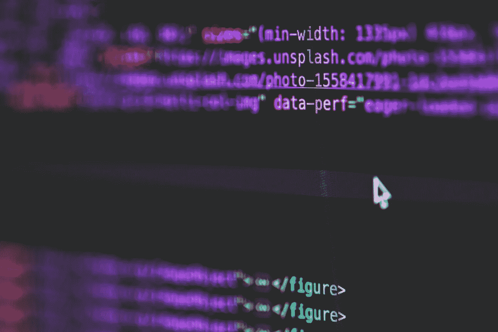

# 你检查你的数据模型的准确性标准了吗？如果你不这样做，你可能会引入不必要的模拟误差。

> 原文：<https://medium.datadriveninvestor.com/do-you-check-your-data-models-for-accuracy-standards-ca40ec6fbd25?source=collection_archive---------6----------------------->

当我坐下来回顾蒙特卡罗模拟模型时，我碰到了模型标准的话题。

Photo by [Markus Spiske](https://unsplash.com/@markusspiske?utm_source=unsplash&utm_medium=referral&utm_content=creditCopyText) on [Unsplash](https://unsplash.com/s/photos/data-science?utm_source=unsplash&utm_medium=referral&utm_content=creditCopyText)

在数据科学中，我们知道符合目的的模型就是设计一个模型来回答一个问题。然而，我们意识到我们的结果的准确性了吗？

通常，在问题识别的过程中，我们如何验证我们的模型成为投资者的一个必要问题。商业投资通常与信息结果有关。除了简单的“它工作得很好”之外，您的客户还会要求对模型结果和准确性进行解释。

 [## 动荡迫使暴风雨中的平静|数据驱动的投资者

### 自然界中很少有东西是直线行进的，尤其是经济。当投资者和消费者希望平静时…

www.datadriveninvestor.com](https://www.datadriveninvestor.com/2019/03/25/volatility-compels-calm-amid-the-storm/) 

定量工程师、首席技术官和分析专家需要能够向客户和投资者传达标准是如何遵循的。这会建立信任。有必要说明我们如何将模型结果与实际情况进行比较。这是模特鉴定的一部分。在模型评审期间，请考虑以下主题:

1.**验证** —我们是否按照规格建造了模型？

2.**验证** —与真实数据相比，我们的模型有多准确？我们有真实的数据吗？

3.**认证**——该模型是否可用于此目的？

一个经典的例子是 2003 年美国哥伦比亚号航天飞机的灾难。哥伦比亚号的机翼在发射过程中被泡沫绝缘材料卡住了。重返地球时，高温气体导致结构崩溃，哥伦比亚号航天飞机被摧毁。我的总结是对太空飞行史上一个可怕事件的简化。然而，这场悲剧的一个结果是不同群体对模型可信度的评估。

新的 NASA 标准建立了一个由外部同行、内部同行和独立验证的技术模型评审。这并不能消除所有的风险，但它确实有助于传达我们模型中的不确定性。

更多信息参见 NASA 参考:M. Babula 等人，“NASA 模型和模拟标准:可信度评估量表”，AIAA 航空航天科学会议，佛罗里达州奥兰多，2009 年 1 月。

你的认证计划是什么？

如果你正在领导一家初创企业，当被要求做出解释时，你是如何确定你的模型输入、结构和输出的？