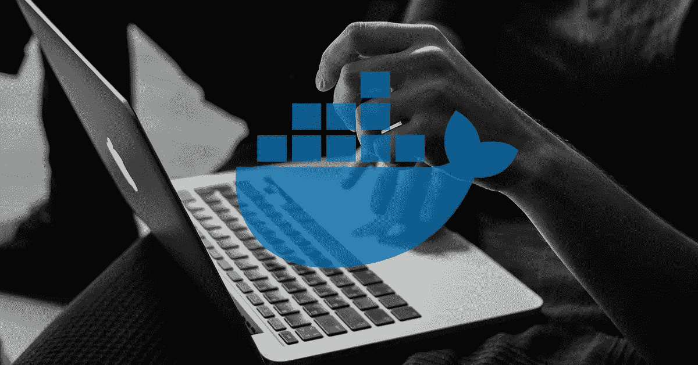

# Docker 容器:绝对胜过虚拟机

> 原文：<https://medium.datadriveninvestor.com/docker-containers-an-absolute-prevail-over-virtual-machines-c595cdec1897?source=collection_archive---------10----------------------->

Docker 容器允许开发人员在任何环境中运行他们的应用程序，无论是裸机服务器、云还是虚拟机。那我们为什么不永远放弃虚拟机呢？

Docker 容器的主要思想是，一旦创建了 Docker 映像，就可以很容易地构建带有它的容器，并在任何环境中运行——无论它在哪里运行，它的行为都完全相同。这意味着无论底层基础设施、操作系统、安装的软件和其他变量如何，应用程序都会一直运行，因为它在容器中有自己的运行时环境。然而，尽管我们在码头工人和流浪者的比较中提到了某些好处，容器并不是通用的。

下面我们列出了在容器和虚拟机之间进行选择时需要考虑的几点:

1.  容器提供了更高的操作灵活性
2.  容器支撑着多云和混合系统
3.  容器很容易与现有的 IT 工作流集成
4.  容器比虚拟机便宜
5.  集装箱本质上更安全

这是对以上几点的简要概述。

# 更高的运营灵活性

Docker 容器是根据脚本构建和启动的，所以 1 个命令就提供了开发人员需要的一切。每次调配新的虚拟机时，都必须对其进行配置，并且在使用之前必须安装和配置所有需要的软件。容器可以在几秒钟内重新启动，而重新启动虚拟机上运行的应用程序需要重新启动虚拟机和所有必需的服务。

# 多云和混合系统的基石

由于容器在任何地方都运行良好，它们可以很容易地用作分布式[云系统](https://itsvit.com/blog/digital-transformation-multi-cloud-strategy/)的构建模块，跨越多个可用性区域，并使用不同提供商的各种功能。他们还可以在[混合系统](https://itsvit.com/blog/3-types-cloud-computing-fits-smb-best/)中创造奇迹，在混合系统中，基础设施的一些部分被部署到公共云，而关键任务系统被保留在本地或私有虚拟环境中。

# 易于与现有 IT 基础设施集成

成熟的公司已经围绕某些工具、工作流、人员和技能建立了自己独特的 IT 基础设施。一旦您的 IT 部门掌握了 Docker 容器的基本概念，他们将会看到将它们集成到您独特的软件生态系统中的多种方式。这一过程的主要目的是减少应用程序部署所需的时间，并消除困扰许多企业软件交付渠道的“在我的机器上运行良好”的情况。

# 容器比虚拟机便宜得多

容器化的应用程序共享相同的操作系统、库和其他组件，允许在大规模部署时节省大量计算资源。实际上，由于移除了虚拟机管理程序层并整合了虚拟化资源，[容器的成本效益比虚拟机高 300%](https://www.itworld.com/article/2915530/virtualization/containers-vs-virtual-machines-how-to-tell-which-is-the-right-choice-for-your-enterprise.html)。

# 集装箱本质上更安全

容器有多个安全层，为运行它们的虚拟主机或[裸机服务器](https://itsvit.com/blog/metallb-load-balancer-bare-metal-kubernetes-clusters/)形成一个保护层。容器中的每一组安全限制都保护主机和所有协同定位的容器，与所有虚拟化安全功能配合良好。

# 关于为什么 Docker 容器胜过虚拟机的最终想法

由于上述原因，Docker 容器对于软件交付和产品维护变得越来越重要。然而，有多种原因导致他们不能成为软件开发的中流砥柱。首先，virtual machine 软件(如 vagger 或 vSphere)是专为支持软件开发管道而设计的，可与多种大数据分析工具、[监控解决方案](https://itsvit.com/blog/5-parts-svit-logging-monitoring-toolkit/)和代码版本控制系统配合使用。

其次，全面迁移到云以及[过渡到使用 Kubernetes 集群](https://itsvit.com/our-whitepapers/kubernetes-the-cornerstone-of-the-modern-cloud-infrastructure/)可能是一项非常昂贵的工作，尤其是对于成熟的企业 IT 基础设施而言。因此，这是可以做到的，也是必须做到的，一次一个项目——但在所有工作负载转移到 Kubernetes 上之前，虚拟机必须做到这一点。

您的公司是否仍在运行虚拟机，或者您已经将工作负载容器化了？哪种方法最适合您的运营模式？请在下面告诉我们！