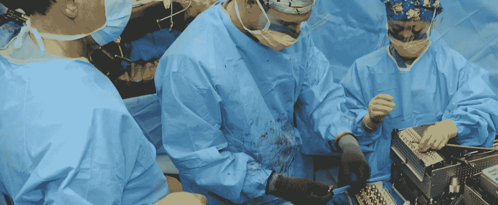

# 医生指导有奎宁的吸引力

> 原文：<https://medium.datadriveninvestor.com/doctor-coaching-has-the-appeal-of-quinine-49e5631a6bc5?source=collection_archive---------4----------------------->

## 接受建议在别人看来是软弱的表现

为什么内科医生不能接受培训？现实是医疗服务提供者*可以*接受指导，但与其他职业不同，医疗领域将接受指导视为软弱的标志。

[雷莫-蒂托·阿吉拉尔博士发现这令人困惑。这位整形外科医生是菲律宾整形外科委员会的受托人，桑托斯将军医疗中心的诊所主任，也是达沃市南菲律宾医疗中心整形外科的医学专家。](https://twitter.com/bonedoc)

阿吉拉尔说:“几十年来，我在我的实践领域为每一个骨科病例做了我能做的一切。“我的导师没有浪费时间训练我成为一个终身学习者，为我提供处理大多数骨科病例的技能，并灌输专业精神和严格遵守道德价值观。”

然而，医生知道导师不是教练。

阿吉拉尔说:“教练是老师、领导者、激励者和批评家，通常比学习者更有经验。”“教练可能不是他们领域中最有才华的表演者，但他们从对领域的不懈研究中获得的无形‘智慧’弥补了这一点。具有讽刺意味的是，大多数教练从他们在球场上的“失败”中获得了他们在球场上的洞察力。

 [## 医疗保健的未来正在被一场大型技术入侵所塑造|数据驱动型投资者

### 过去十年，全球经济的所有部门都经历了大规模的数字颠覆，而卫生部门现在…

www.datadriveninvestor.com](https://www.datadriveninvestor.com/2018/11/02/the-future-of-healthcare-is-being-shaped-by-a-big-tech-invasion/) 

“尽管导师和教练都以被辅导者或被辅导者的成功为目标，但前者更像是一个榜样，而教练则是一个批评家，”他说。“我们的导师大多来自学术界，在医学院或培训期间。他们通常留在那里。教练——如果我们曾经寻找过的话——经常出现在实践中。”

经过深思熟虑，阿吉拉尔列举了著名的教练案例。

“我们钦佩的许多成功人士——尤其是那些医学界以外的人——即使在他们的巅峰时期也有教练支持，”他说。“迈克尔·乔丹和科比·布莱恩特拥有菲尔·杰克逊。拳击手曼尼·帕奎奥有弗雷迪·罗奇。就连科技巨头拉里·佩奇、谢尔盖·布林、埃里希·施密特和史蒂夫·乔布斯都请过比尔·坎贝尔做他们的教练。”

# 不祥的预兆

抛开这些成功不谈，医疗保健为寻求帮助的人设置了障碍。

阿吉拉尔说:“一般来说，医学实践对教练有这种负面的看法。“在医学院和培训中，人们可以很容易地找到一个导师或榜样来磨练自己的技艺。在实践中，许多医生都是独立的，很少与以前的学术导师联系。

“对许多同事来说，接受指导意味着‘信心动摇’，缺乏技能，甚至缺乏独立性，”他说。“病人看到他们的医生被辅导，可能会认为这是无能的表现。因此，在实践中，医生很少找到医生教练，而且医生教练也很缺乏。”

学生和艾滋病顾问迪·j·马德里加尔已经看到了他新生职业生涯中的辅导障碍。

“语言、沟通、个性、知识、文化和距离是指导医疗保健专业人员的障碍之一，”他说。“这些适用于教练和学员。

“自我意识，暂停判断，提出有力的问题，公开假设，考虑安全空间，尊重和倾听在辅导和指导中至关重要，”马德里加尔说。

职业健康专家、世界卫生组织西太平洋地区和菲律宾马卡蒂医疗中心的顾问 Gia Sison 博士将目光投向了工作场所。

“指导的一个障碍是工作场所的环境和文化，”她说。“大多数时候，这更像是指出一个错误，而不是指导改进。”

医学生和健康博客[our lad tanten co](https://twitter.com/drdrlads)整理了几个教练障碍:

*   缺乏某些领域的专家。
*   如果有专家的话，有的很忙其他的事情。
*   年轻的专业人士害怕寻求帮助，被辅导和批评。

“菲律宾大学医学院的研究博士面临的挑战是，我们缺乏内部博士，”坦滕科说。“我们博士的专业知识不是很广泛。我们也面临同样的挑战，医学博士很少。我们通常会出去寻找合作顾问。”

# **不情愿的自我**

在马尼拉菲律宾大学公共卫生学院教授流行病学的 Jaifred C.F. Lopez 博士认为，部分原因要归咎于自我。他也从事健康政策和管理方面的研究。

“很多时候，我们健康专家认为我们足够聪明和有经验，我们不再需要教练了，”他说。“然而，我接受了个人辅导，这对我真的很有帮助。这令人感到谦卑，但很有启发性。”

印度钦奈的药房顾问和营销策略师 Varadharajan Krishnamoorthy 也看到同事们泰然自若。

“他们认为他们什么都知道，”他说。“即使当他们意识到被指导的潜力时，他们也希望教练有义务训练他们。他们的脖子太僵硬了。

"此外，教练应该只来自内部吗？"Krishnamoorthy 说。"来自兄弟会内部有很多优势。"

与其他职业不同，指导医疗保健专业人员会带来好处和风险。

“在其他领域执教的好处几乎是毋庸置疑的，”阿吉拉尔说。“在医学中，尤其是在外科手术中，结果与特定技能或技术的熟练表现密切相关。

“我告诉住院医生 p2r 2——计划、实践、回顾、重复——他们有自己的导师来完成这个过程，”他说。在医生的实践中，对表现的批评留给了同行，这通常默认为自我批评。我们都知道自我偏见是如何运作的。"

这种宫廷阴谋可能会忽视首要目标。

阿吉拉尔说:“性能改善的底线是改善患者的结果。”“虽然教练和被教练的医生都提高了自己的表现，但最终从教练关系中获益的是患者。”

要使安排奏效，双方都需要看到自己的优势。

“这对教练和学员都有好处，”洛佩兹说。“导师和教练是互利的。我们从彼此的旅程中学习。当然信任是必不可少的。双方都不能违背这种信任，把事情藏在心里。”

# **风险与回报**

Krishnamoorthy 已经看到了教练如何提高技能。

“这对专业人士和患者都有巨大的好处，”他说。“如果自我受到伤害，小风险就是破坏个人关系。好处显然大于风险。

Krishnamoorthy 说:“我在一些医疗保健专业人士的演讲演出中指导过他们。“他们成为了更好的演讲者。这吸引了一大批倾听他们的听众。反过来，发言者得到了许多参考。联网改善并造福了该地区的患者。”

阿吉拉尔发现了可训练的医疗保健专业人员的共同特征。

“在医学院和培训之后，我们医生认为我们什么都知道，”他说。“然后我们注意到停滞或更糟——练习成绩下降。批评自己的表现需要谦逊和开放的心态——如果批评来自别人，就更是如此。

“适应不断变化的实践和患者需求的灵活性也是必要的，”Aguilar 说。“就我而言，积极寻找一位与我‘合得来’的可信赖的教练是最难的，尤其是在竞争激烈的内科和外科领域。我想改变这一点，即使在我职业生涯的这个阶段。”

许多教练关系并不局限于特定领域。

Krishnamoorthy 说:“有专业以外的朋友，偶尔放松一下，聊聊天，是一个好的开始，我是许多医疗专业朋友的朋友。即使我不能直接提供帮助，我的倾听也会帮助他们。

“一个有诀窍的友好教练可以走很长的路，”他说。“这也是为什么非专业教练会更容易教授软技能而不是专业问题的另一个原因。”

阿吉拉尔远在海外，多年前曾向达拉斯牛仔队的足球教练汤姆·兰德里(Tom Landry)寻求明智的建议:“教练会告诉你不想听到的东西，他会看到你不想看到的东西，这样你就可以成为你一直以来都知道可以成为的人。”

**关于作者**

吉姆·卡扎曼是[拉戈金融服务公司](http://largofinancialservices.com/)的经理，曾在空军和联邦政府的公共事务部门工作。你可以在[推特](https://twitter.com/JKatzaman)、[脸书](https://www.facebook.com/jim.katzaman)和 [LinkedIn](https://www.linkedin.com/in/jim-katzaman-33641b21/) 上和他联系。