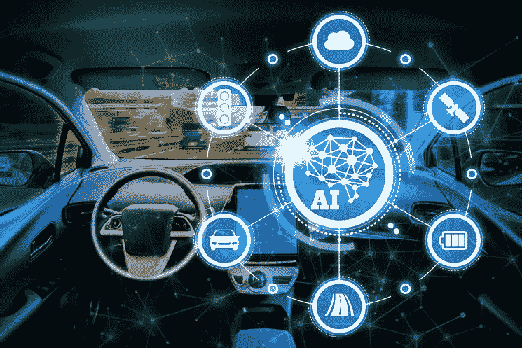

# 从汽车数据到增值服务划清界限

> 原文：<https://medium.datadriveninvestor.com/drawing-the-line-from-automotive-data-to-value-added-services-88ed3801c186?source=collection_archive---------1----------------------->

如今，汽车配备了许多先进的驾驶辅助系统(ADAS)，如自适应巡航控制、盲点检测器、车道偏离警告系统、自动制动和车道居中等。这些系统已经开发出来，并将继续得到增强，以在驾驶过程中帮助驾驶员，提高车辆安全性并改善整体用户体验。ADAS 在现代汽车中的采用导致了汽车数据的产生，因为它依赖于来自多个数据源的输入，包括传感器、计算机视觉、车内网络等。联网汽车每小时产生大约 25 千兆字节的数据，据 Gartner 称，到 2020 年，T2 将有 2 . 5 亿辆联网汽车。想象一下每辆车将产生的数据量。我们如何处理这些数据？我们如何从中获取价值？

## 联网汽车产生的海量数据

未联网的汽车意味着没有车辆生成的数据——至少没有数据到达云端——没有这些数据，汽车制造商更关注车辆的风格和舒适度。今天，可以访问大量的汽车数据，为汽车制造商创造了有利可图的机会，不仅可以降低运营成本，还可以采用新的创收模式。联网汽车每天产生几万亿字节的数据，而半自动和自动驾驶汽车产生的数据甚至更多，接近[每天 30 万亿字节](https://movimentogroup.com/blog/is-data-our-new-voice/)。管理大量的数据极具挑战性。驾驭汽车数据的能力正在成为一项重要的竞争优势，不仅仅是保险。当然，所有这些数据都可以传输到云中，但是无论它有多强大，它都无法快速存储和处理这种数据量。为了克服这个问题，[基于边缘的算法正在开发中](https://www.aptiv.com/media/article/2018/01/12/let-s-connect-on-connected-services)使汽车的计算机能够处理大量数据处理，从而能够以低延迟实时做出决策。

最大的挑战是从车辆中使用的每个传感器、每个网络和每个系统产生的海量汽车数据中过滤出关键数据的能力。汽车数据可以大致分为[三类](https://ec.europa.eu/growth/tools-databases/dem/monitor/sites/default/files/DTM_The%20race%20for%20automotive%20data%20v1.pdf) —驾驶员数据、上下文数据和车辆数据。

*   驾驶员数据与驾驶员行为有关，例如，驾驶员喜欢哪种音乐，或者驾驶员通常在一天中的哪些时间开车？
*   上下文数据代表来自周围环境的所有数据，例如，当前的天气状况或当前的交通流量是多少？
*   车辆数据包含了关于车辆的所有信息，例如车辆的性能，行驶中使用了多少燃料或电池电量，或者车辆是否需要维修？

为了确保数据隐私，可以根据所涉及的各种利益相关者对数据进行分类，并根据每个角色限制对数据的访问。当数据必须与多方共享时，这是非常有用的。

## 通过人工智能了解客户

下一步是理解海量的汽车数据，这就是人工智能的用武之地。随着[数字化和共享经济](https://movimentogroup.com/blog/is-transformation-of-the-auto-industry-more-than-just-digitalization/)的兴起，客户的期望已经从仅仅是车辆的风格和舒适性转变为智能和便捷的车辆。传统汽车现在正变得联网，并将在人工智能的帮助下很快实现完全自动驾驶。它将使车辆能够管理、理解和快速响应来自数百个不同传感器的实时数据输入。大量汽车数据被输入机器学习算法，为汽车制造商和车主/用户提供有价值的见解。汽车制造商开始了解客户感兴趣的好处，而车主/用户可以通过预测分析提前计划维护计划。人工智能正被用于配备 ADAS 的车辆，以提高安全性、能效和驾驶员的便利性。深度学习有望成为开发人工智能最常用的方法，因为它可以学习和开发模拟现实世界场景的场景和算法。

在来自两个或更多独立来源的数据集之间的时间相关性至关重要的情况下，灵活、快速地收集和分析大量数据是做出明智决策的必要条件。将这一切转化为对人工智能自动驾驶系统的现实挑战，这种大规模数据处理的预期结果无非是在最短的时间内获得正确的答案，以确定避免交通事故的适当行动。[延迟和信号更新信息](http://www.electronicdesign.com/test-measurement/how-ai-will-help-pave-way-autonomous-driving)也非常重要，原因有二。首先是获得一个几乎实时的决策模型。第二是确保正确的数据集以某种方式组合和关联，以得出最佳的行动集，从而最终确定正确的决策。

## 创造以客户为中心的增值服务

既然我们可以理解汽车数据，我们需要理解如何从中获得增值服务。据麦肯锡称，到 2030 年，[汽车数据和共享移动的预期价值可能达到 1.5 万亿美元。汽车数据有望通过增加收入、降低移动成本和增强安全性来创造价值。配备 ADAS 的车辆正在开发中，目的是使它们在道路上更加安全。随着越来越多的汽车成为软件定义的，保护它们免受网络攻击的需求也在增加。随着越来越多的汽车联网和自动驾驶，客户越来越希望访问他们最喜欢的应用程序。自动驾驶汽车将每天为](https://www.the-digital-insurer.com/wp-content/uploads/2016/05/704-mckinsey_car_data_march_2016.pdf)[节省大约 50 分钟的通勤时间](https://www.the-digital-insurer.com/wp-content/uploads/2016/05/704-mckinsey_car_data_march_2016.pdf)，并将为乘客打开娱乐、休闲和生产的大门。可信的 P2P 平台和基于使用的保险等新的商业模式将变得更加重要。售后成本降低和创收机会，如[无线(OTA)软件更新](https://movimentogroup.com/products/)将变得非常重要，以确保车辆在其整个生命周期内安全更新。

[随着垂直行业的融合](https://movimentogroup.com/blog/on-demand-mobility-services-are-converging-industries/)，移动性将成为大多数服务不可或缺的一部分。这将创造额外的增值服务，延伸到第三方。汽车制造商和技术公司仍在探索可以提供给客户的此类服务，随着他们开始了解这些需求和希望，潜在的需求将大幅增加。汽车数据能够将车辆转变为移动零售店、数字体验中心等等。最终，监管将在设定数据所有权和可转让性的边界方面发挥决定性作用，允许或限制新用例的扩散。然而，客户将是这场变革的真正赢家，因为他们将从更多的可用功能和服务中受益，这些功能和服务将使交通更容易、更安全、更便宜、更方便。

汽车领域的公司应该客观地看待他们在用户利益理解、组织考虑和未来合作挑战方面的现状。在评估其起点后，量化所涉价值并投入足够的管理能力和资源以加快数据货币化的速度将非常重要。

**免责声明:本文表达的观点和意见仅代表我个人，不代表任何其他人或公司。所有内容都受版权保护。*