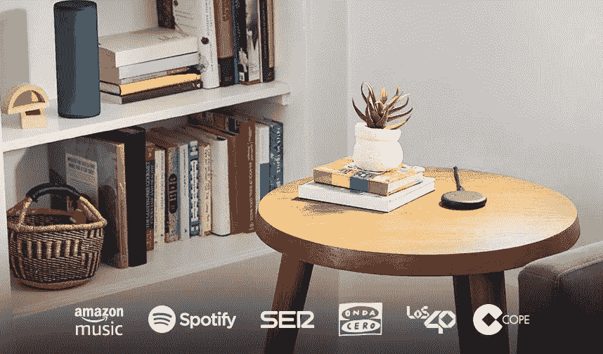

# Echo Input:亚马逊家族的新成员

> 原文：<https://medium.datadriveninvestor.com/echo-input-a-new-member-in-amazon-family-603c12f2ce95?source=collection_archive---------15----------------------->

The new Echo Input by Amazon

就在谷歌停止生产 Chromecast 音频的时候，亚马逊(在西班牙)推出了 Echo Input，这基本上是一款具有相同功能的设备。

家里有几个 Chromecast 音频，我看不出输入有多大意义，但可能会有派上用场的情况。回声输入基本上是回声的简化版本，没有扬声器。

它的使用条件是通过电缆或蓝牙与您已经拥有的扬声器或放大器连接。它值 40 欧元，与 Dot 相比，这个价格对我来说似乎很贵，Dot 有一个扬声器(+ 3.5 音频输出和蓝牙)，你可以在亚马逊以同样的价格购买。如果我们将其与 [Chromecast Audio](https://store.google.com/mx/product/chromecast_audio) 进行比较，那么它的价格是合理的，因为价格是相同的，而谷歌 Chromecast Audio 没有个人助理，但另一方面，谷歌的小工具有光学输出。

以较低的价格，您可以通过语音处理您最喜欢的扬声器。想象一下，你通常使用一个很好的马歇尔扬声器，连接一个回声输入并把它变成一个很酷的智能扬声器是非常容易的。

在家里，我使用 Chromecast 音频连接到我的立体声系统，所以我可以从 Spotify 或任何其他来源将音乐发送到扬声器，从我的手机或通过我的 Google Home Mini。

如果你的个人助理生态系统是 Alexa，那么 Echo Input 是一个为家庭增加新成员的好机会。如果你更喜欢谷歌，Chromecast 音频已经没有了，所以，你无法通过电缆将谷歌 Home 系统连接到扬声器或放大器，因为谷歌 Home 和 Mini 都没有音频输出。

简而言之，亚马逊通过将 Alexa 带到任何类型的扬声器来加强其产品和目录，而谷歌多年来一直在这样做，阻止我们将其助手连接到我们的放大器。