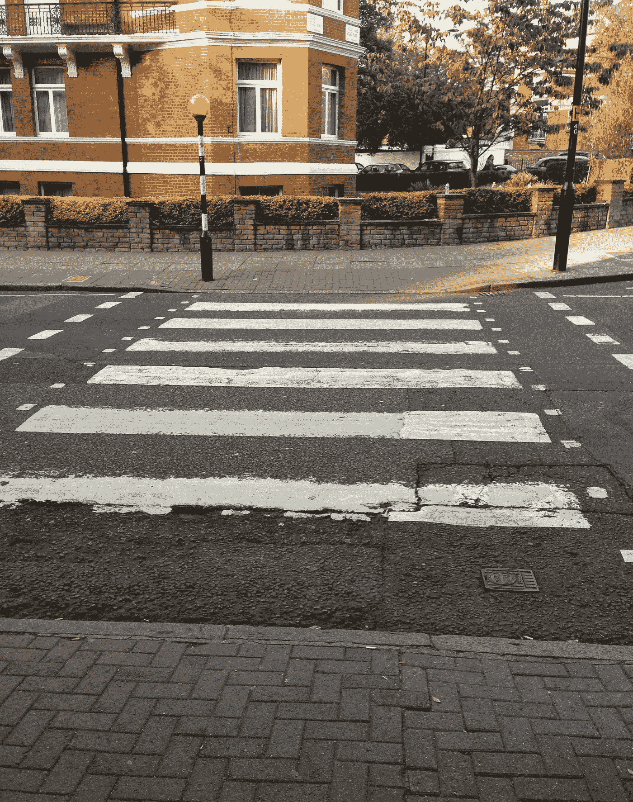

# 灵丹妙药和强化学习-三

> 原文：<https://medium.datadriveninvestor.com/elixir-and-reinforcement-learning-iii-4e7a18b6dd4f?source=collection_archive---------11----------------------->

很久以前在一个很远很远的星系… [第二集](https://medium.com/@marceloreichert/elixir-e-reinforcement-learning-ii-6e55f7e85cfa)。



by

## 我们今天做什么？

我们需要让我们的车骑。这一集我们还是会手动控制。但是，让我们准备好一切，包括智能(RL)，并让它学会找到自己的方式和目标。

[](https://www.datadriveninvestor.com/2019/03/03/editors-pick-5-machine-learning-books/) [## DDI 编辑推荐:5 本让你从新手变成专家的机器学习书籍|数据驱动…

### 机器学习行业的蓬勃发展重新引起了人们对人工智能的兴趣

www.datadriveninvestor.com](https://www.datadriveninvestor.com/2019/03/03/editors-pick-5-machine-learning-books/) 

## 计时器

你应该记得`lib/scenes/environment.ex`文件中的`init/2`函数初始化场景视口、变量和对象。我们将在这个函数中包含我们的计时器，它将每 60 ms 触发一次事件，并更新我们的环境。

```
## lib/scenes/environment.exdef init(_args, opts) do... **# start timer**
  **{:ok, timer} = :timer.send_interval(60, :frame)**...end
```

让我们在`environment.ex`中创建另一个函数来处理由我们的`timer/2`生成的事件。

```
## lib/scenes/environment.exdef handle_info(:frame, %{frame_count: frame_count} = state) do new_state =
    if rem(frame_count, 2) == 0 do
      state |> Car.move
    else
      state
    end graph =
    state.graph
    |> draw_objects(state.objects) {:noreply, new_state, push: graph}end
```

每隔 60 毫秒，就会触发一个`handle_info/2`事件，将`:frame`传递给函数参数 *Info* 。这里有一个名为`frame_count`的新变量，将用于计算更新的总帧数。我们需要将它包含在`init/2`内的`State`地图中。

```
## lib/scenes/environment.exdef init(_args, opts) do... state = %{
    viewport: viewport,
    viewport_width: viewport_width,
    viewport_height: viewport_height,
    graph: graph,
    **frame_count: 0**,
    objects: %{
      car: %{
        dimension: %{ width: 20, height: 10},
        coords: {pos_x, pos_y},
        velocity: {1, 0},
        angle: 0,
        sensor: %{
          left: {0, 0},
          center: {0, 0},
          right: {0, 0}
        }
      },
      goal: %{coords: {20,20}}
    }
  } ...
end
```

## 移动汽车

在`handle_info/2`中，我们还有一个新的`Car.move`功能。让我们在名为`lib/objects`的新目录中的`car.ex`文件中创建这个函数。

```
## lib/objects/car.exdefmodule AutonomousCar.Objects.Car do alias AutonomousCar.Math.Vector2 def move(%{objects: %{car: car}} = state) do
    new_pos = Vector2.add(car.coords, car.velocity)
    rotated = Vector2.rotate({10,0}, car.angle)
    new_coords = Vector2.add(rotated, new_pos) state
    |> put_in([:objects, :car, :coords], new_coords)
  end
end
```

该功能将根据速度和新方向更新汽车的位置。我们需要加入新的函数[来计算矢量的和、减以及旋转](http://blog.wolfire.com/2009/07/linear-algebra-for-game-developers-part-1/)。

```
## lib/math/vector2.exdefmodule AutonomousCar.Math.Vector2 do
  import Math def degrees_to_radians(angle) do
    angle * (Math.pi / 180)
  end **def add({ax, ay}, {bx, by}), do: {ax + bx, ay + by}
  def sub({ax, ay}, {bx, by}), do: {ax — bx, ay — by}** **def rotate({x, y} = vector, angle) do
    angle = degrees_to_radians(angle)
    {x * cos(angle) — y * sin(angle), x * sin(angle) + y * cos(angle)}
  end**
end
```

剩下的就是包含新的`lib/objects/car.ex`文件的别名。

```
## lib/scenes/environment.ex...alias AutonomousCar.Math.Vector2
**alias AutonomousCar.Objects.Car**...
```

如果你现在启动我们的应用程序，`iex -S mix`，我们将在屏幕上看到汽车独自移动，直到它离开我们的环境。让我们试着控制一下。

## 控制汽车

景区触发`handle_input/3`事件。所以我们可以用键盘控制我们的车。让我们给`environment.ex`文件添加一些新函数。

```
## lib/scenes/environment.ex# Keyboard controls
def handle_input({:key, {“left”, :press, _}}, _context, state) do
  {:noreply, Car.update_rotation(state, 1)}
enddef handle_input({:key, {“right”, :press, _}}, _context, state) do
  {:noreply, Car.update_rotation(state, 2)}
enddef handle_input(_input, _context, state), do: {:noreply, state}
```

我们还将在文件`lib/objects/Car.ex`中包含新的函数。

```
## lib/objects/car.exdef update_rotation(state, action) do
  rotation = action?(action)
  put_in(state, [:objects, :car, :angle], state.objects.car.angle + rotation)
enddefp action?(0), do: 0
defp action?(1), do: -20
defp action?(2), do: 20
```

现在，通过运行应用程序，我们可以通过键盘使用左右箭头键来控制汽车。每点击一次箭头，汽车就会向左或向右旋转 20 度。

## 现在呢？

在[下集](https://medium.com/datadriveninvestor/elixir-and-reinforcement-learning-iv-4f94d1b4608d)中，我们将最终开始强化学习的研究，让汽车独自学习其目标的路径。再见。