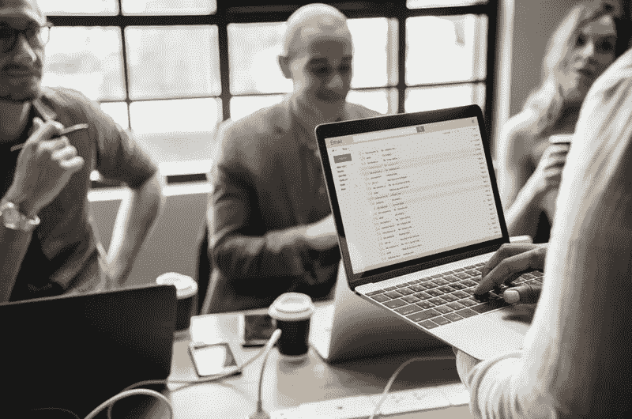

# 电子邮件营销最佳实践

> 原文：<https://medium.datadriveninvestor.com/email-marketing-best-practice-965e3b240aa7?source=collection_archive---------7----------------------->

电子邮件是 21 世纪最好的营销方式之一。每个人和他的狗都有一个或多个电子邮件地址，只需点击智能手机上的一个按钮就可以访问它们。

但是，虽然这使得电子邮件成为一个伟大的营销工具，它也使其极具竞争力。无论你在哪个行业，你都有可能有一个或多个竞争对手了解电子邮件营销的重要性，并且也在使用它。

 [## 在创业之旅中，拥抱学习|数据驱动的投资者

### 好像建立一个数百万美元的公司还不够困难，企业家必须额外照顾他们的…

www.datadriveninvestor.com](https://www.datadriveninvestor.com/2018/10/16/on-the-entrepreneurial-trek-embrace-the-learning/) 

即使你没有竞争对手，一般人每天都会收到大约 15 封新邮件到他们的个人(非工作)邮箱。这使得你的邮件很难脱颖而出。

因此，任何行业的电子邮件活动的典型打开率在一个好的日子里大约是 15%。听起来不多，当然也不多。但通过优化、测试和衡量不同的电子邮件并从中学习，任何企业都可以超过 15%的打开率。

另外。打开电子邮件只是一个目标。第二个目标是让打开你邮件的人采取你希望他们采取的行动——无论是点击你网站的链接，注册网上研讨会，购买产品等等。

也就是说，这并不全是为了获得最大的机会，而是为了充分利用这些机会。

你愿意有 1000 个机会，100 个人从中采取行动，还是一半的机会，两倍的行动者？

正如我所说，关键是测试-测量-优化，这样做你的电子邮件营销结果会不断增加。但也有一些最佳实践，任何行业的任何企业在进行电子邮件营销时都应该遵循。

这些实践会给他们带来更好的结果，还有一些额外的奖励。他们发出的每封邮件的订阅量也会减少，因为他们会打扰更少的人。

可悲的是，每天都有太多的电子邮件纯粹是垃圾邮件，或者说是直销邮件。这些都不行！只会惹恼别人。

所以，事不宜迟，让我们深入探讨电子邮件营销的最佳实践。

# 个性化的

首先，个性化的电子邮件获得了最高的搜索结果。那么我所说的个性化是什么意思呢？最常见的是在邮件的主题和开头使用名字。

这些做得很好，因为它们对接收者来说更突出——只要使用的名字是正确的！

# 频率

企业发送电子邮件的频率至关重要。虽然这篇文章是关于最佳实践的，但是不同的受众和人群喜欢不同的电子邮件频率——所以这是一个测试、衡量和优化的例子。

也就是说，一个简单的经验法则是:

不要发太多！

正如我所说的，这对人们来说意味着不同。一天 1 封应该足够了，然而许多公司(和我工作过的地方)一天可以轻松处理 3-4 封邮件。

# 重复

无论你的电子邮件频率是多少，你都希望避免在邮件中重复相同的内容。根据你正在开展的活动，你可能会在一周内发送 5 封以上目标相同的电子邮件——也许是为了推广新产品。

关键是不要重复邮件内容。最起码，你要改变每一个主题。但理想情况下，你想更进一步。您的电子邮件通常会是这样的:

简介(个性化！)

识别读者的问题

给出价值，建议如何克服

提供解决方案

行动呼吁

因此，到目前为止，最好的做法是为发出的每封电子邮件更改这些部分中的每一个。这很容易转化为大量的工作。我认为可接受的变化水平是改变主题、介绍和价值。问题、解决方案和 CTA 可以相对保持不变。

# 长度

接下来，我们有电子邮件的长度。现在，这又是一件需要测试、测量和优化的事情。因为不同的受众和人群会喜欢不同长度的电子邮件。

话虽如此，仍然有一个普遍的经验法则。

一封电子邮件应该总是很短——为我重复描述的每一部分写一段。

然而，应该影响总长度的是行动号召。如果你要求某人点击一个链接来访问你的网站，你的要求并不高。因此，你的电子邮件可以相当短。

但是，如果你想卖一个 10，000 美元的产品。即使考虑购买，你的电子邮件也需要更长。

# 价值

正如我在重复中提到的，价值是所有电子邮件的关键部分。我所说的价值是指免费向读者提供有用的信息和资源。每封邮件都应该给出某种价值。在 21 世纪，价值对于任何企业、任何行业和任何领域的成功营销都是至关重要的。

如何给出价值可以通过不同的媒介来改变。视频/网络研讨会的链接是一种很好的展示价值的方式。附上电子书和其他文学作品也很好。或者简单地在电子邮件内容中包含提示。

总是给予，你总会从邮件中有所收获。

# 分割

很有可能，你的企业会销售不止一种产品/服务，满足不同的需求，解决不同的问题。因此，你也会有不同的目标受众。

在可能的情况下，你需要对你的邮件列表进行细分，以确定人们有哪些问题，从而为他们提供哪些产品/服务。

这将允许你只向那些人发送带有报价和感兴趣的价值的电子邮件，而不是向所有人发送报价，你知道其中一半人你不感兴趣。

# 净化

正如我在文章开头提到的，或多或少每个人都有一个电子邮件地址——很多人有好几个。有些他们每天都用，有些却被忽视了。可悲的是，许多其他人被黑客攻击并接管。

这就是为什么经常清理你的邮件列表是必要的。清理意味着识别哪些电子邮件与您发送的电子邮件无关。如果一个电子邮件地址在 3 个月内没有打开过一封邮件，你就想扔掉它。

现在需要清理的数字可能很快就会变高，你自然会犹豫要不要清理掉。但是，这又是关于质量超过数量的问题。如果只有 100 个人打开你的邮件，那么拥有 1000 个邮件地址就没有意义了。

另外，你发出的没有被打开的电子邮件越多，你的域名声誉就会越差——你的更多电子邮件将会出现在垃圾邮件和垃圾文件夹中。

每个季度清洗一下就好了！

# 行动呼吁

最后但同样重要的一点是，每封电子邮件都需要在结尾呼吁采取行动。但是以特定方式组织的行动调用表现更好。

首先，你希望人们通过你的电子邮件采取的行动需要非常清晰，易于遵循。

其次，提醒人们如果不采取行动会发生什么。在你的邮件的前面，你会发现读者的问题——引导一个 CTA 去解决它。所以只要提醒人们，如果他们不采取你指定的行动，这些问题不会消失。

第三，对行动呼吁设置某种限制。这可以采取多种形式。一种方法是设置一个计时器——比如说，你的提议只在接下来的 24 小时内有效。另一种方法是在你提供的任何东西上提供有限的空间——新产品/服务、网上研讨会、活动等。

这造成了稀缺，意味着人们意识到他们必须尽早决定采取行动。

通过遵循这 8 个最佳实践，你很快就会发现你的电子邮件活动产生了更高的结果——在打开、点击和采取的行动方面。