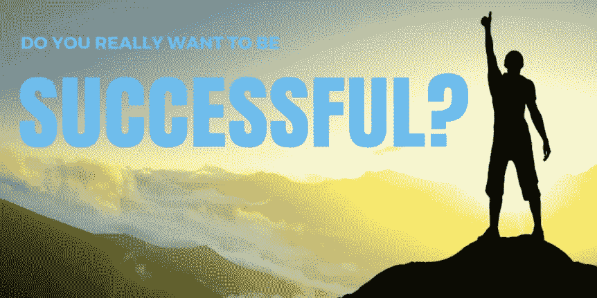

# 企业家成功指南

> 原文：<https://medium.datadriveninvestor.com/entrepreneurs-guide-to-success-7b81b8f011fb?source=collection_archive---------5----------------------->

***“Success comes to those who work for it, not wait for it” — Avy Loren-Cohen***

“谁说生活应该是轻松的？”Avy Loren-Cohen

*“如果成为企业家很容易，每个人都会成为企业家。”— Avy Loren-Cohen*

这是我经常与我的客户交流的几个短语，无论是一家初创公司或上市公司，其首席执行官是经验丰富的，还是年轻的新首席执行官。作为一名企业家，许多创业公司的一部分，以及一名商业咨询和教练，我从中学到的是，一些最有经验和最年轻的新任首席执行官在作为企业家方面非常相似——无论年龄、教育、宗教、肤色、地理等。在许多方面——当然不是每一方面。

那么这和我的主题*企业家成功指南*有什么关系呢？我将与你分享一些企业家通常经历的常见问题，以及如何处理这些问题，从中学习和发展。

请注意，这可能不适合每个人，如果你有你的建议或意见，请随时添加到这篇文章中，并与大家分享，以帮助我们所有人获得更好的创业体验和整体生活。

## 企业家和初创公司成功排行榜

## **关键性格特征**

我了解到，大多数成功的领导者、企业家、首席运营官和首席执行官都有以下五个关键的性格特征

*   对自己的信心。如果你不愿意，谁愿意？成为一名企业家或初创公司的创始人就像坐过山车一样，会有起有落。这是一段令人兴奋和恐惧的旅程，但这是你为自己的职业或业务掌舵所付出的代价。如果你不喜欢这样，为别人工作，让他们赚大钱。所以，为你的人生旅程做好准备，你将不得不挑战自己，承担风险，面对恐惧，学会如何对自己的言行负责。
*   对你正在做的事情充满激情。充满激情的企业家和/或初创公司的创始人往往比缺乏激情的人更容易成功。事实上，在我多年向投资者推销、指导创始人如何推销和与风险投资公司合作的经历中，以及作为风险投资公司([学术技术风险投资](http://academictechventures.com/))的一名成员，激情和真实的创始人可以决定初创公司是否获得投资。如果你对自己的创业没有热情，为什么一开始就要去做呢？是的，钱……但是来吧，要兴奋，不要对钱(将来会有的)充满激情，而是对你在做什么和为什么做，你如何帮助别人，销售一个伟大的服务或产品——无论什么——要兴奋和充满激情。
*   绝对**承诺**。我所看到的是，创始人和首席执行官通常会做大多数人不会做的事情，而其他人都在休息、睡觉或做其他事情。我举的例子是一家初创公司的创始人，他也是一名程序员。他的团队正在开发一个可交付的产品，必须在下周一提交，也就是周五下午。他得到消息，团队没有完成交付成果，而且“他们”也不可能完成。这位创始人夜以继日地在办公室亲自完成所有的工作，然后在周一早上将工作提交给团队——令他们惊讶的是，工作完成了，而且没有错误(因为他们有时间检查)。需要注意的是，这是每一个创始人都应该具备的，也是每一个投资人都看重的“承诺”和奉献的类型。
*   知道如何将**与**区分优先顺序。如果一个人知道他们的优先事项是什么，他就能够将适当数量的资源分配给需要它的领域，并给予适当的关注和注意。在一家初创公司中，销售是公司的引擎，在一开始，牵引力和销售是必不可少的——这是最低可行产品(MVP)和概念验证(POC)——尤其是当它与一家科技公司相关时。因此，如果一个人将重点放在创造销售作为优先事项，您可以最好地将人力、实物资产和货币资源分配到这项工作中，以尽快产生销售结果，而不包括质量、价值、诚信和绩效。
*   **代表团&组织**。企业家、初创公司创始人和高管都需要掌握的两个方面。被**组织**是专注过程的一个分支。如果你能整理好你的周围环境，比如你的办公室、你的电脑桌面、文件归档系统以及你的电子邮箱、你的 iPad、智能手机等等。这将有助于减少浪费的时间。它就像一个合适的建筑基础。使用有用的应用程序或软件来帮助组织你的待办事项列表(如[的事情](https://culturedcode.com/things/))、你的约会和会议安排(如[日历](https://calendly.com/))，或者更好地管理你的社交媒体活动(如 [AgoraPulse](https://www.agorapulse.com/) )，或者帮助组织你的想法(如 [Evernote](https://evernote.com/) )，还有一个[数字虚拟个人助理](https://en.wikipedia.org/wiki/Virtual_assistant)(如[谷歌助理](https://assistant.google.com/intl/en_ca/))是一些帮助你变得更有组织性和效率的例子。**授权**是另一项许多人都不擅长的技能，因为他们往往没有意识到他们正在做每件事，或者他们有一种心态*“如果你想把事情做好，就自己去做”*。事实是，如果你有有能力的人力资源——使用他们，如果你能负担得起——雇用能帮助你的人。适当的授权可以让个人压力更小、效率更高、成果更多。是的，一路上可能会有一些坎坷，但从长远来看，这是值得的。在这种情况下，一个人别无选择，只能为自己做一切，因为他们还没有员工——对此我有一个建议。如今有许多自由职业者可以利用个人虚拟助理 T21 来完成你可以外包的各种任务。而且价格合理。他们可以在像 [Fiverr](https://www.fiverr.com/) 、[Care.com](https://www.care.com/personal-assistants)、 [Frelancer.ca](http://www.freelancer.ca) 、 [UpWork](http://www.upwork.com) 和 [Guru](http://www.guru.com) 这样的网站上找到，但还有更多网站。
*   坚定不移的**专注**。似乎是显而易见的，但许多人可能会分心或偏离轨道，而没有意识到这一点。我想起了一个故事(我忘了这个人是谁了)，一位年轻的首席执行官告诉他的团队，他将开始单独“专注于”与公司增长有关的所有事务以及几乎所有其他事情——他将委托给其他人，或者将其放在“待办事项列表”中以供将来考虑。这种对增长的坚定不移的关注使这位首席执行官能够迅速扩大他的公司，这是我以前从未见过或听说过的，也是自那以后从未听说过的。这并不意味着每个人都应该过度专注于一件事，但它确实说明了我关于专注的观点。
*   有一个**私人关系**或项目经验。如果一个企业家经历了痛苦，并以产品和/或服务的形式提出了一个解决方案，以组建他的新创业公司，他/她就会受益。当创始人来自这种个人经历时，他们通常会深刻理解客户真正真正需要和想要的是什么。这给了初创公司成为成功故事的额外优势(所有条件都相同)，因为他们与目标受众联系并了解客户来自哪里的能力，使初创公司能够提供卓越的客户服务、出色的用户体验和更好的价值主张。
*   一个企业家必须有**决心**——正如一个人所描述的，他有坚定或不可逆转的意图去实现想要的最终目标。就企业家或初创公司的联合创始人而言，决心实现梦想、愿景和目标的人往往比没有决心的人更成功。俗话说，*“不择手段”*——意；为了达到目的不择手段。我绝不会建议*“任何手段”应该暗示或被定义为任何非法或不道德的行为或活动——但*【几乎】*一切可能更现实。*
*   ***适应性**和**灵活性**。这些特质在初创企业中尤为重要，因为创业者必须身兼数职，因此需要履行各种职能来创建公司。我有许多客户带着奇妙的想法来找我，这些想法通常涉及编程、编码和其他技术技能。这些商业想法的问题是，没有一个客户在建立他们的想法所需的任何关键技能方面有任何经验——结果，这些企业家正确地决定推迟他们的创业，直到他们获得了正确建立公司所需的知识。我向许多客户建议，如果他们希望进入这个领域，他们要么必须对所需技能有一定程度的了解或理解，如果可能的话，我建议他们参加一门或多门基础课程——通常，我会介绍他们去 www.coursera.org 的[或 www.edx.org 的](http://www.coursera.org)[因为他们提供世界各地顶尖大学的大规模在线开放课程(MOOC ),而且价格非常实惠。这种知识使得企业家和创始人不会被雇员、自由职业者或这些服务的供应商利用。如果一个或多个核心团队在技术上精通这些技能，这将是一个更明智的举措。](http://www.edx.org)*
*   *强大的财务能力。这意味着你不需要成为一名会计师或财务规划师，但你应该能够轻松地创建电子表格、预算和预测，并且了解资产负债表、损益表、损益表等基础知识。你不需要精通比率，只需要掌握基本知识，这样你就可以知道你的企业在哪里以及如何运作，而不必依赖其他人。*
*   *能够平衡有效的**计划**和**战略** **思维**与完成工作。太多次了，不分学历，学校，地域，年龄等等..许多人的耐心和技能有限，无法成为战略思考者和计划者。作为一名专门研究商业战略的商业顾问，我认为这是一种结合了生活经验和教训、正规教育和基于个人智力设计和能力的技能。在每一种情况下，商业战略家都必须考虑许多不同的因素，无论是创新、运营、效率、环境、定价、销售、分销、增长、客户忠诚度、品牌忠诚度、数字战略、市场营销……大多数人在规划商业战略时对未来的看法都是有限的(狭隘的)。这就是为什么我强烈建议你认真考虑与商业策略师合作，帮助你为公司的长期发展和未来制定一个可靠的计划，因为他们有能力看到对业务和生命周期更全面的理解——无论是深度还是广度。*

## *失败:*

*我坚信失败是生活和商业中长期成功的一部分。事实上，在大多数情况下，失败的人倾向于将这次经历作为一次教学或人生课程，并铭刻在他们的大脑中——通过了解早期预警信号(EWS)以及如何在第一时间防止这种情况，帮助他们在未来防止同样的糟糕经历。这些人也倾向于用他们的经验来帮助他人，这样他们也能从中受益。*

*我认为，成功人士接受失败是创业过程的一部分，并以某种方式接受失败，这并不意味着这个人是一个失败者，而是行动或尝试不够完美，他们可以从中吸取教训，然后改进、修改或干脆完全扼杀主动性。有趣的是，我共事过的许多经验丰富、睿智的企业家和首席执行官都谈到了他们的失败，以及他们如何从这些经历中受益，因为这些经历使他们成为更好的思想家和战略家。*

## ***被烧伤**:*

*这可能是“失败”的一个分支，但在这种情况下，我指的是一个人在职业生涯中经历了一次关键的、潜在的破坏性或有害的经历，这个人在商业中受到了严重的伤害，以至于这个人可能面临临床抑郁症、精疲力竭、焦虑和其他心理问题的风险。在商业中，我们用合同和协议来保护自己，如 NDA 等。，但正如一句老话所说——“那么起诉我”，意思是，一份合同或协议只有在签署该文件的人或公司的诚信情况下才有效。最终，如果你没有准备好或者没有能力对肇事者提起法律诉讼，那么这张纸只值它的回收价值。*

*我有一个客户被他所谓的“合作伙伴”和“密友”严重烧伤，因为他谎称有一个欺骗性的计划来重组公司并欺骗现有投资者。长话短说，我的客户最终被董事长解雇了，因为他建议董事长和创始人采取 CEO 的行动，却不知道董事长也参与了这个诡计。最终结果是，我的客户陷入了大约两年的深度抑郁。他的信心崩溃了，动力丧失了，对商业和创业的热情几乎荡然无存，他的声誉也因为他的前合作伙伴对其投资者的诽谤而受损——其中许多投资者是他认识的，或者是他带到了公司。他的未来看起来很黯淡，这个人所能做的就是消极地看待*他生活中唯一被认为是好的部分，那就是他唯一的运气是无论去哪里都能找到停车位。事实上，他说的是*“如果我没有停车的运气，我就不会有任何好运气”。***

*这是非常令人担忧的，他的妻子让我和他一起努力，让他振作起来，树立信心，并热情地找回自我。这是我用来帮助我的客户在八个月内重建的公式的一部分。*

*改变他的心态，从告诉他不要以一种他永远不会让别人对待他的方式对待自己开始。这意味着他不能再轻视自己，贬低自己，这包括永远不要告诉自己*“如果我没有停车的运气，我就不会有任何好运”*。这样做的原因是为了重新训练他的大脑，使其不再消极地思考自己的生活和未来，从而改变他的精神面貌。*

*b-他再也说不出“我不能”这几个字了，这让我想起了 2008 年由[金·凯瑞](https://en.wikipedia.org/wiki/Jim_Carrey)主演的电影《[应声虫](https://www.imdb.com/title/tt1068680/)》，在这部电影中，一位励志演说家告诉观众，为了一个人生活中更积极的改变，永远要对每一个机会或情况说“是”……事实并非如此，但这个想法是，不相信她/他的自我，他应该首先相信他能够做，能够实现，能够成功，并说“是”作为第一反应，是的，我能，或者至少我会弄清楚我如何能，而不是我如何不能。*

*他不得不开始照顾自己，从饮食开始，晚上睡个好觉，并把每天的锻炼纳入日常生活。这三个因素有助于提高他的个人价值感，随着他“完成”一些减肥，他觉得自己的身体状况更好了，而且随着休息得更多，他发现自己的整体态度变得更积极，注意力更好了(根据他的孩子)，专注和完成任务的能力提高了(根据他的妻子)等等。这些天来，他小了 4 号牛仔裤，身体和精神都非常健康——这不是一个短期的解决办法，而是整体长期思维的改变。*

*改变她/他在任何屏幕上听的和看的内容。不再有会给他带来压力的电视(或网飞)节目或电影，那些消极的，可怕的，等等…不再有新闻节目，因为这又一次带来了更多的压力——持续的负面新闻，我的 CNN 版本(开玩笑)。我们没有采用上述方式，而是用创造笑声和快乐的娱乐节目来代替，如《生活大爆炸》、《布鲁克林九个九》(Brooklyn Nine-Nine)、《摩登家庭》、《好汉两个半》( Two and Half Men)等情景喜剧，以及其他不包括节目中有压力的交叉点或包括可能给他带来额外压力的过于严肃的内容的节目。请记住，这不是一个长期的解决方案，这可能是所谓的愈合期。后来，由于他能够控制自己的压力和焦虑水平，他能够将常规电视节目重新融入自己的节目中。*

*还结合了其他策略，包括正念、同伴、朋友和家人的反馈，以建立自信和形象。他最终回到了企业家的世界，并通过最初向朋友和熟人提供免费咨询服务，慢慢地重建了自己的信心——这导致了他的职业转变，他进入了咨询行业，然后在加利福尼亚州硅谷的一家科技公司担任首席执行官。*

***拒绝***

*无论是一家寻找投资者的初创公司，进行第一笔交易或销售，还是从朋友、家人或银行获得贷款…你肯定必须习惯于会有大量拒绝的想法——这一点我可以向你保证，就像我可以向死亡和税收保证一样。但这是作为一名企业家非常重要的一部分，尤其是作为一家初创公司的一部分，这里的一切都是新的，未经证实的，时间和资源非常宝贵。让我这么说吧，如果你没有准备好接受拒绝，那么你要么学习如何接受，要么重新考虑你的角色，这需要你有这样的经历。对许多人来说，拒绝的有趣之处在于，随着时间的推移，它会变得更容易，因为你意识到大多数时候这不是针对你个人的，也不是对你的反映。另一个事实是，随着实践和经验的积累，你了解了人和沟通的艺术，你学会了如何处理会(在过去)导致拒绝的负面反馈，而在未来，你将能够有效地将结果转化为积极和成功的结果。*

***少报&超额交付***

*这是我不断向我所有客户宣扬的一个话题。因此，在商业和日常生活的各个层面上，许多人都倾向于夸大其词，而没有意识到这一点，结果是表现不佳。无论是预测、预算、与风险投资公司、银行、投资者、客户、分销伙伴等合作。一般来说，适度地少报和多报会更好。我相信很多人都经历过我想在这里传达的东西，但我怎么强调这在商业中的重要性都不为过，尤其是当它涉及到一家初创公司及其创始人的时候。我见过太多的创业者因为没有遵循这条建议而付出代价。事实是，人们有时会忘记考虑“墨菲定律”**这句格言，任何可能出错的地方都可能出错。无论你如何划分，创始人声称达到他们的里程碑需要多少时间，寻求(通常是足够的)资金/投资来支付他们列出的资金使用，程序员预测需要多少天或多少小时来完成他们的任务——他们都倾向于脸上挂着蛋。我认为发生这种情况主要有两个原因，一个是过于自信，另一个通常是因为这个人不希望要求更多或突破极限，所以他们选择了最乐观或最好的情况。无论如何，永远要给你的计划或承诺留有足够的缓冲空间，考虑到生活中的*【未知】*或*【倒霉事】*。请记住，如果你超额完成任务，很少有人会不高兴。***

***增加&多动症***

*作为我实践的一部分，包括高管业务绩效辅导，我与许多患有成人[注意力缺陷障碍](https://www.additudemag.com/adult-test-for-add-adhd/) &注意力缺陷多动症(ADD & ADHD)的企业家合作。我发现绝大多数人(我的客户中有 70%)都是注意力缺陷多动症患者，因为他们被企业家精神、创业、广告、营销和销售所吸引。根据我多年来的观察和了解，多动症在很多方面对企业家来说是非常有利的，比如维珍帝国的理查德·布兰森爵士、宜家创始人英格瓦·康普拉德和捷蓝航空创始人大卫·尼尔曼等等。比如高度专注、敢于冒险、创造力、社交能力强、(通常是无尽的)精力、高度好奇的天性以及善于头脑风暴。*

*患有多动症的陷阱可能包括但不限于过度集中——为什么？你可能目光短浅，忘记所有其他的事情、人、承诺和时间——时间管理和组织是两个关键的弱点。其他弱点包括冲动，这是一个需要注意和战略思考和沉思的问题。易怒和不耐烦是开会时的主要问题，试图教一个新手，等等——通常是由于个人的大脑工作速度太快，其他人跟不上，这使多动症患者感到沮丧(有很多比这更重要的，但为了简洁起见，我会在这里停下来。请随时与我联系，更详细地讨论这个问题和任何其他主题)。对于患有多动症的人来说，帮助你在商业上成功的一个有效策略是雇佣一个专门研究多动症的商业教练。*

***从初创公司 CEO 到真正 CEO 的转变***

*如何成为一名首席执行官并不是一个你可以简单地去大学上一门课程或一组课程就能成为首席执行官的角色。我曾辅导过许多新的和年轻的首席执行官以及首席运营官的首席执行官，帮助他们理解自己的角色、目的，以及如何与媒体、投资者、员工等不同的受众沟通和表现自己。需要指导的部分是首席执行官的个性以及首席执行官的行为方式。这通常与自尊、自我形象、[骗子综合症](https://en.wikipedia.org/wiki/Impostor_syndrome)和/或[邓宁-克鲁格效应](https://en.wikipedia.org/wiki/Dunning%E2%80%93Kruger_effect)有关。个人需要时间来拥有自己的角色，扮演角色，成为公司的天生领导者，并激励员工和投资者跟随，因为不是每个人都能像脸书首席执行官[马克·扎克伯格](https://en.wikipedia.org/wiki/Mark_Zuckerberg)那样完成转变。另一件要考虑的事情是，也许你不是自己公司 CEO 的最佳选择。这是一个艰难的决定，但一个好的创始人/所有者会意识到，公司未来的增长和成功将在很大程度上取决于一个好的领导者和首席执行官，因此，痛苦的正确决定是聘请一位首席执行官，并在公司担任一个情人头衔的职位。同样，为了达到最佳效果，找一个导师或雇佣一个，如果可以的话，找一个同时是教练和导师的人，因为他们会给你的角色和挑战带来更广阔的前景。*

*让你周围都是优秀的人*

*我有一个说法，所有者、创始人、首席执行官等应该围绕在他们周围(雇佣)那些补充他们技能、提供不同观点、有不同背景的人。我甚至建议他们找一些完全相反的人，因为他们可以提供非常公正的观点和非常有趣的视角，更不用说激烈的讨论了。一天结束时，一个聪明的企业家(或领导者，首席执行官)等。)会寻求他人的意见和知识，而不担心或担心他们可能更有能力、更有知识或更聪明。我坚信，是人可以成就或毁灭一家公司，所以要明智地选择，不要陷入雇用与你相似或非常相似的人的陷阱，因为这感觉很好……这不一定适用于合伙人和共同创始人，因为你们必须有相似的价值观和信仰，如果需要的话，当你们不在时，你们可以无缝地融入对方。但即使在这种情况下，你也可以把它与年龄、地理或文化混为一谈，因为他们的观点自然会与生活经历不同。*

***关注客户，更高的目标——少花点钱。***

*我总是建议初创公司的创始人和企业家，在任何事情之前都要关注客户和他们的满意度，因为如果客户满意，企业就会健康发展，并有更大的可能性获得巨大成功，并随着时间的推移而持续下去——一切都是平等的。我发现，那些只关注底线和短期盈利能力的公司往往无法实现其财务(收入和增长)潜力。为什么？因为这一切都是为了钱！虽然我明白，我的意思是这毕竟是北美…但我是这样看的，我的客户中有多少人将他们的成功归功于专注于客户需求和体验。如果你让顾客高兴和满意，你就会有忠诚度——你也会赢得想要的短语“品牌之爱”，在满意的消费者和品牌之间存在情感和激情的关系。想想苹果和星巴克，它们在同类品牌中一直以最高的 NPS ( [净推广分数](https://en.wikipedia.org/wiki/Net_Promoter))领先于同类品牌。这是一家拥有强大而根深蒂固的价值观、明确的目标以及相当于清晰个性的行为方式的公司，这有助于人们真正感受到他们了解你，进而信任你的公司，与你建立联系，并希望喜欢你的公司，成为一名忠诚的客户——即使没有忠诚度奖励计划。*

*我还可以继续，但是我相信我没有重复许多其他作者以前写过的东西，我已经涉及了与常规有些不同的观点。我祝愿你们在个人和职业上取得巨大成功，并一如既往地欢迎你们的反馈。*

*我是 Avy，我为全球不同行业的公司提供战略业务咨询和高管培训服务。我与初创公司和创始人一起工作，与上市公司的首席执行官一起工作，当我们一起克服障碍时，我帮助公司和高管带着尊重和自豪实现他们的个人和职业目标。在过去的 10 年里，我共同创立了三家公司，目前是一家科技公司的联合创始人和首席运营官/首席市场官，作为天使投资人投资了一些早期初创公司，担任了一家美国风险投资公司的顾问，并指导了数百名个人和初创公司。欲了解更多信息，请访问 www.avylorencohen.com*

*我也鼓励你把这篇文章分享给你认为能从中受益的每一个人，因为它可能会对很多人非常有用。*

**

*Please share this article*

***关注我:***

*推特[https://twitter.com/AvyLorenCohen](https://twitter.com/AvyCohenBizWiz)*

*https://www.facebook.com/AvyLorenCohen 的脸书*

*领英【https://www.linkedin.com/in/avyloren-cohen/ 领英*