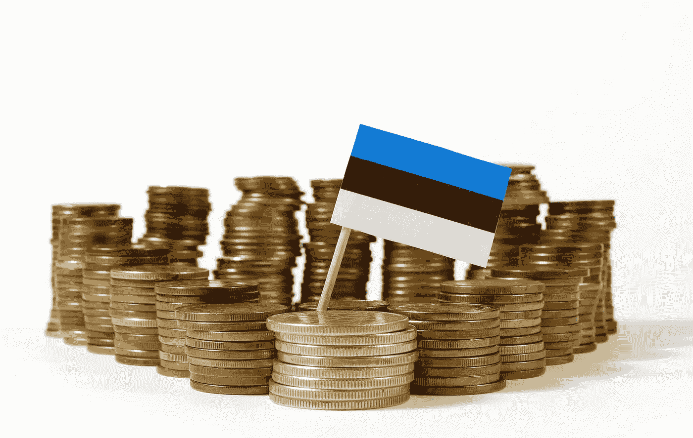

# 解释爱沙尼亚的公司税收制度(外行问答)

> 原文：<https://medium.datadriveninvestor.com/estonias-corporate-tax-system-explained-questions-and-answers-for-laypersons-6b99d6361ec?source=collection_archive---------1----------------------->

爱沙尼亚提供了优惠而独特的税收政策，这也是**导致许多密码公司选择该国开展业务的三个主要原因之一。要发现另外两个论点，请看这里的。**

由于爱沙尼亚公司税收制度的独特性，我的目标是提供一个**爱沙尼亚公司所得税**的详尽概述。

用简单的英语写关于税收的文章很有挑战性:希望一些问题和答案能有助于把事情说清楚。我尽量避免使用技术术语或复杂术语:出于这个原因，请注意我可能做得过于简单了。

# 企业收入是如何确定的？

一家爱沙尼亚常驻公司**从其全球收入**中缴纳利润(分配情况，请见下文)**税。**

非居民的常设机构(PEs)只对来自爱沙尼亚来源的分配利润征税。根据《经合组织所得税和资本税示范公约》*,“常设单位”系指企业全部或部分开展业务的固定营业地(第 5 1 条。常设单位可以是管理机构、分支机构、办事处、工厂、车间……(第 5 条第 2 款)。)*

# *爱沙尼亚公司交多少税？*

*简短的回答是:“视情况而定。”这种可变性并不意味着爱沙尼亚税收环境的不确定性。*

***两种情况可能适用**，每个公司选择最符合其战略计划的一种。*

## *场景 1:不分配红利*

*在这种情况下，公司利润免缴公司所得税(CIT)，因此**CIT 税率为零**。这项免税包括主动收入(如交易所得收入)和被动收入(股息、利息、版税等所得利润)。这项免税还包括出售资产的资本收益。*

## *场景 2:分配红利*

*在这种情况下，就产生了缴纳所得税的义务。确切地说，**分配的利润应按照利润分配净额**的 20/80 缴纳 20%的所得税。在所有其他欧洲司法管辖区，对毛利征收企业所得税。爱沙尼亚使用不同的系统。鉴于**对净分配**征收企业所得税，适用 20/80 的税率:首先对净分配进行汇总，然后征收 20%的企业所得税。*

*举个例子会有帮助:*

*   *毛利:70 万欧元*
*   *毛利决定分配:70 万欧元*
*   *需缴纳的公司所得税:175，000 欧元(700，000 x 20/80)*
*   *支付给股东的股息:56.5 万欧元(70 万至 17.5 万英镑)*
*   *将保留在公司账户上:无(700，000–175，000–565，000。)*

*简单来说:**赚取利润本身并不产生所得税责任**。只有当赚取的利润分配给股东时，这种情况才会出现。就公司实体而言，纳税期为一个日历月:必须在下个月的 10 日之前提交所得税申报表并支付所得税。*

*该税收制度适用于爱沙尼亚居民公司和在爱沙尼亚注册的非居民公司的 PEs。*

# *我在某处读到爱沙尼亚实施了 14%的所得税:是真的吗？*

***是的**，即使有限制。*

*从 2018 年开始，**在特定条件下，适用 14%的企业所得税税率**。如“20%的所得税税率”在技术上意味着“净分配的 20/80”，“14%的所得税税率”必须理解为“净分配的 14/86”*

*公司可以使用较低的企业所得税税率，达到前三年股息的平均总和(T12 )( T13 ),因此——现在很清楚了——只考虑在爱沙尼亚纳税的分配利润。任何在爱沙尼亚免税的支出，如收到的股息收入，不应计算在内。*

*超过前三年分配利润总和的部分仍按 20%的税率征税。*

*如上所述，新规则于 2018 年 1 月 1 日生效，因此考虑的第一个财政年度是 2018 年。2019 年，从 2018 年起，将对三分之一的已分配利润适用 14%的税率。2020 年，14%的税率将适用于 2018 年和 2019 年的三分之一已分配利润。*

*请注意:对于 2018 年注册成立的公司，法定的 20%企业所得税税率将适用于其第一年产生并于 2019 年分配的利润。2020 年，从 2019 年起，将对三分之一的已分配利润适用 14%的税率。2021 年，公司将对 2019 年和 2020 年的三分之一分配利润适用 14%的税率。*

# *股息需要缴纳预扣税吗？*

*一般来说，**没有**。但是，分配利润并支付降低的 14%所得税的公司**还必须从支付给居民和非居民自然人的股息中扣缴 7%的所得税**。*

**

# *爱沙尼亚是否需要缴纳地方所得税？*

***没有**。爱沙尼亚不征收市政或地方所得税。*

# *增值税呢？*

***增值税标准税率为 20%。***

*一些商品和服务(书籍、某些期刊、某些药品和医疗设备以及住宿服务)适用 9%的降低增值税率。*

*一些交易需要缴纳零税率(0%)的增值税。其中，零增值税适用于货物出口和欧盟内部供应、跨境 b2b 服务、与出口和进口相关的运输服务。*

*最后，一些交易**免缴增值税**(证券和金融服务、保险服务、租赁费及其他。)*

**免责声明。我们已经尽了最大努力来验证本作品中包含的信息的准确性。所有信息在作品出版时被认为是正确的，但在阅读时可能是不正确或不完整的。作者对此处包含的信息、其解释或对其的依赖不承担任何责任。本文不应被解释为任何形式的推荐、认可、意见或批准。**

**本作品仅供参考，不得用于法律目的。在根据所提供的信息采取行动之前，应始终寻求法律建议或其他专业咨询。**

**原载于 2018 年 3 月 19 日 www.datadriveninvestor.com**T21*[。](http://www.datadriveninvestor.com/2018/03/19/estonias-corporate-tax-system-explained-questions-and-answers-for-laypersons/)*