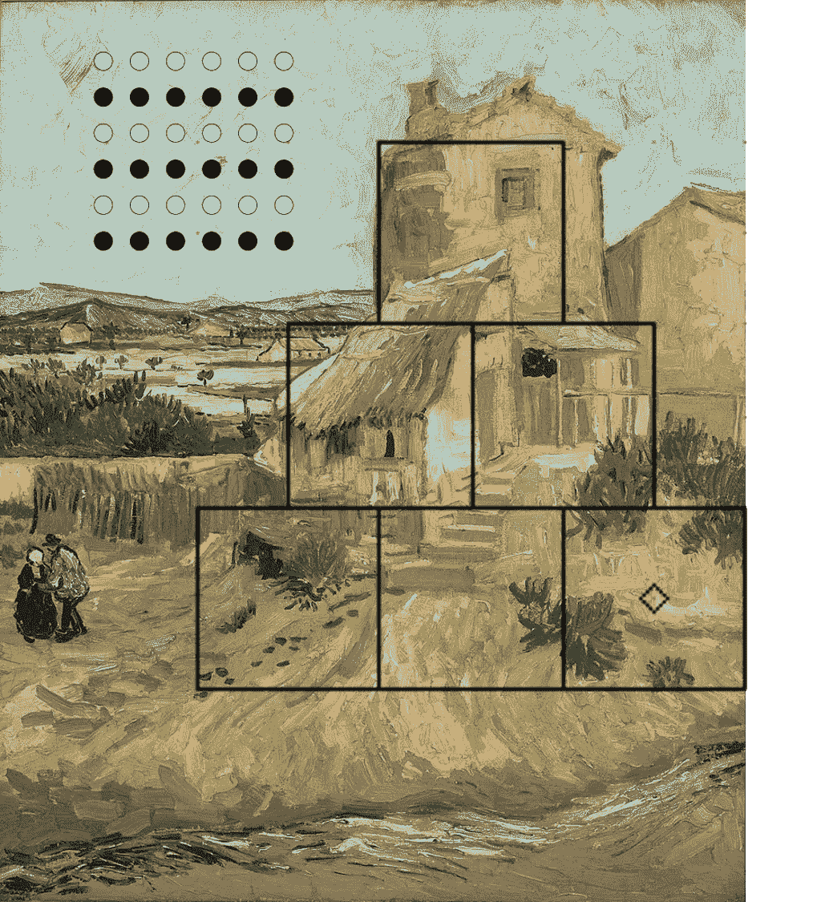

# 探索荷兰燃烧发电厂的近期历史。

> 原文：<https://medium.datadriveninvestor.com/exploring-recent-history-of-combustion-power-plants-in-the-netherlands-with-multi-index-dataframes-53ac95c1aaca?source=collection_archive---------17----------------------->



Hierarchy and the painting The Old Mill (1888) by Vincent van Gogh

## 第二部分。乍一看很吓人，但内心毛茸茸的。关于为什么应该使用多索引(等级)数据框的说明。

下面我简要介绍一下我对多索引数据框架的看法。结果见第 1 部分。如需代码，请点击[这里](https://github.com/pol690/Dutch_Power_Plants)。如果你正在寻找一个好的入门教程，我可以强烈推荐你[这个](http://www.zaxrosenberg.com/pandas-multiindex-tutorial/)或者[这个](https://jakevdp.github.io/PythonDataScienceHandbook/03.05-hierarchical-indexing.html)。

如果你和我一样对时间序列分析感兴趣，你总是会很难找到以最具代表性的方式添加时间维度的方法。事实上，我仍然记得我第一次尝试探索一个相当大规模的时间序列数据集时，我是多么沮丧地决定要做什么才能不失去与数据的时间特性的联系。如果我告诉你，现在我确信多索引数据框架是实现这一点的最佳方式，会怎么样？

我们的大脑可以感知 3 个(甚至更多)维度，那么为什么数据框架只限于 2D 呢？这可以理解地与降维的想法相矛盾，但是在某些情况下，不要过度强制降维是好的。

多索引的功能在熊猫身上已经成长了相当一段时间，但我仍然有一种感觉，它没有获得足够的信任。

让我来解决一个多索引新手的主要焦虑:多索引数据帧似乎很难处理。然而，没有什么能离现实更远。这里有一些强大的盟友来帮助你。

[*盟友一号。分组依据。*](https://pandas.pydata.org/pandas-docs/stable/generated/pandas.DataFrame.groupby.html)

该功能有效地允许数据帧级别之间的快速和无痛切换。

[*盟友二号。堆叠/拆分。*](https://pandas.pydata.org/pandas-docs/stable/generated/pandas.DataFrame.stack.html)

厌倦了多重索引？带着你想要的任何索引去 2D。

*盟友三号。熊猫的其他功能。*

在最近的版本中，许多 python 函数都有一个“level”参数，它指定了应该应用于哪个索引。

为了演示，让我举一个 2 个数据清理函数的例子。

```
def pollution_change_spotter_plants(dfx, threshold): """
    Calculate amount of pollutant-years per each plant from 2007 to 2015.
    Pollutant-year - a relative measure of power plant performance. One pollutant year corresponds to a (one) year
    when the particular emissions were higher than in 2015.
    Input: multiindex dataframe created earlier, threshold value for comparison with 2015 - by default 1.
    Output: regular dataframe
    """ dfx = dfx[["NOx", "SO2", "Dust"]].copy() dfx = dfx.groupby(level=0).apply(lambda x : x.iloc[-1]/x)
    df_changed_plants = dfx[dfx < threshold] #selecting plants which polluted more than in 2015
    df_changed_plants =        df_changed_plants[~df_changed_plants.index.isin(["2015"], level=1)] #dropping 2015
    df_changed_plants = len(dfx.groupby(level=1))-df_changed_plants.groupby(level=0).apply(lambda x: x.isna().sum(axis=0)) -1 #number of more polluted years than 2015

    return df_changed_plants
```

和

```
def pollution_change_spotter_years(dfx, threshold):
    """
    Calculate amount of power plants per year, whose pollution in a given year was more than in 2015.
    Input: multiindex dataframe created earlier, threshold value for comparison with 2015 - by default 1.
    Output: regular dataframe
    """
    dfx = dfx[["NOx", "SO2", "Dust"]].copy() dfx = dfx.groupby(level=0).apply(lambda x : x.iloc[-1]/x).replace(0,np.nan) #if result of lambda x >1 -> polluted less than in 2015
    df_changed_years = dfx[dfx < threshold] #selecting plants which polluted more than in 2015
    df_changed_years = len(dfx.groupby(level=0)) - df_changed_years.groupby(level=1).apply(lambda x: x.isna().sum(axis=0)) -1#number of polluted more
    df_changed_years.drop(df_changed_years.tail(1).index,inplace=True)
    return df_changed_years
```

其中最重要的一句话是:

```
df_changed_years = len(dfx.groupby(level=n)) - df_changed_years.groupby(level=m).apply(lambda x: x.isna().sum(axis=0)
```

唯一不同的是指数水平的变化。然而，它有助于全面解析和组合特定轴上的特征。可以为数据帧的更高级别创建这种函数，并且与 2D 数据帧相比，这种函数在数据清理的逻辑和效率方面有相当大的改进。

多重索引是一种快速而可靠的技术，可以按照你所理解的方式操作你的数据。