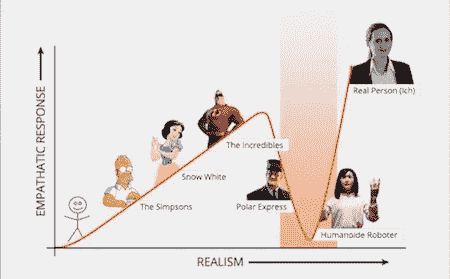

# 恐怖谷外的人脸合成

> 原文：<https://medium.datadriveninvestor.com/face-synthesis-outside-the-uncanny-valley-8f5283964b27?source=collection_archive---------1----------------------->

/via [https://medium.com/advanced-design-for-ai/how-to-make-an-emotionally-intelligent-machine-in-terms-of-visual-design-considering-uncanny-9bc473b0267f](https://medium.com/advanced-design-for-ai/how-to-make-an-emotionally-intelligent-machine-in-terms-of-visual-design-considering-uncanny-9bc473b0267f)

还记得 [*极地特快*](https://www.imdb.com/title/tt0338348/) 吗？对于没有的人(你真幸运！)，这是【2004 年的圣诞节，一个应该传递圣诞精神、快乐、圣诞老人等等的节日。反而最后变成了活人(！)化身的[恐怖谷](https://en.wikipedia.org/wiki/Uncanny_valley)，充斥着死眼的 CGI 僵尸小孩，而且是——没有别的词可以形容——令人毛骨悚然的*。*

*问题是，人类往往非常善于识别和分类他人的行为，尤其是面部表情。你爱人嘴唇的轻微抽动意味着他们发现你的行为很可爱，左眼几乎看不见的皱纹——你犯了大错。
当显示的行为与我们期望的不一致时("*嗯？为什么眼睛会像* ***那个*** *一样抽动？*)”，就像有一个刺耳的警笛在说“*这很奇怪为什么是这样我不明白*”。简而言之，*看起来像真人，但又不完全像真人的人形物体会引起不可思议的、或奇怪的熟悉感、怪异感和厌恶感，以及我们对它的亲近感的下降。**

****

**然而，不仅仅是《极地特快》,还有很多电影都曾在恐怖谷愉快地走过。当他们决定用数码技术去除《正义联盟》中亨利·卡维尔的胡子时，我们能忘记内心的恐惧吗？**

**这里的好消息是，机器学习正在拯救我们。不，我不是指那种——理所当然地被大肆宣传——意识到在去除超人的胡子方面，一些基础的曼梯·里可以做得更好。**

**这里的背景是来自微软人工智能人员()的[开创性工作，展示了如何拍摄一个人的头像(*主题*)，然后将其变形为具有与完全不同的人的头像相同的姿势、情感或灯光(*样本*)。](http://openaccess.thecvf.com/content_ICCV_2017/papers/Bao_CVAE-GAN_Fine-Grained_Image_ICCV_2017_paper.pdf)**

****

**/via [https://www.microsoft.com/en-us/research/blog/believing-is-seeing-insightful-research-illuminates-the-newly-possible-in-the-realm-of-natural-and-synthetic-images](https://www.microsoft.com/en-us/research/blog/believing-is-seeing-insightful-research-illuminates-the-newly-possible-in-the-realm-of-natural-and-synthetic-images/?OCID=msr_blog_facesyn_tw_CVPR)**

**正如你在上面的例子中看到的，主体(上面显示为-a-“身份”)呈现身份的姿势、面部表情、情绪和灯光(上面显示为-b-“属性”)。最重要的是，根本没有*恐怖谷*效果——生成的人脸看起来完全自然，彼此相似，与主体也相似。**

**他们的工作依赖于使用*生成对抗网络* (GANs)来分离出面部的“身份”部分(Think " *这就是 Alice)。如果是她生气的大头照也无所谓，从一个角度，或者随便什么，* ***是爱丽丝*** 】)从“属性”(认为*生气，从一个角度，在蓝色背景下，灯光昏暗等。*”)。一旦您这样做了，重新组合它们就变得轻而易举了，这样您就可以使用一个人的身份和另一个人的属性，如上面的示例所示(或者，就此而言，混合和匹配身份和属性)。**

**关于他们如何做到这一点的[细节非常有趣](https://www.microsoft.com/en-us/research/blog/believing-is-seeing-insightful-research-illuminates-the-newly-possible-in-the-realm-of-natural-and-synthetic-images/?OCID=msr_blog_facesyn_tw_CVPR)，并且涉及不对称损失函数，在训练分类和判别网络时实现交叉熵损失。是的，如果这不代表什么，别担心。如果听起来有趣，去读读[整篇论文](https://arxiv.org/pdf/1803.11182.pdf)😆。**

**为了让这个回到现实世界，我们现在有了不进入恐怖谷就能修改人脸的构件！我们可以让一个“替身”来表演这些场景，然后换上演员的脸，或者甚至让演员来表演这些场景，然后换上演员年轻时没有胡子的脸，或者其他什么。**

**技术，这是一个变化，感谢深度学习！**

**()[面向开集身份保持的人脸合成](https://arxiv.org/pdf/1803.11182.pdf)鲍等。**

***(* [*这篇文章也出现在我的博客*](http://dieswaytoofast.blogspot.com/2018/06/face-synthesis-outside-uncanny-valley.html) *)***