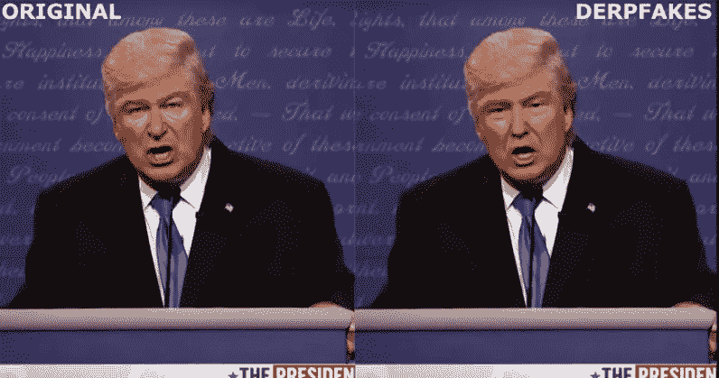

# 人工智能世界中的事实& Deepfakes

> 原文：<https://medium.datadriveninvestor.com/facts-in-a-world-of-artificial-intelligence-deepfakes-c073f8791cb6?source=collection_archive---------4----------------------->

Deepfake of Donald Trump applied to Alec Baldwin SNL skit, made by Derpfakes

就像任何其他新技术一样，人工智能(AI)可以用于善或恶。人工智能只是一个工具，虽然是一个强大的工具。

你可能已经熟悉这个网站，它可以生成不存在的人的照片般逼真的图像，www.thispersondoesnotexist.com 的 T2？几周前它在技术圈里疯传。来自麻省理工学院、斯坦福大学、英伟达、谷歌和其他许多公司的研究人员正在使用[深度学习](https://en.wikipedia.org/wiki/Deep_learning)和[生成对抗网络(gan)](https://en.wikipedia.org/wiki/Generative_adversarial_network) 对人工智能进行编程，使其能够创建这些虚假图像，用于娱乐、研究和其他积极的应用。但是一旦事情败露，就很难阻止那些希望我们受到伤害的个人和组织使用这些技术。要知道，[制造假人的技术比你想象的还要先进](https://www.theverge.com/2018/12/17/18144356/ai-image-generation-fake-faces-people-nvidia-generative-adversarial-networks-gans)。

事实上，研究人员已经非常擅长创造逼真的假数字人，我们已经在互联网上看到了现在俗称的 [deepfakes](https://en.wikipedia.org/wiki/Deepfake) 。deepfake 是一个由 AI 通过组合源图像和虚构图像制作的视频或图像，观众无法分辨其中的区别。结果是，我们不能使用一个重要人物的现有镜头，比如说奥巴马总统，和一个演员的视频，并把它们结合起来，让奥巴马说那个演员说的话，也像他一样移动。下面的视频解释了 deepfakes 是如何制作的。例如，研究人员正试图改进这项技术，以造福娱乐业。

Deep Video Portraits — SIGGRAPH 2018

我可以想象电影导演已经对这项技术垂涎三尺，因为如果做得足够好，他们可以在电影中使用模拟声音的知名人士的脸，而不必拍摄他们。他们所需要的只是足够多的名人镜头，一个有能力但不太昂贵的演员，以及在他们的作品中使用名人肖像的权利，结果:这位不太贵的演员在屏幕上以数字方式戴着名人的脸。多么节省成本和时间啊！制片人也可以利用这项技术让一个受人喜爱的虚构人物栩栩如生。突然间，他们可以让演员扮演任何角色，只需要最少的数码艺术家参与。

不幸的是，同样的技术可以让任何政客在视频上说任何话，做任何事。使用这种技术会把人放在虚构的场景中，说一些不可思议的事情，从而损害名誉。这些假视频很难被人的眼睛和耳朵发现。人工智能创造人造图像的能力已经令人印象深刻。再多一点训练，我们就几乎不可能知道什么是真实的，什么不是。

这就是我们生活的世界。如果你认为糟糕的演员已经在互联网上充斥着虚假的图像和照片，那就等着这项技术变得更加普及吧！怎么才能知道什么是真实的？

令人欣慰的是，用于创建虚假图像和视频的相同人工智能技术[可以检测到它们](https://www.theregister.co.uk/2018/11/06/fight_ai_deepfakes/)。

**事实与虚构**

我们很快就要进入一个事实和虚构的世界，在这个世界里，唯一能够决定什么是真实的，什么是虚假的智能是人工的。也许这是一件好事。就像其他任何事情一样，人类自己也浪费了大量的时间来解释信息。由于我们大多数人没有时间去核实我们遇到的每一个信息来源，我们经常会误以为假信息是真的，而忽略了重要的事实。

如今，我们都从自己认同的来源获取信息。它又懒又舒服，所以我们大多数人都这样做。这就创造了一个由想法相似的人组成的微型社区，他们对相同的信息达成一致。在一些国家，比如美国，我们可以看到保守的美国人看福克斯新闻频道和信息战争，自由的美国人看 MSNBC 和自然新闻。新闻媒体讲述着同样的故事，但加入了保守派或自由派的观点，这些故事总是符合新闻媒体的世界观和他们的观众。由于人们观看的新闻与他们的观点一致，观众相信他们对世界的看法一定是正确的。在这种环境下，一个微型社区的成员很容易在志同道合者的包围下巩固自己的观点。每个人都走到自己的角落，认为自己一定是对的。

如果我们在这个问题上再加上一个更重要的虚假视频、音频和照片，那么任何人都可以捏造新的信息作为事实，并成功地揭穿真实的事实。我们都希望自己是对的。我们信任谁和什么？

最有趣的是，对于最严肃的来源，事实是一样的。问题在于对这些事实的解释。幸运的是，人工智能至少已经被用来将观点转化为公正的事实。例如，我经常使用基于人工智能的[Knowherenews.com](https://knowherenews.com/)来获取新闻故事的核心事实。这个新闻网站使用人工智能搜索同一主题的所有网络文章，并产生公正的新闻版本。看了这条不切实际的新闻后，我觉得我可以对这条新闻发表自己的看法。我认为我们将需要尽可能多的这样的工具来保持我们在这个充满真实和虚假新闻、真实和虚构的视频片段和图像的混乱世界中的理智。我们生活在一个人工智能能够产生真实故事和虚假故事的世界。我们生活在一个人工智能也能比我们更好地识别真假的世界。在我们的世界里，工具变得很重要。

**我们需要人工智能知道什么是真实的**

虽然现实的战斗正在我们眼前发生，但我们仍然需要为自己和家人做出合理的决定。由于我们不能依靠自己的眼睛和耳朵来知道什么是真实的，我们需要依靠复杂的人工智能来可靠地给我们事实。我们需要帮助过滤我们的社交媒体账户、电子邮件和在线出版物。像记者这样的专业人士将需要在向世界展示一个故事之前，使用人工智能来确定一个信息来源是真是假。当你读到这些文字时，科技公司正在全力以赴。在最初的超级混乱的过渡期之后，这种寻找事实的人工智能有希望变得流行起来，并集成到我们的搜索引擎中。

谷歌可以在 YouTube 和谷歌搜索引擎中加入一个寻找事实的狭义人工智能，让我们知道哪个视频和网页包含最虚假或不真实的信息。脸书、Instagram 和 Twitter 可以在帖子旁边添加旗帜，向我们显示任何帖子是假的或真实的可能性。也许这些人工智能可以相当准确地告诉我们什么是真实的，什么不是。谷歌和亚马逊可以在他们的数字助理人工智能中添加虚假检测功能，让他们有能力为我们筛选我们最喜欢的新闻类别和社交媒体，为我们提供我们关心的重要、真实的信息。

有太多的信息需要我们去浏览，而我们的意志又太小了。我们不能指望普通人对他们遇到的每一点信息都进行猜测。就像我们在网上购物时信任亚马逊推荐的商品一样，大多数人会信任人工智能对真实(或虚假)的判断。

如果我们假设这个寻求事实的侦探 AI 的制造者没有偏见，这是我能想到的避免坏演员和他们的不健康信息的最好方法。问题是，我不确定我们可以相信谷歌、脸书、IBM、苹果、英伟达和亚马逊是无偏见的，除非政府制定法律，规定这类商业产品有偏见是非法的。要求政府干预这类事情似乎有些过分。另一方面，政府应该保护我们免受危险。

即便如此，当人工智能本身从与世界的互动中学习时，我们又怎么能确定一个商业人工智能正在给我们提供符合我们个人最佳利益的信息而没有偏见呢？这也是一个大谜团。我们只需要对好的和坏的情况做好准备，并采取相应的行动。