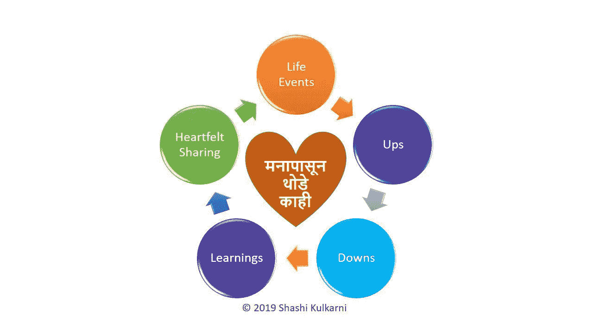

# 几个你每天都可以用来与人建立融洽关系的方法(如果你是一个内向的人，效果最好！)

> 原文：<https://medium.datadriveninvestor.com/few-ways-you-can-use-everyday-to-instantly-build-rapport-with-people-works-best-if-you-are-an-f9f478454220?source=collection_archive---------2----------------------->

## 建立即时的融洽关系

## 谁不希望几乎立刻就有喜欢他们的人呢？

Photo by [Product School](https://unsplash.com/@productschool?utm_source=unsplash&utm_medium=referral&utm_content=creditCopyText) on [Unsplash](https://unsplash.com/s/photos/seminar?utm_source=unsplash&utm_medium=referral&utm_content=creditCopyText)

我们都喜欢建立良好的关系。伟大的关系需要时间来建立，但如果我们在最初的互动中遵循某些方法，开始会快得多。

在我生命的早期，我一直在为此而挣扎，甚至不知道如何以一种好的方式开始对话。随着过去许多年的全球互动，这种情况已经发生了变化，从每一个互动中学习，有时是以一种艰难的方式。

 [## 摔倒不是失败。数据驱动的投资者

### 你只有在放弃的时候才会失败。每个英雄都会倒下，我们活着就是为了失败者出现的时刻；上升到…

www.datadriveninvestor.com](https://www.datadriveninvestor.com/2019/01/17/falling-isnt-failing/) 

对我帮助最大的是观察他人如何建立即时的融洽关系。

以下是一些快速提示:

## 每个人都喜欢他们的名字

这是一条放之四海而皆准的真理，已经被谈论过无数次了。有些人说名字里有什么，但我认为每个人最喜欢的是他们的名字——当发音或书写正确时。

这甚至可以在电影的名字中看到——'*郑屹·梅拉·纳姆'*(印地语电影——注意，印地语中'*梅拉·纳姆*'的意思是'我的名字')，'多莱米特是我的名字'，' T6]梅拉·纳姆·乔克' (1970 年印地语电影)，或者像'*梅拉·纳姆·拉朱，加拉纳姆*'(印地语电影歌曲)，'我的*名字是安东尼·贡萨尔维斯*。 或者著名的对话，比如《我叫邦德，詹姆斯·邦德》(印度电影)，等等。

Photo Credit: “Spectre” James Bond Movie

就我个人而言，尽管我认为我简短的名字“沙希”很容易拼写或发音，但似乎许多人并不这么认为。它已经被许多人写成 Sashi，Shasha，Sasi，Shash，Shahsi，Shashik 和其他一些曲折。

很多时候人们也很难发音。

我只见过几个花时间和精力去正确理解它的人。

当我们了解语言和发音的全球方面和差异时，就很容易理解为什么会存在这样的挑战。

我的一个朋友，他的姓是“Joshi”，有一次去德国和瑞士旅行，他们把他的姓读作“Yoshi”，后来他去了西班牙国家，他们把他的姓读作“Hoshi”

从这次经历中，我学会了在结识新朋友时遵循一些原则。

我努力询问他们名字的含义、背后的背景，最重要的是，我确保询问他们如何正确拼写，以及最终如何准确发音。然后我重复，问我的发音对不对。

每次你遇见新的人时都这样做。这样你会很好地记住他们，他们也会记住你，至少找到了一个在各方面都关心他们名字的人。

我学校的一个同学，至今记得我们班每个人的全名。他是印度著名的医生。

## 每个人都爱自己的孩子

我的一个好朋友有一种立即与人沟通的诀窍。我坚持观察他很多年，从他身上学到了很多东西。

我总是看到，每当我们遇到任何带着孩子的人，在与家长打了一个简短的招呼后，他会立即将注意力集中到他们的孩子身上——开始与他们交谈，问他们叫什么名字，他们在几年级，他们在学校喜欢什么，等等。

*每一次，我都会看到在这种情况下父母们容光焕发的脸，对他们的孩子充满自豪。*

Photo by [Kelly Sikkema](https://unsplash.com/@kellysikkema?utm_source=unsplash&utm_medium=referral&utm_content=creditCopyText) on [Unsplash](https://unsplash.com/s/photos/parent?utm_source=unsplash&utm_medium=referral&utm_content=creditCopyText)

更重要的是，这改变了他们和我朋友说话的方式，就好像他们认识他很久了一样！

我的一位经理，每当他遇到他的团队成员时，都会和他们进行一对一的谈话。他总是从询问他们的家庭、孩子和兴趣开始。

然后，当他后来见到他们时，有时是在几个月的长时间间隔后，他会首先询问他们的孩子，特别是记得上次的谈话，并询问关于进展的问题或关于这些的进一步信息。

在我所有的经理中，我对他有着特殊的印象。

每次你遇到带着孩子的人时都这样做，你自己会发现不同之处。

## 每个人都有一些特别的地方

当你在他们身上看到一些特别的东西时，立刻去欣赏他们。具体说明你为什么喜欢这项特殊技能或天赋，以及它与拥有类似技能的人有何不同。这是目前为止建立融洽关系的最佳方式。

Photo by [Tim Gouw](https://unsplash.com/@punttim?utm_source=unsplash&utm_medium=referral&utm_content=creditCopyText) on [Unsplash](https://unsplash.com/s/photos/dance?utm_source=unsplash&utm_medium=referral&utm_content=creditCopyText)

几天前，我们参加了一个聚会。每个人都很开心。有安排好的活动、舞蹈、表演等等。

我第一次和那个小组一起参加这个活动。几乎不认识他们中的任何人。

因此，我确保在活动结束后立即去拜访每一位表演者，并与他们交谈，首先从欣赏他们的表演以及它在其他表演中的独特之处开始。

明确是至关重要的。

“你的舞蹈很自然，是向专业人士学的吗？我观察到，不仅你的手和腿在同步运动，跳舞时你的脸上洋溢着笑容，最重要的是，与众不同的是，你的头部也在与身体的其他部分协调运动。太棒了！”

在接下来的 5 分钟里，他一直和我说话，好像他认识我很久了。

> 无论你要说什么，保持足够的句子来表达你自己，然后在剩下的时间里，当他们的眼睛亮起来并开始说话时，专心地听。

## 每个人都有特别的回忆和喜欢

每个人都有自己喜欢谈论的特别回忆。他们引以为豪的东西。一些成就。或者是他们度过的最好的假期。可能是一些发明或项目或艺术作品或音乐会或体育赛事。

Photo by [Christopher Burns](https://unsplash.com/@christopher__burns?utm_source=unsplash&utm_medium=referral&utm_content=creditCopyText) on [Unsplash](https://unsplash.com/s/photos/tennis?utm_source=unsplash&utm_medium=referral&utm_content=creditCopyText)

我已经开始关注一些运动，尽管我之前对它们知之甚少。这样我就可以准备好和一个热爱运动的人交谈，并使用恰当的语言。

很少的基本信息很有帮助，因为他们需要认识到的是我们双方有共同的兴趣。

*找到共同感兴趣的东西至关重要。*

这为进一步的讨论提供了线索。足以让他们分享他们喜欢分享的记忆或知识。

有时可能是他们度过童年的城市或他们来自的国家。我们都很珍惜童年的回忆，一说起就怀旧。在这样做的时候，不知不觉地，我们开始喜欢上问我们这些问题的人。

## 每个人都热爱自己的母语

用他们的母语说几句话。大多数情况下，我们用英语交谈——不管它是我们的第一语言还是第二语言。当你发现某人的第一语言不一样时，如果你懂他们的语言，试着用他们的语言说至少几个单词。如果你不知道，那就问他们如何说一些基本的问候，比如早上好，晚上好，谢谢等等。

去年，我们去了洛杉矶。在参观了几个地方并感到饥饿后，我们去了附近的一家泰国餐馆。工作人员最初的反应非常标准。他们也累了，只是尽最大努力继续前进。

Photo by [Elli O.](https://unsplash.com/@oelli?utm_source=unsplash&utm_medium=referral&utm_content=creditCopyText) on [Unsplash](https://unsplash.com/s/photos/thai?utm_source=unsplash&utm_medium=referral&utm_content=creditCopyText)

当女服务员过来点餐时，我漫不经心地开始点*“Sawasdi Khrap。萨拜·麦迪·赫拉普？”*(下午好。你今天过得怎么样？“用泰语。)

她根本没想到我会开始说泰语。

心情完全变了。在那之后，我们得到的服务非常令人惊讶。

只需要用他们自己的语言说几句话。

那是我们很久以来吃的最好的午餐之一。我们出来时面带微笑，精神焕发。

要点——无论你要说什么，保持足够的句子或时间来表达你自己，然后在剩下的时间里，当他们的眼睛亮起来并开始说话时，专注地倾听。

综上所述，以下是需要再次记住的几点:

> *1。人人都爱自己的名字*
> 
> *2。每个人都爱自己的孩子*
> 
> *3。每个人都有一些特别的东西*
> 
> *4。每个人都有特别的回忆和喜欢*
> 
> *5。每个人都热爱自己的母语(母语)*

**© 2019 Shashi Kulkarni. All rights reserved.**