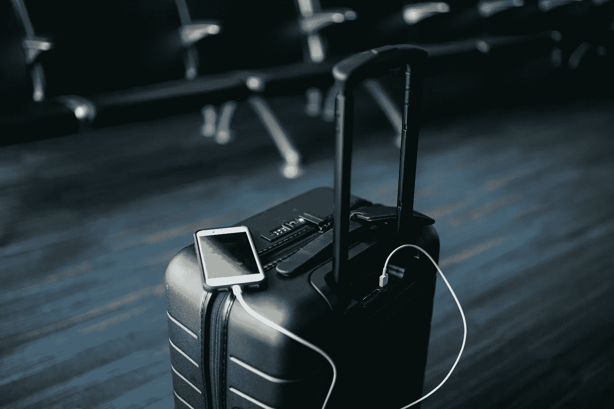

# 财务成功:有这方面的应用

> 原文：<https://medium.datadriveninvestor.com/financial-success-there-are-apps-for-that-17addbd69a7c?source=collection_archive---------0----------------------->

## 拥有更便捷的网上银行，有身份保护

就在几年前，在过去，如果你想跟踪和管理你的财务，你必须平衡你的支票簿，使用你发誓在高中毕业后再也不用的数学。

今天，当谈到财务成功时，嗯…有一个应用程序。事实上，你可能会使用几个应用程序来保证你的安全和偿付能力。

来自消费者信用报告机构 [Experian](https://www.experian.com/corporate/about-experian.html) 的专家权衡了金融应用的利弊。他们一致认为，应用程序在正确使用和谨慎使用的情况下是好的。

 [## 掌控你的财务生活

### 金钱不能定义你，但你需要它来储蓄和投资

medium.com](https://medium.com/datadriveninvestor/take-control-of-your-financial-life-f858fa54f500) 

应用程序正在改变人们管理财务的方式。想到不久的将来人们会问“什么是支票”，这一点都不夸张。

益百利的[斯泰西·史密斯](https://twitter.com/Expn_Stacy)说:“金融应用程序提供了一种自动投资、购物、转账的方式，并保护你免遭身份盗窃。

益百利公共教育总监 Rod Griffin 说:“应用程序有助于实现财务管理、债务偿还和费用跟踪的自动化。自动让它更简单。”

# 边走边学

通过经常使用，金融 app 有助于提高金融素养。随着越来越多的人开始接触应用程序，这项技术成了金融意识和理解的迷你课程。

“智能手机正在成为一种生活方式，这些应用程序是学习基本金融概念的便捷方式，”史密斯说。“应用程序可以帮助你停下来思考。有些人会发短信或提示，提醒你注意自己的支出，并提醒你设定目标。”

她补充说，应用程序加载了教育内容，以帮助用户了解他们的财务状况。

最明显的金融应用是网上银行，以及显示医疗保险、人寿保险和工资单的应用。还有那些帮助用户找到便宜的天然气价格，这有助于保持他们钱包里的钱。

还有用于预算、储蓄、信用管理、投资、债务偿还和跟踪股市的应用程序。

NerdWallet 分解了其他选项，以及应用程序可能如何满足你的财务需求。

 [## 好的投资毫无疑问

### 理解并起草你的财务目标

medium.com](https://medium.com/datadriveninvestor/good-investments-leave-no-doubt-14e250dd6a6) 

不同的人喜欢不同的金融应用，用户需要判断哪些应用适合他们。一个应用程序都是关于舒适的。你越习惯一个，你就越有可能发现它是如何适合你的财务状况的。

“你的应用程序应该帮助你少花钱，少挣钱，”史密斯说。“如果你花的比挣的多，这个应用程序就不适合你。”

格里芬表示，用户应该“问一个简单的问题:你在使用这款应用吗？它有助于你实现目标吗？”

你在为旅行存钱吗？想投资但不知道从哪里开始？询问某些应用程序是否适合你的需求是帮助你选择合适的金融应用程序的一种方式。

# 与你的目标保持一致

随着应用程序越来越成为你日常生活的一部分，你自然会看到你的消费和储蓄习惯带来的实时好处。一个应用程序可以帮助你在购买大件商品(比如房子或汽车)之前提高你的信用评分。

“财务应用程序帮助你了解你的钱去了哪里，这样你就可以在需要的地方削减开支，并开始实现你的生活目标，”史密斯说。

格里芬补充说，“当你消费时，发送提醒和警报的应用程序可以帮助你在那一刻做出更好的决定。”

很多人不假思索就把理财 app 当成了第二天性。这包括定期更新银行余额和账单。

“我建议每周检查一次，确保你没有被收取额外费用或超出预算，”史密斯说。

格里芬说，使用频率“取决于你、应用的目的及其功能”。“可能是每天，可能是每周，可能是每月。在某些情况下，应用程序可能会主动联系你，所以你不必考虑使用它。”

 [## 网络罪犯期待您的邀请

### 您的隐私取决于坚持个人最佳实践

medium.com](https://medium.com/datadriveninvestor/cyber-criminals-look-forward-to-your-invitation-9c01640367fd) 

值得注意的是，不要假设一个应用程序是值得信赖的。警惕那些想要访问你所有个人和社交媒体信息的应用程序。空白支票不是个好主意。

“确保你的金融应用程序保护你的密码，并有适当的安全措施来保护你的信息，”史密斯说。"处理财务时，最好将财务信息保护记在心里."

CreditCards.com 的[给出了 budget app 的安全提示，帮助保护你的信息。这在你的手机上尤其重要。当在手机上使用金融或任何应用程序时，请确保使用安全的 WiFi 连接，以帮助阻止身份窃贼。](https://www.creditcards.com/credit-card-news/7-tips-using-budget-apps-safely-1282.php)

美国消费者新闻与商业频道[分享了如何保护金融应用免受黑客攻击的技巧](https://www.cnbc.com/2016/08/06/how-to-protect-your-financial-apps-from-getting-hacked.html)。

“确保你的金融应用程序使用双重认证登录，”史密斯说。"多走一步就能保证你的信息安全."

也有可能太多的应用程序离好东西太远了。你可能会迷路或不知所措。不要试图用你的应用程序一次做所有的事情。还要确保应用程序不要重复功能，这可能会令人困惑。

“要有选择性，”格里芬说。"了解你的财务目标，只使用那些有助于实现目标的应用程序."

史密斯建议找一款“能让你全面了解自己财务状况”的应用。使用多个应用程序会让人不知所措。”

用户可能想要进行应用审计。看你用哪些，为什么。删除那些你不用的，以释放手机空间，消除混乱。

理想情况下，史密斯补充道，“找到一个包含你的信用评分和监控你的信用的应用程序。”

**关于作者**

吉姆·卡扎曼是[拉戈金融服务公司](http://largofinancialservices.com)的经理，曾在空军和联邦政府的公共事务部门工作。你可以在[推特](https://twitter.com/JKatzaman)、[脸书](https://www.facebook.com/jim.katzaman)和 [LinkedIn](https://www.linkedin.com/in/jim-katzaman-33641b21/) 上和他联系。