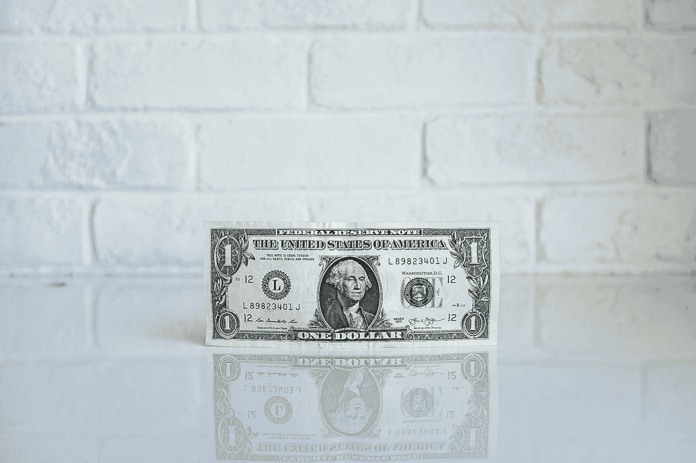

# 看在上帝的份上，提高最低工资吧

> 原文：<https://medium.datadriveninvestor.com/for-goodness-sake-just-raise-the-minimum-wage-6fd16e19423c?source=collection_archive---------4----------------------->

随着民主党 2020 年竞选季的开始，最低工资再次成为人们关注的焦点。

Photo by [NeONBRAND](https://unsplash.com/@neonbrand?utm_source=medium&utm_medium=referral) on [Unsplash](https://unsplash.com?utm_source=medium&utm_medium=referral)

西雅图和纽约市的地方努力，以及加利福尼亚和新泽西等州的努力，普及了“[为 15](https://fightfor15.org/) 美元而战”运动，并吸引了许多民主党总统候选人的注意。

一些候选人，如伯尼·桑德斯、卡玛拉·哈里斯、科里·布克、艾米·克洛布查尔、塔尔西·加巴德等人，已经站出来支持将联邦最低工资提高到每小时 15 美元。

他们是对的。美国需要提高最低工资，经济数据也支持这一点。

**工资停滞，需要加薪**

在经济复苏的这个时候，经济学家传统上会认为工资应该快速上涨。根据国会预算办公室的数据，被认为是“充分就业”的失业率是[4.6%。截至今天，失业率远低于这个数字，为 4%。](https://theconversation.com/what-is-full-employment-an-economist-explains-the-latest-jobs-data-95908)

理论上讲，工资应该上涨如此之快，以至于经济学家们担心这会导致破坏性的通货膨胀。但在实体经济中，工资几乎没有上涨，事实上，几十年来一直停滞不前。

政界的经济学家对这一事实感到惊讶，并一直在努力寻找答案。尽管这个话题没有什么确定性，但经济学家已经提出了一些可能的解释。

由于大公司的市场力量增加，工人讨价还价的能力下降了，工会成员减少了(T2)。这使得企业在生产率几乎没有阻力的情况下保持低工资。另一个论点是，我们实际上没有充分就业，因为我们的参与率[很低](https://qz.com/1414865/the-us-unemployment-rate-is-at-a-48-year-low-so-why-are-so-many-americans-still-out-of-work/)。然而，并不是每个原因都是负面的。工资增长缓慢的一个积极解释是，如今雇主在福利上花的钱比过去多。

很有可能出台政策来扭转这些趋势。但是这些问题也可以通过提高最低工资直接否定。

是的，理想情况下，我们希望看到工资由自由市场力量而非政府指令上涨，但企业自愿提高工资需要在经济中具备许多条件。但由于工人议价能力下降，企业市场力量增强，许多人仍然失业，福利增加，这些条件都不具备，政府必须直接介入提高工资。

但是和任何政治观点一样，也有反对的声音。

提高最低工资的证据喜忧参半，但研究倾向于支持这一观点。

反对提高最低工资的一个最流行的论点是，最低工资是一个就业杀手。还有一些分析[暗示着](https://papers.ssrn.com/sol3/papers.cfm?abstract_id=2951110)。

这就是为什么我倾向于相信那些认为最低工资对就业影响很小甚至没有影响的研究。经济学家 Hristos Doucouliagos [在 2009 年发表了一项元分析](https://onlinelibrary.wiley.com/doi/abs/10.1111/j.1467-8543.2009.00723.x),发现许多最低工资研究受到出版物选择偏差的影响。在控制了这些因素后，他证实几乎没有证据表明提高最低工资对就业有负面影响。

我相信这些研究提供了很多有用的数据。例如，T2 的研究表明，如果最低工资保持在中等收入的 50%左右或以下，那么最低工资的增长不会带来大规模的失业。所以这是一个很好的跟踪指数。

但是，即使没有证据表明工作会减少，工作时间肯定会减少，对吗？[这其实是真的](https://www.nber.org/papers/w23532.pdf)。2017 年，华盛顿大学的一项研究发现，低工资工人的工作时间实际上减少了。但 2018 年的一项后续研究[显示，工资的增长远远弥补了损失的时间。](https://www.nber.org/papers/)

但是商品和服务的价格不会因此上涨吗？[其实是的](https://www.apnews.com/9bed3bde87cd46dbbe2ba7a81b782abd)。但是没什么大不了的。这是因为价格的上涨不是美元对美元的上涨。

例如，美联社报道，由于最低工资上涨，密苏里州的一家餐馆不得不将他们的三份炸鸡套餐的价格提高 20 美分。但是最低工资增加了每小时 75 美分，这意味着受法律影响的每个工人在那家餐馆都比以前有更大的购买力。

尽管每个最低工资研究都有不同的结果，但是他们中的许多人似乎都同意一件事:它减少了贫困

这应该是决定性因素。私营部门目前无法将工资提高到足够高的水平，数据显示，提高工资对就业的负面影响很小。明白了这一点，提高最低工资应该是每个政治家的政策重点。