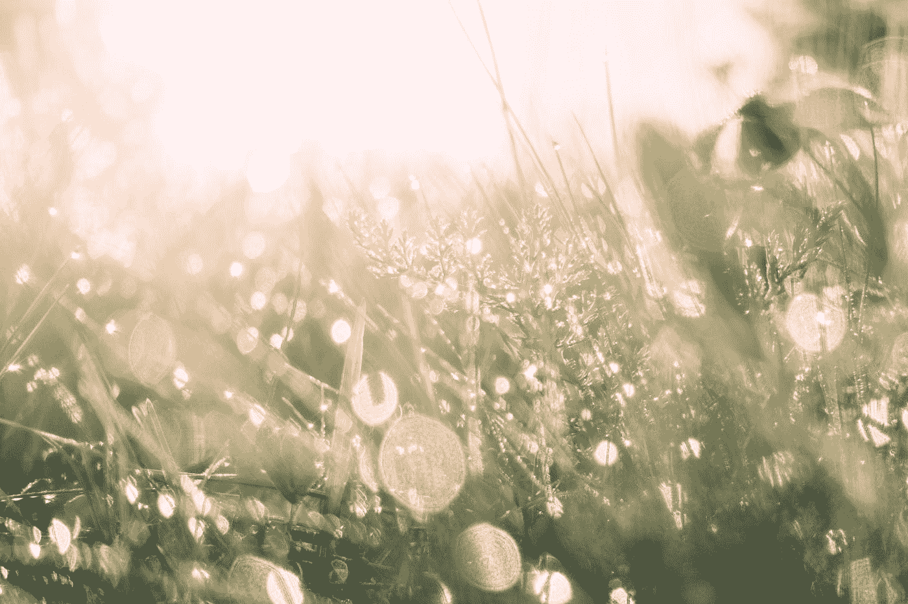

# 新鲜空气

> 原文：<https://medium.datadriveninvestor.com/fresh-air-eb370dc9b0ec?source=collection_archive---------5----------------------->

## 我对树木排放物的生理益处的研究

Photo by [Jen We](https://unsplash.com/@jenwe?utm_source=medium&utm_medium=referral) on [Unsplash](https://unsplash.com?utm_source=medium&utm_medium=referral)

我们都有过这种经历——在户外呆了一段时间后的某种感觉。宁静，对荒野的未言或未实现的崇敬，平静的满足感，也许是一种幸福的感觉。

就我个人而言，我曾经认为这是我在树林中剧烈跑步或骑车时产生的内啡肽的最终结果。新鲜空气当然很好，但我不认为还有比这更好的了。然后，我摔断了锁骨，在此过程中，我不得不学习如何在没有任何剧烈运动的情况下在荒野中浸泡，以一种悠闲的方式沉浸在野外。

令我惊讶的是，同样的感觉在我脑海中涌动——那种平静，持续了我在路上度过的时间，并渗透到接下来的日子里。这并不仅仅是从日常生活中暂时脱离出来导致了这种宁静感，也不是逃避或花大量时间自我发现和思考。空气中有更多的东西。

> “美丽的春天来了；当自然恢复她的可爱，人类的灵魂也容易复苏。”—哈里特·安·雅各布斯

有一天，我穿着雪地鞋去附近国家公园的一个了望台。几天前春天终于来了，但是几英尺厚的雪仍然覆盖着眼前的一切，蒸发的速度和融化的速度一样快。太阳的热量是多产的——如此之多，以至于我几乎可以听到我周围融化的雪，从一块被加热的巨石顶上，我可以凝视着散落在我下面的山谷。在强烈的阳光照射下，我可以看到粒子流在空中漂浮，乘着风在周围的山上缠绕。

 [## 模式和机器人:一个复杂的现实数据驱动的投资者

### 哈耶克的名著《复杂现象理论》(哈耶克，1964)深入探讨了复杂性的话题，并断言…

www.datadriveninvestor.com](https://www.datadriveninvestor.com/2019/03/04/patterns-and-robotics-a-complex-reality/) 

这些粒子，不管它们是什么，对我来说完全是个谜。

> “在攀登的底部和顶峰之间的某个地方，是我们为什么要攀登这个谜的答案。”—格雷格·蔡尔德

我以前见过许多东西在空中移动:花粉、雪、毛毛雨、冰、雾、薄雾和灰尘。但我从未见过在万里无云的日子里，万物仍被雪覆盖，生命尚未从严冬的掌握中夺回荒野，如此纷飞的颗粒四处飞溅。我想了一会儿，在我承认这是春天的行为之前，这可能是什么——可能所有被困在冬季冰雪层之间的颗粒、纤维和灰尘现在都被释放出来，被上升的热量和瀑布般的风带走了。这些粒子——它们并不明显，如果没有合适的角度、斜视和遮挡太阳光线的话，真的看不到。换句话说，一个人可以在外面走一整天，而不会注意到漂浮在空中的粒子的海洋潮汐，除非他们爬到山脊的顶部，在正确的背景和焦点下以正确的方式向下看。

这让我想到——有太多的东西漂浮在空中，我们不一定要花时间去考虑，除非我们患有季节性过敏或碰巧研究了大气生物学(空气传播的有机体)、微生物学等。，虽然我们也许应该停下来考虑一下，因为我们正在吸入一个谜。

我们看不到某些东西并不意味着它不会影响我们——我们已经知道了这一点。这么想吧——我们会喝从排气管里滴出来的水吗？尽管不断发现汽油比燃料汽车做得更多，我们似乎可以很好地呼吸空气，因为它的烟雾被发现[也助长了侵略性的神经行为倾向](http://futurismic.com/2009/11/24/of-vapor-and-violence-do-gasoline-fumes-fuel-aggression/)。再加上所谓的致癌物质[芳香气雾剂](https://www.ncbi.nlm.nih.gov/pubmed/645556)或[沥青](https://www.cdc.gov/niosh/docs/2001-110/default.html)或[任何数量的有毒物质暴露](https://www.theguardian.com/society/2015/oct/28/116-things-that-can-give-you-cancer-list)，一幅戏剧性的画面突然出现了。

但这并不是说我们必须担心在任何给定的时间里我们周围空气中漂浮的东西；更确切地说，这是关于我们能从大自然的空气中获得什么，如果有的话。

所以我决定去看看到底是什么在林冠周围盘旋，或者在山峰周围层叠，我想知道我们是否只是碰巧呼吸到了更干净的空气，或者是否有更多的东西从荒野中无数的生命形式中散发出来。

> "我去大自然中寻求安慰和治疗，让我的感觉恢复正常。"—约翰·巴勒斯

也许这种纱线可以用不同的方式纺成。

一定有什么东西存在，有更多的东西可以解释为什么我们如此多的人被吸引到森林深处，或者至少从远处被它们迷住——为什么绿色植物和植被如此有效地抚慰我们的心灵，以至于它越来越多地被编入建筑学和外部/内部设计图表中，为什么日本人从 80 年代以来就一直在洗森林浴，为什么德国人有一个不可翻译的词来指代这种与自然的某种联系。

我们来自荒野，发现自己在无法形容的人工栖息地全职工作，这种回归自然的渴望(至少对我自己来说)——我肯定这不仅仅是一种熟悉感或某种倾向。我确信这是一种生理现象，是大脑中某种神经化学过程造成的。

如果清洁剂、燃料、油漆、粘合剂、沥青、冷却剂、绝缘材料等产生有毒烟雾。可以证明对我们的生理或神经状态是有害的，并且已知植物的排放物可以净化和改善空气质量，那么从根本上说，从树木和植物中排放的无数萜烯对我们的好处不仅仅是净化我们呼吸的空气，这听起来是正确的。

因此，深入研究这些自然排放物以探索其实际潜力可能是值得的。

我经常在湖里游泳，当我这样做的时候，我有时会对我发现的漂浮在水面上或水面下的东西感到惊讶。在一个奇怪的例子中，在一个小湖的正中央(谷歌卫星上显示的湖大约是 400 x 300 米)，我目睹了一只白色的小蜘蛛在水面上小跑，好像在散步；我不明白它怎么会在那里游荡，还没有被鸟或鱼吃掉。但是除了蜘蛛——耶稣之外，湖水中充满了各种大小的颗粒，观察者只有靠近了才会真正注意到。

当然，许多所说的颗粒是水携带的，鱼皮屑或海藻碎片，但更多的颗粒像雪一样落到湖面上，像粘在玻璃画布上的细沙一样漂浮在水面上和水面下。水是一种媒介，在其中他们被困住，陷入圈套，并容易实现。因此，毫无疑问，当我费力地骑车或跑步穿过树林时，我不仅每次呼吸都吸入几口 T2 化合物和排放物，而且还吸入了更多肉眼或肉眼看不到的东西。

那么我吸入的是什么，它对我有什么好处吗？

起初，我很难证实这一点，因为我搜索的每一篇文章似乎都与树木的净化作用有关——二氧化硫和二氧化氮等气体如何被吸入树叶，然后扩散，发生化学变化，不再对人类的肺部构成威胁。

直到我偶然发现纽约州环境保护部的一篇文章，才把我引向正确的方向。这篇文章指出，正在进行的研究发现，空气中的植物杀菌素是有益的，这是植物为了保护自己免受昆虫侵害而释放的化学物质。这些植物杀菌素还具有抗菌和抗真菌的特性，有助于相应的植物抵抗疾病。

> “当人们吸入这些化学物质时，我们的身体会做出反应，增加一种叫做自然黑仔细胞(NK)的白细胞的数量和活性。这些细胞杀死我们体内的肿瘤和病毒感染细胞。在一项研究中，3 天 2 夜的森林浴旅行增加的 NK 活性持续了 30 多天。

这将(或应该)表明，这些植物杀菌素有助于我们免疫系统的健康，或以某种方式改善我们的免疫反应机制。当我在迷宫般的研究中徘徊时，我希望情况会是这样。最终，我发现研究支持这一观点，并进一步证明，这些天然植物化学物质可能具有抗癌剂的功能。

为了简洁起见，快速浏览一遍:

*   [对日本 24 个森林](https://www.ncbi.nlm.nih.gov/pubmed/19568835)的实地研究发现，“与城市环境相比，森林环境促进了较低浓度的皮质醇、较低的脉搏率、较低的血压、较高的副交感神经活性和较低的交感神经活性”。
*   [另一项研究](http://www.ncbi.nlm.nih.gov/pubmed/17903349)，结合上面提到的两点，也发现森林浴能增强人体 NK 活性和抗癌蛋白的表达。
*   除了最后一点，[对森林浴者血液和尿液的研究](https://www.ncbi.nlm.nih.gov/pmc/articles/PMC2793341/)揭示了持久的免疫功能:“旅行后 NK 活性的增加持续了 30 多天，这表明每月一次的森林浴旅行将使个人保持较高水平的 NK 活性”
*   [在《斯堪的纳维亚森林研究杂志》上发表的另一项研究](https://www.tandfonline.com/doi/abs/10.1080/02827580902903341#preview)通过每天四次收集每个主题的生理和心理数据，对比观察真实的森林景观和城市景观，研究了潜在的恢复效果:“这些发现支持真实的森林景观可以缓解压力、帮助自主神经系统放松和增加积极情绪的观点，并为森林引导的健康益处提供了重要的科学证据”
*   [参考文献](https://www.ncbi.nlm.nih.gov/pubmed/9531856)的最后一项研究发现，让受试者沉浸在森林环境中相当于降低血糖水平:“除了增加卡路里消耗和提高胰岛素敏感性，在森林环境中行走还有其他降低血糖水平的有益效果

最后，我们有α-蒎烯——一种由植物释放的单萜——主要是针叶树，但也有像迷迭香或鼠尾草这样的低洼植物群。它是常青树闻名的清新气味的来源，今天，α-蒎烯风靡一时，因为它们是在大麻品种中自然发现的，这给了大麻倡导者一系列健康吹捧的弹药，在越来越多的研究中形成了合法的根源。

越来越多的研究认识到α-蒎烯对健康的益处，包括它们的[抗癌和抗炎特性](https://www.ncbi.nlm.nih.gov/pubmed/26119957)。现代科学正在慢慢证实几个世纪以来松油作为一种抗癌剂在传统中药中的应用，以及各种草药的无数益处，这些草药已经成为无数民间疗法的主要成分。

我在这个兔子洞的爬行持续不断，因为我不断遇到更多的动力去冒险更深。当我每次徒步进入当地的国家公园，都强化自己的信念时，像心理-地形(远离自然造成的创伤)、心理创伤(环境变化造成的痛苦)或生态认知(对不断变化的景观的压力)这样的概念吸引了我的注意力。

除了生理或心理反应，我可以肯定的一件事是，我们对这个主题的集体兴趣非常丰富，正是这种兴趣本身让我相信，在我们自己和大自然的新鲜空气之间，有更深层次的东西在起作用。

[**阅读:思维折叠【多层次思维】**](https://medium.com/datadriveninvestor/mindfolding-multi-level-thinking-39981a232a18)

*“The ‘paradox’ is only a conflict between reality and your feeling of what reality ‘ought’ to be”— Richard Feynman*