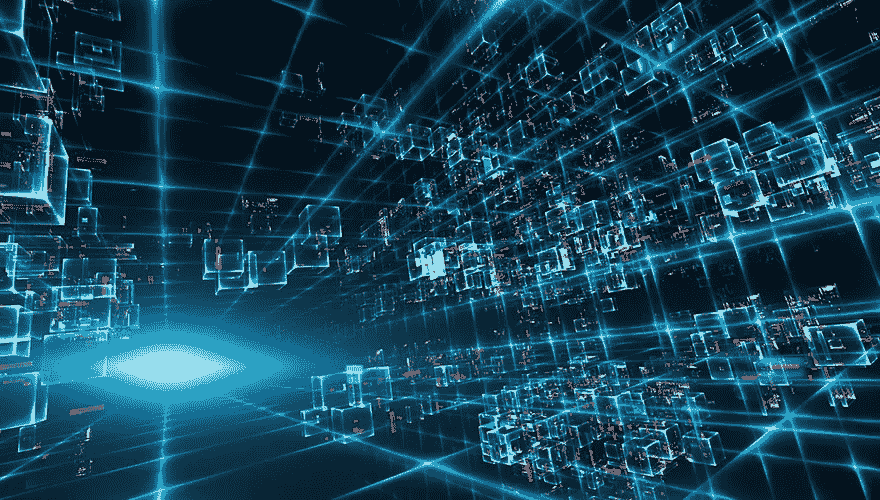

# 从电到增强现实的眼睛

> 原文：<https://medium.datadriveninvestor.com/from-electricity-to-the-eyes-of-augmented-reality-b26212e3a6c8?source=collection_archive---------14----------------------->

众所周知，电是在工业时代出现的，当时任何设备的输入都是借助开关提供的模拟输入。这就是用户界面普遍化的开始。每一个依靠电力工作的设备都有按钮或开关，这成为了工业时代革命时代的开端。通常称为 UI 的用户界面必须经历从开关或按钮到调谐收音机、使用滑轮等的转变。这导致了模拟实时界面的觉醒。UI 汲取了电的灵魂，因为这一切的基础是电。电，恰恰成为了工业时代的软件。

工业时代的结束导致了信息时代的发展，周围的所有信息都开始数字化。虽然信息开始变得数字化，但用户界面仍然可以通过开关机制来工作。这时键盘上有了按钮，已经存在的按钮变成了文本按钮，旋钮变成了列表、复选框或音量按钮。模拟互动变成了数字互动。动态输入范围的演变出现了，开关变成了数字，同样的按钮在不同的页面上有不同的格式，比如在网站上。按钮变成了实时输入和动态界面，这是数字界面的早期阶段。数字接口的中间阶段是在自适应或响应接口的帮助下发展起来的。响应界面是那些当被点击时，输出得到显示并且界面有反馈机制的界面。苹果公司为响应式界面带来了突破，图标的光影起到了最重要的作用。当图标随着用户交互无缝地打开和关闭时，UI 变得更加灵敏。数字界面的后期阶段是在脸书登录等帮助下进行的应用程序定制。此外，过滤器开始成为应用程序中的强制要求，以便为用户提供更好的定制。

信息时代即将结束，从而为激动人心的体验时代铺平了道路。体验时代的开端是个性化，如今在智能机器人的帮助下，个性化正在发生，智能机器人了解人们真正想要什么，并向他们提供建议。Alexa 和 Siri 可以作为最好的例子。这清楚地表明，语音输入是互动的新时代，而建议是个性化的开始。体验时代的未来是这样的，周围的一切都将连接到互联网上，互联网将了解世界的每一个角落。这将借助物联网和智能眼镜中摄像头的使用来实现，在智能眼镜中，一切都将在语音助手的帮助下实现个性化。

未来正走向这样一个点，人们愿意表达故事，并希望得到同样的回应。这时，输入可能采用不同的语音格式，而输出可能是可视的。

让我们期待意想不到的事情。手指交叉！