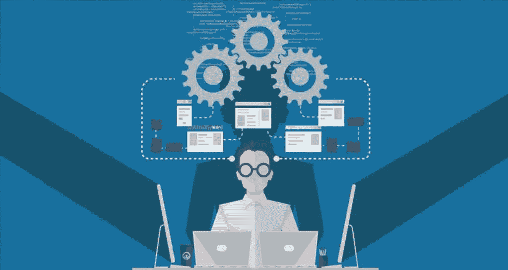

# 软件工程的未来:深度学习

> 原文：<https://medium.datadriveninvestor.com/future-of-software-engineering-deep-learning-8d9174c53e0f?source=collection_archive---------5----------------------->

还记得软件正在吞噬世界的时候吗？最近流行的观点是，人工智能(AI)正在吞噬软件。传统上，开发人员将软件编写为一系列硬编码的规则:如果 X 发生，那么 y 也会发生。但新技术认识到，随着深度学习的进步，我们可以建立一个神经网络，学习想要的结果需要哪些指令或规则。甚至特斯拉人工智能主管 Andrej Karpathy 也提到，我们将不再真正编写代码。

 [## 深度学习用 7 个步骤解释-更新|数据驱动的投资者

### 在深度学习的帮助下，自动驾驶汽车、Alexa、医学成像-小工具正在我们周围变得超级智能…

www.datadriveninvestor.com](https://www.datadriveninvestor.com/2019/01/23/deep-learning-explained-in-7-steps/) 

另一方面，软件工程师在机器学习方面相当保守。对他们来说，深度学习(DL)仍然相当不成熟，需要进一步的工作来促进高质量系统的开发。为了解决这一冲突，我们需要了解深度学习和软件工程之间的交叉点面临的挑战。由 Peltarion 成员 Anders Arpteg、bjrn Brinne、Luka Crnkovic-Friis 和 Jan Bosch 撰写的研究论文[“深度学习的软件工程挑战”](https://peltarion.com/resources/software-engineering-challenges-of-deep-learning)确定并概述了与构建具有深度学习组件的系统相关的主要软件工程挑战。研究团队将这些挑战分为三类:开发、生产和组织挑战。

## **第一:发展挑战**

开发机器学习系统不同于传统的 SE 系统。软件工程是基于将复杂系统简化为更小、更简单的模块的原则。在 DL 开发中，缺乏模型透明性，对大型复杂模型和复杂神经网络如何执行或预测的理解不足，使得难以规划、调试和维护 ML 系统。由于我们通过大量不同的实验来确定最佳模型，因此通过保存组件的准确版本(如 GPU 模型模型配置和预处理设置、输入信号和目标值)来确保这些实验的可重现结果非常重要。在训练 DL 模型期间，只有 DL 开发者是全局误差估计。因此，对于需要几天时间来训练的大型 DL 模型，无法保证一定会达到某个性能水平。此外，处理这些大型模型的数据需要多个 GPU，这意味着操作它们需要额外的成本和时间。最后，通过将数据集分成训练样本和测试样本来测试 DL 模型。这里的挑战是提供一个样本，包括可能存在于完整数据集中的所有边缘案例。

## **第二:生产挑战**

*“传统的 SE 通常建立在这样的假设之上，即硬件在最好的情况下不是问题，在最坏的情况下是静态实体”*。DL 系统主要在 GPU 上训练，因此提高硬件性能直接转化为减少训练时间，这意味着更好的结果。

由于很难涵盖模型在生产中部署后可能出现的所有边缘情况，ML 系统可能会频繁地重新培训，这需要额外的工作来维护部署的 ML 系统。

*“特别是在部署于大数据环境中的模型中(ML 系统通常如此)，存在创建非预期反馈循环的风险，在这种情况下，现实世界的系统会适应模型，而不是相反。”*

## **第三:组织挑战**

在 DL 学习项目中，你知道主要目标是什么，而不是如何去做，这使得很难估计完成它所需的时间和资源。

敏感数据集的隐私和安全是另一个问题。虽然模型中的信息是模糊的，但是在保护数据的安全性和隐私性方面已经做了一些工作。

最后，建立一个具有不同角色和文化价值观的团队来建立一个 ML 系统是一个组织挑战。如何让数据科学家、后端工程师、UX 设计师和产品负责人参与进来，让他们合作开发一个生产就绪的 ML 系统。

**研究人员通过**总结了他们的论文

> 传统的 SE 拥有用于审查、编写测试和调试代码的高质量工具和实践。然而，它们很少足以构建包含 DL 组件的生产就绪系统

随着这种冲突的出现，一种需求诞生了。需要一个能让敌对双方重聚的人。一个人在两个领域都足够流利，足以让产品启动并运行。设计和构建机器智能功能的深度学习工程师的需求。开发与深度学习相关的机器学习算法，如搜索算法中的物体检测、语言翻译、图像检索等。在生产中部署分析模型并评估其可扩展性。使用 PyTorch、Tensorflow 等 ML 框架实现和原型化深度学习模型。在将模型部署到生产环境后，对其进行监控和更新。使用数据扩充来处理小型数据集。在硬件、软件架构硬件和质量保证方面与其他数据和工程团队协作。

## 了解更多信息

 [## 什么是深度学习？

### 为了理解深度学习，我们需要区分深度学习和机器学习。

medium.com](https://medium.com/@BdourEbrahim/what-is-deep-learning-ae73b0553f5a)  [## 如何将机器学习模型集成到你的 app 中？

### 。近来，对…的需求

medium.com](https://medium.com/@BdourEbrahim/how-to-integrate-machine-learning-models-into-your-app-b77717e2702)