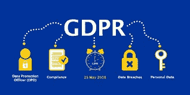

# B2B 营销人员 GDPR 指南

> 原文：<https://medium.datadriveninvestor.com/gdpr-guidelines-for-b2b-marketers-ac2d68a17bb7?source=collection_archive---------5----------------------->

GDPR 适用于 B2B 营销吗？

是的。当你能直接或间接地识别一个人时，GDPR 就适用了，即使他们是以专业身份行事。根据工作组准则草案第 29 条，你想与之展开营销对话的公司必须知道:

1.  你的组织的身份
2.  如果收件人选择加入，他们的数据会怎么样
3.  这些数据将如何存储
4.  为什么需要这些数据，需要多长时间
5.  数据主体的权利，包括根据《GDPR 公约》第 21 条，反对出于直接营销目的处理其数据的权利。

营销人员处理数据有六种途径，最常用的两种是“同意”或“合法利益”两者都可用于建立 GDPR 下处理数据所需的必要级别。

**数据处理**可以是手动或自动的，包括个人数据的收集、记录、组织、结构化、存储、改编或修改、检索、咨询、使用、通过传输、传播或其他方式进行披露、整理或组合、限制、擦除或销毁

**同意**

根据 GDPR，同意被定义为“数据主体自由给出的、具体的、知情的和明确的意愿表示，他或她通过声明或明确的肯定行动表示同意处理与他或她有关的个人数据。”平权行动要求表明，受试者必须积极地做一些事情来表示同意，如正在进行的业务互动，如注册网上研讨会或下载白皮书。

**可以用什么方法获得同意**？英国信息专员办公室提出了多种方法:

1.  在纸质表格上签署同意书
2.  点击在线选择按钮或链接
3.  从同样突出的是/否选项中选择
4.  选择技术设置或首选项仪表板设置
5.  回复请求同意的电子邮件
6.  对明确的口头同意请求回答“是”
7.  为特定目的自愿提供可选信息

ICO 还提供了关于**如何根据第 7 条记录同意**的指南，以及应包含哪些信息以提供有效的审计跟踪:

1.  **谁同意**:名称和识别特征
2.  **他们同意的时间**:注明日期的文件或在线记录的副本
3.  **当时告知他们的内容**:文件或数据采集表的主副本
4.  **他们是如何同意的**
5.  **他们是否撤回同意:**根据第 7(3)条，数据主体有权随时撤回其同意，例如通过电子邮件取消订阅按钮。

**合法利益**

三部分平衡测试:

1.  对处理数据感兴趣
2.  处理是达到目的所必需的
3.  数据主体有理由期望他们的信息会得到处理

**对于合法利益**，GDPR 制定了一项一般原则，即如果合法利益被证明是有效的，则允许直接营销。这意味着数据主体和控制者之间必须存在“相关和适当”的关系。然后，组织必须考虑正在处理的数据的性质的平衡，以及个人期望与您的组织联系是否合理。过去关系的基础可以满足这个测试。

一个更详细的例子:如果一个人参加了一个商业研讨会，组织者收集了名片，组织者有理由认为他们对建立关系网和发展业务有合法的兴趣。为此，从名片上收集联系方式是必要的。接下来要考虑的是组织者处理这些数据是否合理。在这种情况下，递名片的代表有理由期待他们的业务联系会得到处理。

另一种获得“合法权益”的方式是通过“软选择加入”这是电子隐私指令中关于如何在合法利益下进行合法联系的一种技术。总的原则是，如果有人从你这里买东西，你可以自动注册他或她进入营销。营销必须类似于他们已知的关系，因此必须是一个类似的产品，你必须提供一个退订的所有直接营销你发送给他们的选项。

《ICO 准则》接着指出,“合法利益”是各种情况下的适当标准，包括在无异议的情况下通过邮寄、电话直播，以及通过电子邮件/短信向业务联系人或通过软选择加入获得的个人发送。

合法利益能否用于向第三方披露数据？

可以，考虑的利益可以是自己的，也可以是第三方的利益。你的重点将是证明你的揭露是正当的，以及为了这个目的揭露是否正当。根据 ICO，第三方有责任确保他们自己的进一步处理是合法的。

如果您购买销售线索列表，线索生成者必须同意与您共享信息，并且您仍然需要获得特定的同意才能使用列表上的电子邮件地址，除非他们同意将他们的数据传输给第三方，而您的组织是特定命名的。

关于同意、软选择加入和选择退出的规则不适用于发送给“公司订户”的电子营销信息，公司订户指的是公司和其他法人团体。唯一的要求是发送者必须表明自己的身份并提供详细的联系方式。但是，一般来说，个人在公司的机会是可以识别的，因此符合 GDPR 的要求。

**定义和解释**

根据 GDPR，透明度是关键，因为它是授权数据主体并让他们控制自己的个人数据的核心。个人信息是指通过直接或间接方式与已识别或可识别的自然人相关的任何信息，如信用卡信息、姓名、地址、电话号码和电子邮件。

必须出于特定、明确和合法的目的收集数据。只要有适当的保护措施，进一步的处理不应被认为是不相容的。数据的保存期限仅限于收集数据所需的时间。

**数据处理器**是代表数据控制器处理数据的实体。**数据处理**可以是手动或自动的，包括个人数据的收集、记录、组织、结构化、存储、改编或修改、检索、咨询、使用、传输披露、传播或以其他方式提供对齐或组合、限制、擦除或销毁。

处理数据的要求是什么？

数据主体必须同意。这是指任何自由给出的具体和知情的意愿表示，数据主体通过这种方式表明他或她同意处理与他或她有关的个人数据。

**数据泄露**

数据泄露由什么组成？

数据泄露包括意外或非法破坏、丢失、更改、未经授权披露或访问传输、存储或以其他方式处理的个人数据。组织必须在意识到违规行为的 72 小时内向国家监督机构报告违规行为。在德国，对公司总部所在地区拥有管辖权的当局行使监督权。

根据第 29 工作小组的规定，有三种违约行为:

1.  机密泄露:未经授权或意外泄露或访问个人数据
2.  完整性破坏:个人数据被未经授权或意外更改
3.  可用性漏洞:个人数据意外或未经授权丢失或遭到破坏。

第 33(3)条下的违规通知应包括对个人数据违规性质的描述，包括相关数据主体的类别和数量、数据保护官员的姓名和联系方式、对个人数据违规的可能后果的描述，以及对已采取或建议采取的措施的描述

**罚款和纪律**

已经发布了关于罚款评估的指导方针。首先，数据保护当局将考虑“侵权的性质、严重性和持续时间。”轻微的侵权行为确实存在，有些违反行为只有在“对有关数据主体的权利不构成重大风险且不影响有关义务的实质”的情况下才可能引发谴责。此外，还有一个关于处罚负担的考虑。

考虑的因素有:

1.  所涉数据主体的数量:受影响的人数越多，罚款越多
2.  具体来说，处理 DPA 的目的是检查组织在多大程度上遵循了限制原则。
3.  数据主体遭受的损害
4.  情报的持续时间

根据 GDPR 停止处理订单或罚款:这种方法可能比行政罚款使用得更频繁，行政罚款最高可达全球营业额的 4%或 2000 万美元。以较大者为准。

停止处理通知要求公司在指定期限内停止处理所有个人数据

**常见问题解答**

欧洲公司应该如何处理他们在未经同意的情况下收集的数据？

你可能对业务联系有合法的兴趣

定期交流和持续业务的信号意图是否暗示了选择加入？

是的，这被认为是必要的扶持行动。然而，什么也不做不被认为是同意。

GDPR 如何影响以下渠道:

直邮:名单上的个人应给出一个总体声明，表示他们很高兴收到我们的营销信息，或者营销信息与收到营销信息的背景一致，并且所提供的信息涉及类似的产品或服务

电子邮件:如果您的邮件列表中包括明确选择在 2018 年 5 月 25 日之前接收您的营销电子邮件的人，那么您可以继续与他们沟通，前提是他们通过尚未选中的复选框表示同意。这就像发送一封电子邮件说，“是的，我想选择加入”一键解决方案一样简单。但是不允许在方框前打勾。包含隐私声明是至关重要的，因为这是对潜在客户的适当通知，告知他们的数据将用于何处。

尽管同意并不是唯一的选择，如上面**合法利益**部分所述。

双重选择加入呢？Double opt-in 指的是向新订户发送自动电子邮件，以确认他们的电子邮件地址是正确的，并且他们已经注册接收营销。双重选择加入不是一项要求；尽管双重选择加入被认为是一种最佳做法，但一个带有潜在客户在 CRM 中注册时间的数字记录就足够了。

GDPR 的一个重要方面是给予个人对其数据的控制权，尽管需要获得同意，但个人还必须能够退订营销电子邮件，并应被纳入电子邮件活动。一旦个人退订，他们的营销相关数据必须被删除。

事件:好的，处理参加事件的个人的数据并提供联系信息。这满足了合法利益平衡测试

电话:录音电话是在选择同意的情况下进行的，号码可以识别是谁在打电话。直播电话是合法的，也是允许的，尽管应该保留一个禁止电话列表。