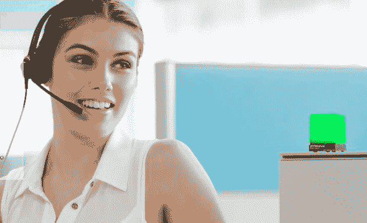

# 黑客办公桌轮用

> 原文：<https://medium.datadriveninvestor.com/hacking-hot-desking-b6257658bacf?source=collection_archive---------9----------------------->

办公室——你和我每天至少有三分之一或更多的时间在这里度过。如果你在今天的办公室工作，你很可能会在开放式办公室工作，这种办公室实行基于活动的工作方式，也称为“办公桌轮用制”。

***那么什么是作业基础工作呢？***

基于活动的工作(ABW)自 20 世纪 90 年代初就已出现，并首先在荷兰付诸实施。这个概念的前提是没有员工“拥有”或拥有指定的工作站。取而代之的是一个开阔的空间，有各种各样的活动区域。鼓励员工将自己放置在最适合他们完成工作的地方，例如学习、专注、协作和社交。公司搬到 ABW 是为了降低物业成本，让宝贵的办公空间得到灵活利用。

 [## 跑步摆脱疯狂:锻炼如何提高你的生产力|数据驱动的投资者

### 没有比锻炼更好的方式来开始一天的工作了。我试着一周至少做四天，在…

www.datadriveninvestor.com](https://www.datadriveninvestor.com/2018/10/23/running-to-get-rid-of-the-crazy-how-working-out-increases-your-productivity/) 

然而，整个行业都在争论 ABW 的利弊。

ABW 的支持者表示，这是一种创造动态工作环境的模式，鼓励建立关系网，与同事偶遇，引发新的对话和想法，从而为公司赢得更多业务。

另一方面，ABW 的反对者说，这是非常低效的，因为一个人可以花一天中关键的几分钟做一些琐碎的事情，比如找一张桌子，打开笔记本，调整屏幕，椅子——而这些时间可以用来做一些实际的工作。它还会扰乱注意力，因为有可能被拖入无计划的办公室玩笑，比如某人的假期计划，某人的电影故事，在你知道之前，你已经失去了一天中的 30 分钟和注意力。

然而，在 ABW 生存并不像看起来那么困难。我将向你提供一些屡试不爽的技巧，帮助你超越 ABW。

1.  **依靠一些善良古老的人类行为。**

不管 ABW 周围的规则是什么，记住人类是习惯的动物，他们会不知不觉地留下一种模式。了解人们——识别定居者和流浪者。

定居者通常首先到达，选择他们喜欢的桌子，并随着时间的推移重复他们的选择，建立一个桌子或区域作为“他们”的空间。

另一方面，流浪者表现出不拘泥于同一地区、同一人群的行为，经常四处流动。

这会让你了解人们每天是如何活动的。确定闲聊协作区(通常靠近厨房、集线器和咖啡机)和安静焦点区(通常在办公室的外围，靠近窗户)的模式。

2.了解你的一天。

提前看看你的日历，也许在下班前。你的日程表上有什么样的活动？是会议、协作，需要与人交流想法，还是以专注为导向，如处理需要深度专注的文档、演示文稿。现在，基于你对办公空间和人员的了解，你可以掌控自己的命运。

更多基于协作—坐在温暖的聊天区。更加专注的工作——在安静的区域找一个座位(也许让一个定居者为你预留一个座位！)

如果你的一天是两者兼而有之，也许可以四处走走。

3.借助科技。

耳机——有史以来发明的最神奇的设备。可以用普通耳机，也可以用降噪耳机。戴上它们，打开一些焦点音乐，看看你的生产力开始了。我注意到，戴上耳机，不知何故会向人们发出一个信号:你正在做一件非常重要的事情，人们在打断你之前会三思。这样你就不会成为不需要你参与的随意聊天的一部分。当然，如果你想参与的话，你可以随时摘掉它们——但至少你可以控制这种干扰。

您也可以尝试使用光立方或 LED 状态灯，这是一种可以放在显示器顶部的光立方，用于指示您是否有空、忙碌、离开或处于“请勿打扰”模式。人们普遍尊重灯光。

*Image:* [*https://embrava.com/collections/blynclight-standard-plus*](https://embrava.com/collections/blynclight-standard-plus)

好了，现在你已经黑掉了办公桌轮用制。毕竟，一生中你可能要在办公室度过大约 92，000 个小时——你最好让这些时间发挥作用！完全掌控你想要的一天。