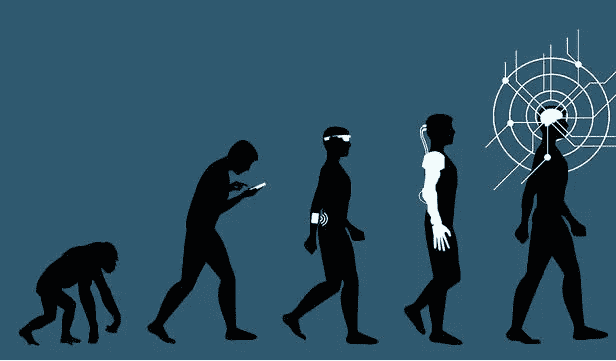

# 协调人类学习和深度学习(HHL-DL)

> 原文：<https://medium.datadriveninvestor.com/harmonized-human-learning-and-deep-learning-hhl-dl-33a672606efe?source=collection_archive---------13----------------------->

**深度学习**很长一段时间以来就在我们身边。我们正试图在许多领域达到人类水平，事实上，我们已经在一些领域取得了成就，比如:
1。问答系统(谷歌的 **BERT** )
— BERT 还能够识别句子中的漏词(掩蔽 LM 或完形填空任务)，预测下一句话。
2。图像分类( **ResNet** )
3。游戏( **AlphaGO** )
但是在一些人类无法比拟的任务上失败了。这是因为人类的学习方式与深度神经网络完全不同。

# 那么，人类如何学习呢？

首先也是最重要的一点是——**人类通过图像学习自然语言**，而不是一次一个地学习。例如，回到你的童年时代，想想你读过的任何故事，在阅读的时候，你也在想象书中或杂志中出现的场景(视频)或事物(图像)。现在举一个完全相反的例子，在看电影的时候，你也在处理与电影中出现的每个图像或视频片段相关的语音(自然语言)。所以自然语言处理和图像处理是齐头并进的。

## 我们回幼儿园吧。

为了学习字符(A，A，B，B，1，2)你没有处理语言，你**处理每一个字符的图像**。你看到了一些图像并创建了你自己的版本，就像 GANs 现在做的一样，GANs 通过观察原始图像的分布来创建类似的图像。这里的原始图像是老师画的或印在课本上的人物图像。

## 好了，现在你已经学会了字母数字字符，接下来呢？

一旦你能够画出这些字符，你就可以使用它们了。为了使用它们，你学习每个字符的属性，如每个字符的**表音、元音和辅音**。你把它们储存在大脑里。**(A——元音，我们如何发音，它看起来如何，与 A 的相似度，它出现的地方——字母顺序)**。
通过这种方式，你开始从图像、文本和语音中建立你的数据集。了解 A 和 A 之间的区别以及使用它们的方式也很重要(a-句子的第一个字母，在人名中，A-单词的第一个字母，在句子中间，在单词中间)。

现在，在下一步中，您**将学习将这些字符转换成单词**。**在学习这个的时候，你也会想到单词的图像，你会学习它们的发音，你也会学习它们的意思(通过图片或者其他单词，如果你想不出它的任何图片的话)**。
例如，当你学习苹果时，你也会看到所有字符的连接图像(A，p，p，l，e)，一个苹果的图像，你也会试图将你知道的尽可能多的东西与这张图片联系起来(比如它的味道，从你妈妈带来它的地方，如果你有时在树上看到它，你会将树与它联系起来，你也可以想象它的大小，并试图与你的手掌或其他东西进行比较)。

现在，请记住，在你生命的这一阶段，你习惯于向你的老师、父母或朋友问很多问题，因为你对一些事情感到困惑，比如——同一事物的两个不同的词或者两个不同的事物和相同的名称。在这个时候，你开始对你所学的东西进行分类。(水果——苹果、香蕉。交通工具——小汽车、公共汽车)。
现在，你要学会有效地对它们进行分类，并尝试对类别中的事物进行概括(比如在水果中，我们知道我们吃苹果，我们也知道香蕉也是一种水果，所以我们逻辑上认为我们也可以吃香蕉，另一个例子是，我们可以认为苹果长在树上，所以香蕉也一定长在树上)。你在这个阶段引入逻辑，并试图以一种一般化的方式思考，这样你就不需要为每一件事再明确地学习那些东西了。所以你不需要明确地知道你可以乘公共汽车旅行，你必须通过公共汽车也是一种交通工具这一事实来知道。

在这一点之后的一段时间里，你只能靠自己了。你**从环境中学习东西**(网站、书籍、另一个人)。如果你遇到任何新单词或图像或视频，你可以去找任何人(互联网、朋友、书籍)来理解它。

这种学习的好处是，现在你可以**在要求的时间内从环境中学习任何东西，单词的表征也容易多了**(图片)。如果你遇到一个新单词，你已经在脑海中准备好了这个单词的形象(人物形象)。

现在你需要**介绍事物之间的联系**。连接单词组成一个句子，连接图片组成一个剪辑。
在这里你**在你的学习中引入语法**把那些单词连接起来获得一些更有意义的信息。在组织一个句子的时候，你也可以看到这些图像在起作用。例如，当你读到句子“**一个人正在过马路**你也可以想象一个人过马路的画面。(现在这种想象完全取决于你以前的学习手段，你从哪种图像中学到了什么。)你用每个句子学习语法。你试着弄清楚句子中什么是主语，什么是宾语，该用什么形式的动词，如何使用冠词。通过这种方式，你倾向于从文字中构建句子，或者从静态图像中构建有声图像。

接下来是令人兴奋的部分— **获得某些领域的专业知识**。请理解，首先，**我们把学习一般化了，现在进入具体领域**，和深度学习完全相反。
一旦你知道如何学习东西，现在，你所需要的就是域名。一旦你得到了域名，你就只能靠自己了。你知道如何获得该领域的专业知识。你去网站阅读材料，去听讲座(视频)，处理自然语言和图像来学习材料。一旦你准备好学习，你就准备好创造奇迹。

现在到了关键的部分——“**怎么用**？”
-就所学领域提问以获得答案。
——要求总结一篇文章。
——要求记下它到目前为止学到的任何东西。
-要求做一个演示。显然，对于这些任务，你在学校接受过训练，但不一定在每个阶段都接受过训练。

> 我已经开始制作这个模型了，如果你想成为其中的一员或者想帮我，请发邮件给我:ganeshpatel1618@gmail.com