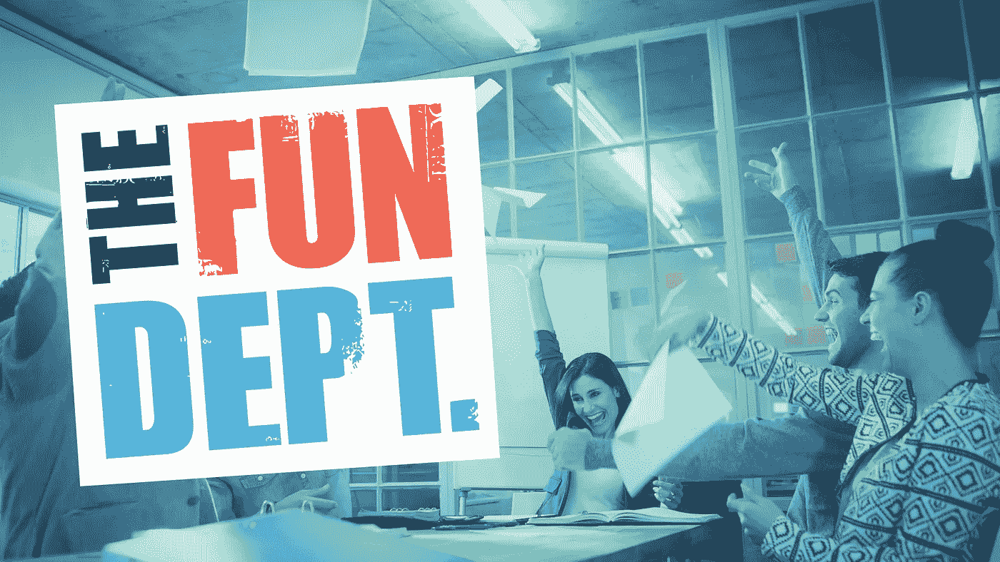

# 找点乐子——并从中获利

> 原文：<https://medium.datadriveninvestor.com/have-a-little-fun-and-profit-4dd7b69d6a90?source=collection_archive---------3----------------------->

## 如何在不倾家荡产的情况下融入幽默

通常，“工作”和“娱乐”是一对矛盾的词。领导者关心的是生产率和利润，其次才是乐趣——如果有的话。

[尼克·吉安诺利斯](https://twitter.com/NickGianoulis)拿这个想法开玩笑。自称“趣味教父”的他创立了[趣味部](http://thefundept.com/)。帮助组织将乐趣融入他们的文化。他已经成为如何在员工中创造共享体验、如何遵循快乐法则以及如何在不倾家荡产的情况下融入快乐的专家。

福布斯分析师、品牌策略师兼 TalentCulture 首席执行官 Meghan M. Biro 加入 Gianoulis，讨论如何改变工作场所文化，以获得乐趣和利润。

千禧一代的涌入影响了传统的职场文化。Gianoulis 说，他们想要一种目标感、协作感和认同感。

这听起来就像所有工人想要的。不同之处在于，千禧一代推动变革，因为他们选择自己想去的地方工作，并追寻自己的愿望。

比罗引用了英国的一项研究，发现快乐的员工生产率提高了 12 %,而不快乐的员工生产率下降了 10%。

# **不要勉强**

“你不能强求乐趣，”比罗说。“乐趣必须来自真实的地方。它需要成为你公司文化的一部分。为什么不把乐趣当成一个过程，而不是一件大事呢？”

Gianoulis 提供了一个简单的等式:乐趣=建立可信赖的联系=友谊=幸福=巨大的商业成果。

“基于你的文化建立你的品牌，”他说。“客户可以选择这么多不同的公司进行合作，所以要让自己与众不同。”

像大多数有效的文化转变一样，变革的推动力会随着高层的认同而成功。

Gianoulis 说:“当领导们相信这一点时，创造乐趣的成功率是 100%。“但领导人不只是想娱乐他们的人民。他们参与其中。这让他们变得人性化，也让员工有了发挥的空间。”

娱乐真的是一件严肃的事情。

“这不仅仅是娱乐和游戏，”Gianoulis 说。“它是关于连接人类，打破孤岛，实践公司文化。乐趣不等于足球桌。问问你的员工对他们来说什么是乐趣，然后从那里开始。”

# **简单定律**

快乐部的快乐法则很简单:

*   领导力买入
*   一致、合规、公司时间
*   所有感官的乐趣

“在为工作设计乐趣时，它是否包罗万象，没有威胁，”Gianoulis 说。“我们不强迫任何人跳舞。我们允许员工在他们感到舒适的水平上参与。”

他认为工作场所有趣很重要。只工作不娱乐会让员工变得迟钝、不开心，从而降低生产率。人们宁愿不来上班。

比罗说:“当工作场所把娱乐作为一个因素时，就会产生更快乐、更满意的员工。”。"快乐的员工在工作中会表现得更好."

她说，工作场所的乐趣与增强动力、提高生产率、减轻压力、提高工作满意度和改善任务表现联系在一起。

“在工作场所营造积极的社会氛围可以提高工作满意度，”比罗说。“除了有效管理和改善员工的情绪之外，开心还能改善团队合作，建立信任关系，提高员工忠诚度。"

# **顶尖人才**

留住人才是 Gianoulis 的一个重要因素。

“你想要吸引和留住最优秀的人才，”他说。“对于员工来说，‘乐趣’实际上比其他任何变量都与一个好的工作场所有着最高的相关性。乐趣是弥合代沟、让人们走到一起的催化剂。

“这让友谊得以形成，”Gianoulis 说。“我们的‘直觉’是，朋友们在一起工作得很好。如果你允许员工享受有机的乐趣——简短而包容——他们会在接下来的一天中更有活力。他们会有几个月甚至几年的回忆来谈论。”

快乐的工作场所会增强员工的安全感。随着乐趣自上而下的传播，生产力也随之提高。

“如果人们玩得开心，他们会更加努力工作，待得更久，在危机中保持冷静，更好地照顾组织，”比罗说。

她说:“根据研究，员工娱乐和高效工作的程度、提供更好的客户服务以及参与创造和创新之间有着直接的联系。”

# **创意爆棚**

根据 Gianoulis 的数据，有趣的工作场所能让员工保持 44%的工作热情，提高 31%的工作效率和 300%的创造力。

“他们有更好的客户服务，”他说。“我想和那些在一起开心的公司一起工作！”

有乐趣的公司也享受较低的医疗费用。

“员工更健康，因为他们喜欢他们的工作环境，”Gianoulis 说。"然而，乐趣不能解决工作场所中没有解决的更深层次的问题."

快乐的员工也更加投入。

“一个有趣的工作场所有助于保持员工的参与，参与的员工更有效率，”比罗说。“拥有伟大的公司文化是让员工每天都想去上班并尽最大努力的原因。

“快乐的工作场所也有助于吸引新的人才，”她说。“当员工热爱他们的工作时，他们自然会成为公司大使，从内到外帮助有机地宣传你的公司。”

# **建立协作**

有了乐趣，品牌很容易建立一种合作文化。像其他企业文化元素一样，协作从高层开始。领导人必须接受。他们为其他员工树立了榜样。

比罗说:“协作的力量在于将一个团队的才能结合起来，最大限度地发挥每个成员的能量、激情和创造力。”“根据个人优势建立团队。创建协作文化将始于对每个人的能力和弱点的真实而诚实的概述。

“奖励创新，鼓励团队挑战现状，”她说。"对传统智慧的漠视带来了新的想法，这些新的想法通过新的、更有效的策略使组织受益."

肯定对创造乐趣也有很大作用。

“我们在娱乐部使用‘是的，还有’这个词，”Gianoulis 说。“即使有不同的意见，我们也总是相互肯定，从而相互验证，保持沟通畅通无阻。”

# **明确一点**

他还强调了明确的使命和坚实的核心价值观的重要性。

“根据核心价值观经营你的企业，”Gianoulis 说。"根据核心价值观雇佣和解雇员工."

尽管这很令人向往，但快乐不会很快出现。

“致力于文化和解决正在讨论的一切确实需要时间和精力，”Gianoulis 说。“这是值得的，但我们不能指望一夜之间就有结果。”

最终，耐心会有回报。

“人们希望为那些认同与其个人身份一致的公司工作，”Gianoulis 说。“他们会和品牌以及他们的同事建立更多的联系。”

从上到下，每个人都会有一个好玩的地方工作。

**关于作者**

吉姆·卡扎曼是拉戈金融服务公司的经理，曾在空军和联邦政府的公共事务部门工作。你可以在[推特](https://twitter.com/JKatzaman)、[脸书](https://www.facebook.com/jim.katzaman)和 [LinkedIn](https://www.linkedin.com/in/jim-katzaman-33641b21/) 上和他联系。