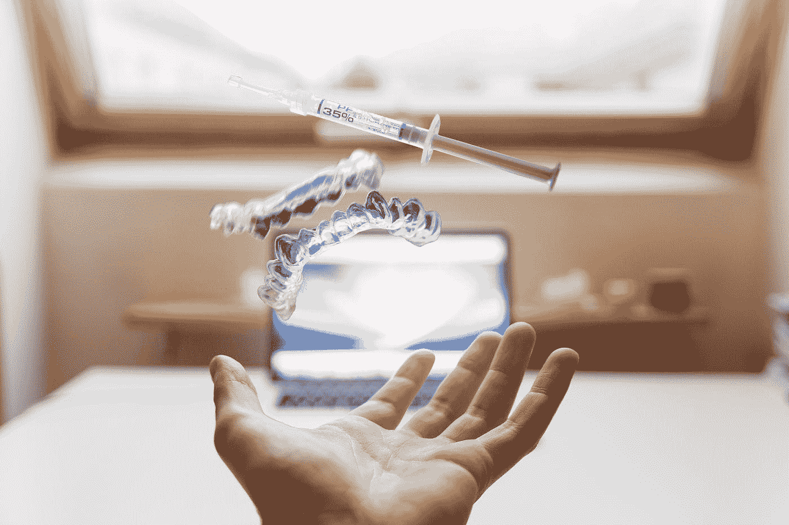

# 医疗保健必须为进化做好准备，超级细菌就是如此。

> 原文：<https://medium.datadriveninvestor.com/healthcare-must-be-prepared-to-evolve-the-superbugs-are-9467250e7897?source=collection_archive---------41----------------------->

由 Cyanna Mitchell 撰写

毫无疑问，生物技术已经影响了我们理解、解释和实施我们健康常规的方式。

> *未来的医疗产品令人惊叹:*
> 
> *答:一种研究医疗器械“研究手表”,旨在利用专门的传感器采集和分析生理和环境数据。*
> 
> *b .一种微型连续血糖监测仪(CGM ),通过实现连续皮下监测来帮助二型糖尿病患者控制病情。*
> 
> *c .用于连续监测葡萄糖水平的葡萄糖传感镜片和用于老花眼(与年龄相关的远视)患者的可调节隐形眼镜。*

生物技术的创新使人们能够积极参与医疗保健，从而改善健康状况。人们现在可以使用应用程序、可穿戴技术甚至植入设备来监控自己的健康。医生可以远程进行检查，取代了亲自检查的需要。

# **随着住院治疗的危险增加，医疗保健的革命来得越来越快。**

> *为了提高护理质量，医疗保健正从医院走向家庭:*
> 
> *答:长期护理中心减少，医院尽快让病人出院*
> 
> *b .大手术单元与慢性病患者分开*
> 
> *c .在家里，自我护理与多次、短期体检相结合是很常见的事情*

# **支持和鼓励家庭医疗保健的用户友好型技术势在必行。**