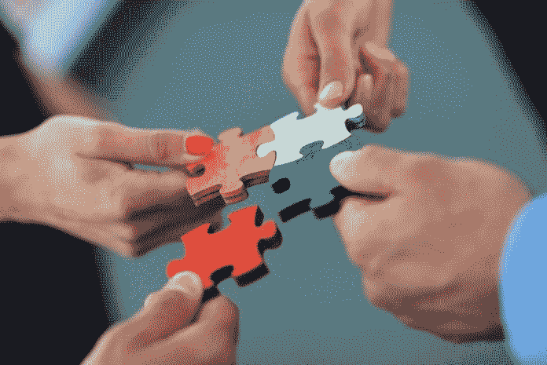
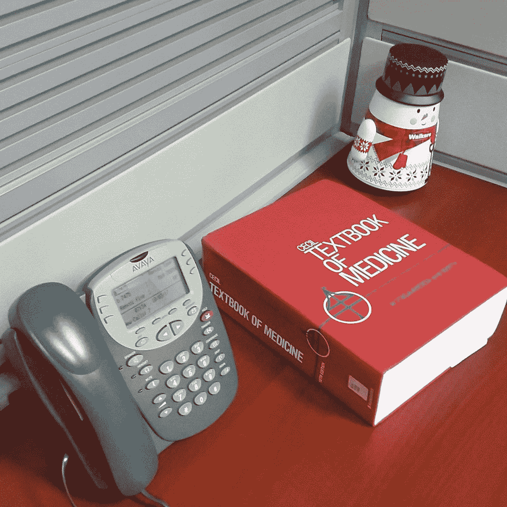

# 伸出援助之手，连接远方的伙伴

> 原文：<https://medium.datadriveninvestor.com/helping-hands-connect-partners-from-afar-760cd32ba1fd?source=collection_archive---------39----------------------->

艺术从专业和个人角度创造利润。到目前为止，他们提供了比单干更好的结果。

“我正忙于联系、组织和合作，”宿务市文森特·索托纪念医疗中心妇产科传染病专家[海伦·马丹巴](https://twitter.com/helenvmadamba)医生说。菲律宾，和一个艾滋病倡导者。

“成为一个受欢迎的人并不容易，”她说。“你必须培养自己的耐心、宽容和让人感到舒适的技能。这是你每天遇到新朋友时养成和提高的习惯。”

这对于任何人来说都是一个负担，让马丹巴和其他像她一样的人成为精疲力竭的候选人。像马丹巴一样，聪明的专业人士会把合作关系放在口袋里。

“我学会了如何善待陌生人，以及如何与和你不同的人联系，”马丹巴说。“基于[关联主义](https://en.wikipedia.org/wiki/Connectivism)理论，在数字时代，你不仅可以在个人内部学习，还可以在网络内部和跨网络学习。

“连接主义将知识视为一个网络，将学习视为模式识别的过程，”她说。“这个在线建立社区的过程教会了我如何有效地建立线下社区。”

她在世界各地的许多同事都有与其他团体建立伙伴关系和合作实现健康相关目标的经验。

“在美国，人们的领土意识很强，”保健专家兼讲师尹卡·维达尔说。“如果你踏入他们的区域，就会发生爆炸。先得到医院 CEO 的认可。那么与医院其他部门的联系可能会更容易。

“你的策略在学术机构和政府医院可能会很有效，”他说。“然而，在美国企业界——如果没有互利，人们试图超越彼此——许多问题将会出现，阻碍进步。”

开放的手牌不会自动被接受。

“并非所有好的建议都受到当权者的欢迎，”维达尔说。“小心线程。通往解雇通知书的道路是由良好的意愿铺成的。在综合医院系统中，情况可能会好一些。在美国企业界，情况就不同了。

“公司内部的某些人认为系统设计必须来自高层，”他说。“否则，一线工人的任何尝试都可能被视为违规。”

当试图建立伙伴关系时，控制可能是一个因素。

Cycling buddy and bunny, Max, by Sandra Woods

“根据我在美国医院处理医疗差错的经验，最大的障碍是控制行政系统的‘政治权力’，”维达尔说。“我还从系统重新设计中了解到，有效的系统设计来自一线工人通过协作，而不是来自坐在办公室里的 CEO。

他说:“医生和其他医护人员因为敢于改善医院系统的运作系统而被解雇。”“你会听到这样的说法:谁给你的权力？”

桑德拉·伍兹(Sandra Woods)从她大约 20 年前开始从事生物医学伦理学的角度，以及在过去两年作为一名慢性疼痛和罕见疾病患者的经历，提出了她的观点。

“在 2000 年代中期，我不得不综合使用传真、电话和电子邮件来计划任何事情，”她说。“这是因为有些人并没有真正使用电子邮件，也没有社交媒体——或者智能手机、应用程序……

“我在一所大学医院的癌症流行病学和生物统计研究中心工作，”伍兹说。“我获准每月使用一次研讨室。我在所有附属医院组织了关于生物伦理的非正式研讨会。这是一个互相交流想法、讨论最棘手案例的机会。”

10 多年前，她开始写关于生物伦理的博客，以提高意识并与其他人分享。

“跳台太可怕了，”伍兹说。“几年前我失去了一切。我现在正在重建。”

教育家兼研究员[杰罗姆·克莱奥法斯](https://twitter.com/DrJeromeCleofas)博士已经合作过几次，包括与行为艺术相关的团体。

“有艺术团体愿意分享他们的才华，以提高健康相关事业的意识和资金，”他说。“例如，我们与菲律宾音乐人在线团体 [SoundCloudPH](https://twitter.com/SoundCloudPH) 合作，举办了一场音乐会，为一个与艾滋病相关的组织筹集资金。

克莱奥法斯说:“此外，两个口语集体——[Words Anonymous](https://twitter.com/wordsanonph)和我的团队[collaboratory ph](https://twitter.com/CollaboratoryPH)——举办了一场演出，以提高对心理健康的认识，并为[青年心理健康联盟](https://twitter.com/Youth4MH)筹集资金。”。“这些是艺术家的兴趣小组——音乐家、诗人等等——他们通常有专业的日常工作。他们发挥自己的才能，志愿参加有原因的活动，其中一些活动与健康有关。”

睡眠专家 Patrick Moral 建议找出优势，并将其提供给组织。

“在台风海燕过后，我用我的创意作品为一个在最需要医疗服务的地区扎根的团体筹集资金，”他说。“这些是推动宏伟计划的齿轮。个人贡献者微小而具体的行为有助于实现组织的总体目标。

“菲律宾的某些问题没有得到分发的支持，”Moral 说。“我们能够与 3000 多名医疗从业者讨论伦理问题。我们参考了一家公司的讲座时间表，并把它作为附加内容提供给大家。”

临床研究专家[凯蒂·汉伦](https://twitter.com/khanlon)欣赏小东西。

她说:“有时候，小目标会给患者带来最大的影响和伙伴关系。”

“我是一名心理健康同行专家，从事跨学科工作，为一群患有严重精神疾病的女性举办一场特别活动，”汉隆说。“我永远不会忘记他们的快乐。”

内分泌学家[Iris Thiele Isip Tan](https://twitter.com/endocrine_witch)博士在训练中学会了与团队合作。

“菲律宾总医院有糖尿病肢体护理团队，由内分泌科、麻醉科、骨科、康复科、血管科和感染性疾病科组成，”她说。“糖尿病足的护理是多学科的。

“我的另一个兴趣领域，健康信息学，汇集了不同背景的人:健康，计算机科学，生物统计，政策等，”谭说。

提供者喜欢朝着一个健康相关目标共同努力的好处和挑战。

“我珍惜各种各样的观点，”流行病学教师兼医疗保健研究员 jai Fred f .“Jim”Lopez 博士说。“当我们解决问题时，我们经常通过我们习惯的方式来解决。伙伴关系可以提高我们解决问题的能力，因为让他人参与进来可以让我们从不同的角度看问题。问题会很快得到解决。

“这种多样性既是一种优势，也是一种挑战，”他说。“这就是为什么我们总是需要确保尊重和培养创造力。”

当整体大于部分时，克莱奥法斯是感恩的。

“合作的主要好处是汇集和最大限度地利用现有的人力和资源，”他说。“获得您需要但缺乏的资源和人才，以及对方可以提供的资源和人才，可以让您的努力和产出卓有成效。

“主要的挑战是必须处理相关群体的分歧，谈判可交付成果，并确保每个人都得到他们的交易，”克莱奥法斯说。"设定期望值和适当的沟通可以解决这个问题."

这让他回到了艺术的一面。

“具体来说，与艺术团体合作的主要好处是，与健康相关的联合活动获得了不同的风味，”克莱奥法斯说。"同时也探讨了实现健康相关目标的美学和情感因素."

汉隆说，合作者有一个目标是关键。

她说:“如果你专注于一个目标，那么你就可以寻求共同的利益相关者和跨专业的关键意见领袖。”“一个目标是统一。”

伍兹回忆了她自己的伙伴关系挑战:

*   人员的时间和可用性。
*   不同的时区。
*   有些人喜欢在工作时间，有些人喜欢在下班前或下班后交谈。

“好处包括在专业人员之间分享知识和支持，”伍兹说。“我参与了生命终结计划和讨论。靠一个团就好。

“作为一名相对较新的罕见病患者和倡导者，我非常依赖社交媒体来提高对复杂区域疼痛综合征和慢性疼痛的认识，”她说。“我在努力帮助未来的病人。”

为此，她引用了一篇文章， [*“欧盟的慢性疾病:慢性疼痛的流行和健康成本影响”*](https://www.tandfonline.com/doi/abs/10.3109/15360288.2012.736933?journalCode=ippc20)

“诀窍是要投入到目标中，”Moral 说。“如果一个人不是，他或她可能会跳出轨道，特别是如果一个是没有特别吸引力的东西。人们需要留在火车上。”

关于建立伙伴关系的利弊，谭提到了《纽约时报》的文章， [*“谷歌从寻求建立完美团队中学到了什么。”*](https://www.nytimes.com/2016/02/28/magazine/what-google-learned-from-its-quest-to-build-the-perfect-team.html)

在现代世界，社交媒体在建立健康伙伴关系方面发挥着重要作用。

Photo by Sandra Woods

“沟通是良好合作的关键，”克莱奥法斯说。“社交媒体提供了促进这一点的工具:脸书群组、Twitter 聊天、活动页面、项目管理网站和应用程序。

“社交媒体让你更容易找到并联系到某个项目中需要合作的团队，”他说。“有趣的是，项目结束后，你可以在网上和网下保持联系和友谊。”

洛佩兹利用了社交媒体的全球影响力。

“正因为如此，我能够接触到我从未想过能够与之交往的人，”他说。“这是授权。”

不可忽视的是社交媒体的财务收益。

“我在通过社交媒体提交的联邦拨款申请中找到了一个合作伙伴，”汉隆说。“他是使用推特和患有严重精神疾病的年轻人的专家。

“我们在网上会议室、推特和电话上交流，”她说。“我们拿到拨款了。”

伍兹的伙伴关系有一种清醒的效果。

“我参加了一个名为对话项目的小组，”她说。“我们鼓励人们在仍然健康的情况下谈论临终愿望，以打破禁忌。由于这个话题的敏感性，我们仍然为合作伙伴举行电话会议。”

对于罕见病患者的宣传，Woods 混合使用了几种沟通方式:

*   一对一，面对面与她的骑自行车的伙伴和兔子，马克斯。
*   艺术和照片。
*   作为与会者参加会议。
*   社交媒体。

**关于作者**

吉姆·卡扎曼是[拉戈金融服务公司](http://largofinancialservices.com)的经理，曾在空军和联邦政府的公共事务部门工作。你可以在[推特](https://twitter.com/JKatzaman)、[脸书](https://www.facebook.com/jim.katzaman)和 [LinkedIn](https://www.linkedin.com/in/jim-katzaman-33641b21/) 上和他联系。

*原载于 2019 年 1 月 22 日 www.datadriveninvestor.com***。**