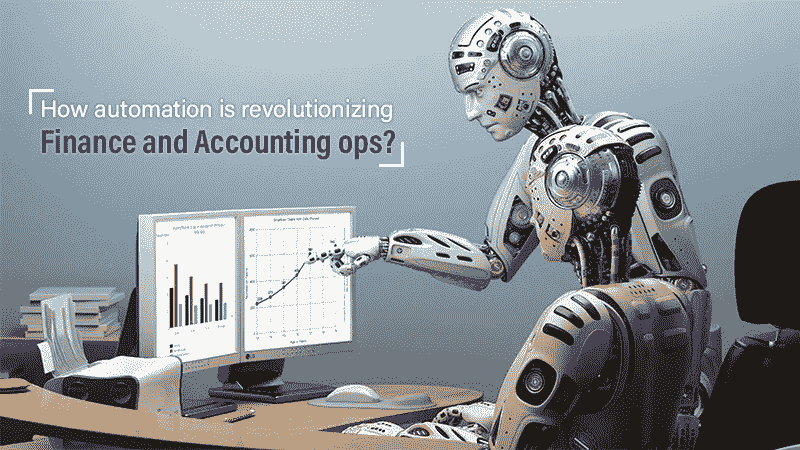

# 自动化如何革新财务和会计运营

> 原文：<https://medium.datadriveninvestor.com/how-automation-is-revolutionizing-finance-accounting-ops-c7ed1d358325?source=collection_archive---------3----------------------->

Photo by [Alexander Schimmeck](https://unsplash.com/@alschim?utm_source=medium&utm_medium=referral) on [Unsplash](https://unsplash.com?utm_source=medium&utm_medium=referral)

智能自动化是一种程序，它使用记录和简单的编程语言，为单调的任务再现应用程序的人工工作。这项技术将有助于制造能够进行交易、处理数据和与其他数字系统通信的计算机软件或机器人。

人工智能是发展最快的技术之一，它正被广泛用于监听所有客户通信。这既可以直接与公司联系，也可以从呼叫中心联系到聊天小组和其他社交媒体活动。

*Accounting software**could be foreseen as the future of finance and accounting related services*

财务会计自动化有什么好处？

 [## 不管准备好了没有，革命就在我们面前|数据驱动的投资者

### “对于技术如何影响我们的生活和重塑经济，我们必须形成全面的全球共识……

www.datadriveninvestor.com](https://www.datadriveninvestor.com/2019/02/12/ready-or-not-the-revolution-is-upon-us/) 

**好处 1:** 智能自动化执行简单的机械化任务，比如通过聊天回复一系列询问。而智能自动化可以更进一步。

**好处#2:** 像客户关系管理中的沟通、跨多个信息基础更新数据等动作，也可以在几秒钟内完成。

人们经常说，人工智能将改变社会的所有领域，这本身就是一个国家发展的象征，然而，它也威胁到在这些领域工作的员工的地位。

**好处#4:** 自从实施智能自动化以来，生产的优越性有了实质性的增强，并且消除了由人引起的错误的危险。

**好处#5:** 智能自动化很容易融入您的业务；智能机械化可以适度地应用到商业中，因为不需要使用一些原始工具来修改动作。

**人工智能和自动化的使用:**

**#1。雕刻金融服务**

金融客户的要求是高度优化的，只有通过使用自动化和人工智能才有可能实现。数字银行和贷款发放的应用程序使用基于学习算法的机制，该机制收集贷款资格和其他相关服务的数据。

在金融上有可能创造出使用 AI 的产品；这些产品将从客户的数据中学习，并帮助确定如何执行整个过程。有**小企业会计软件**，它是在人工智能的帮助下创建的，具有许多其他**在线会计**功能。

**#2。骗局设置**

在人工智能的帮助下，有可能感知任何欺诈或网络犯罪。它一直在帮助阻止信用卡欺诈或任何在线交易欺诈，这些欺诈可能在进行在线支付时发生。银行还利用人工智能来揭露和阻止另一种臭名昭著的金融犯罪:洗钱。

使用人工智能，有些机器可以发现任何非法行为或欺诈行为。

金融领域被 AI 革命；这是通过对人类思维方式的持续理解来保护其产品和服务而自由完成的。它确保在策划和交付任何金融工具时，诚实地遵循所有政策、法规和安全措施。

*金融领域的人工智能也有助于防止严重的控制错误。*

**#3。快速跟踪业务**

人工智能正被大公司用来加速基于知识的活动，以改善和扩大业务。如果银行使用人工智能来最大限度地缩短接受贷款的时间，它不仅可以降低自己的成本，还可以改善客户体验。

对股票表现的预测更加精确，因为程序可以检查基于过去数据的交换方案，并将验证过程提前推进到一个全新的水平。

它在拓展商业和贸易方面一直扮演着非常重要的角色。

它利用尖端的知识机器整合实时市场数据，对价值行动中的设计进行分类，以获得更准确的市场预测。

**#4。人工智能中的风险管理**

人工智能在各方面的功能都像人类的大脑一样，有着惊人的能力去理解它所能理解的一切。在金融风险管理方面，人工智能帮助很大。它有助于管理结构化和非结构化数据。

人工智能已经能够分析和预测即将到来的实时问题&对任何与商业或金融领域相关的可能风险的详细预测。随着 AI 的使用，**基于云的** [**会计软件**](https://www.hostbooks.com/us/) 成为可能，在各个领域帮助金融部门。

有许多公司已经看到，通过使用人工智能，他们的风险分析技术发生了巨大变化。利用人工智能诱导的风险管理技术，成千上万的财务记录是安全的。

**#5。个性化银行**

因为 AI 在金融领域增加了很多额外的好处。语音控制的计算机生成的信息是由最新的技术驱动的，如亚马逊的 Alexa 可以看到稳定性，计划费用，账户查询等。

许多国际银行正在为其客户提供设置支付账单提示的功能，帮助他们规划支出，并以轻松高效的方式与银行合作，从接收数据到完成与交易相关的连接。

他们还提供金融提示作为人工智能的一个特征；这就是科技发展的方向。人工智能在需要高度动态的领域呈现自动化，从而保护消费者的信任。

**#6。电脑化**

出色的平衡以及将人工智能视为决策因素的能力，与人类对未来金融决策的展望一样重要。人工智能允许的软件根据给定的边界验证数据并创建报告，分析文档，并从表格中提取数据。人工智能可以在涉及金融交易检查的行动中大量使用。

*由于人工智能和自动化已经在金融和会计领域竭尽全力，我们可以预计，在不久的将来，我们将看到机器人会计。变化是最大的真理，除了接受技术的进步，我们别无选择。*