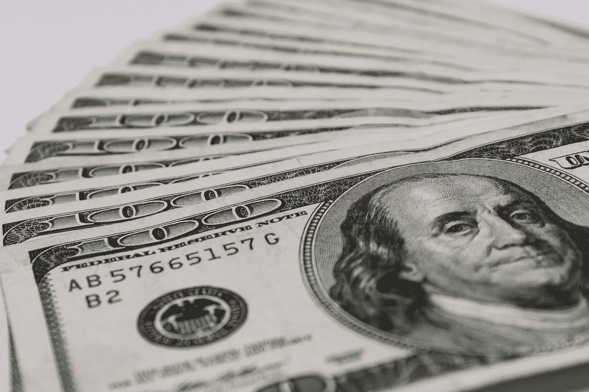

# 区块链将如何帮助没有银行账户的人

> 原文：<https://medium.datadriveninvestor.com/how-blockchain-will-help-the-unbanked-f85571f9ab?source=collection_archive---------11----------------------->

推特:@infosec_andy

根据最近的估计，目前大约有 20 亿人没有银行账户。这些“没有银行账户”的人主要通过脱离网络的实物现金交易生活。

当今商业环境的超连接数字结构要求参与者拥有一个银行账户，以便在国内外发送和接收付款。Venmo、Paypal 和 Payoneer 等服务与没有银行账户的人群不兼容，而 Western Union 和 Ria 等服务则非常昂贵。

然而，随着区块链技术的出现，没有银行账户的人可能能够保持这种方式，仍然可以使用数字支付和汇款。

# 当前的范式

无法进入银行对没有银行账户的人有什么影响？一般来说，除了实物现金，他们不能发送或支付任何东西。大部分没有银行账户的人都是需要往家里寄钱的农民工。由于没有银行账户，这些工人唯一的选择是通过西联汇款和速汇金等跨境汇款公司汇款。

一名移徙工人从意大利向喀麦隆汇款，平均至少要支付汇款金额的 15%，最高可达 25%。西联汇款、速汇金和 Ria 只是少数几个每年收取超过 50 亿美元高额费用的全球汇款解决方案(2017 年，西联汇款在同年向全球发送 800 亿美元后报告了 55 亿美元的利润)。

除了上述情况之外，一般来说，大多数没有银行账户的人口都生活在人均收入较低的发展中国家。在非洲，有银行账户的 10%的人当中，38%的人将他们的账户严格用于接收来自国外的汇款。这些指标在东南亚、中东大部分地区和整个拉丁美洲都很相似。

随着服务从对现金的依赖转向纯数字/无纸化系统，没有银行账户的人发现自己无法参与社会的现代化。

## 区块链为没有银行账户的人提供金融包容性

如果说有一件事区块链做得比之前的任何技术都好，那就是全球支付。西联汇款、贝宝和国际银行转账费用昂贵，需要一到几个工作日才能发送，并且需要账户，而区块链支付只需几分钟，交易费用极低，并且不需要银行账户。

例如，Stellar Lumens 的目标是通过提供低成本、即时和包容性的支付网络，为没有银行账户的人提供银行服务。要登机，用户只需要一部智能手机、一个一流的 Lumens 钱包和现金，就可以在任何现金进出点(多币种加密自动取款机、便利店等)为钱包充值。

OmiseGo 是一个与以太坊密切相关的项目，旨在建立分散经济，并承诺“解除银行的银行业务”。OMG 网络将连接商家和用户，使他们能够用加密货币和法定货币支付。OMG 路线图包括一项创建现金进出点的计划，建立一个包容性的金融网络，如果有足够的采用，可以使银行成为过去。

由麻省理工学院的一个团队创建的新兴加密货币 Algorand 希望他们近乎无感觉、无限可扩展的货币能够填补比特币的空白，为世界各地的人们提供一种高效、便捷的交易方式，而无需银行的介入。

在这些项目以及肯定会出现的更多项目中，将金融普惠扩展到世界上没有银行账户的人群似乎正是区块链的使命。

