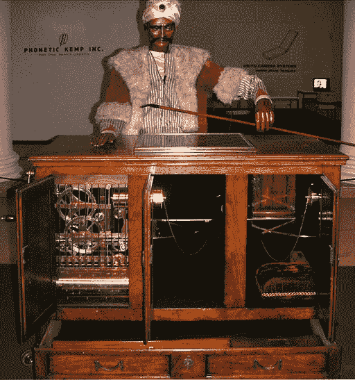
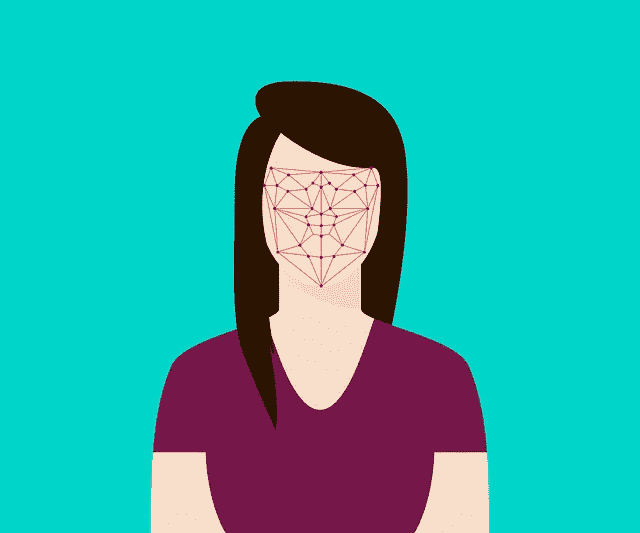

# 深度学习如何让机器变得更聪明

> 原文：<https://medium.datadriveninvestor.com/how-deep-learning-is-making-machines-smarter-7ed29d6fbfd3?source=collection_archive---------4----------------------->

Carafe at English Wikipedia [GFDL ([http://www.gnu.org/copyleft/fdl.html](http://www.gnu.org/copyleft/fdl.html)) or CC BY-SA 3.0 ([https://creativecommons.org/licenses/by-sa/3.0](https://creativecommons.org/licenses/by-sa/3.0))], via Wikimedia Commons

科学家们已经对人工智能的概念进行了 60 多年的实验。人工智能的正式实验于 1956 年在达特茅斯学院正式开始。但是，你可以争辩说，创造机器人和人造人的想法可以追溯到许多世纪以前。人们总是着迷于建造能像我们一样行动和反应的机器。深度学习的最新发展让这个梦想更加接近现实。

一些人相信科学家早在 1770 年就已经发现了人工智能的秘密。这是下棋的机械土耳其人被释放到世界上的时候。“土耳其人”是为哈布斯堡公爵夫人玛丽亚·特蕾莎制造的机器人。“他”打扮成一个下棋的机械人，穿着长袍，坐在一个木柜子上的棋盘前。土耳其人可以击败许多人类玩家，成为当时的名人。

当然，“人工智能”和“深度学习”这两个词在那个时候还没有被发明出来——然而这个土耳其人无疑是一个人造人，他似乎在每场比赛中都在学习和提高自己的棋步和技巧。许多人透过木柜看了看，宣称那里不可能有一个真人。里面全是齿轮、齿轮和发条装置。

土耳其人与其他自动机的区别在于，他不遵循一套指令，也不执行重复的任务。他似乎对对手的行动反应自然。

但这一切都是骗局。实际上有一个小人在里面，操纵着棋步，拉着适当的杠杆。真正的深度学习和人工智能让机器变得更聪明还需要很多年。但是机械土耳其人至少鼓励人们去思考创造能够像真正的人一样思考和行动的装置的想法。

# 深度学习和人工智能有什么不同？

深度学习是人工智能的一个子集。人工智能融合了所有使机器智能化的科学。机器学习提供了一种无需特定编程就能让机器变得更智能的方法。它包括允许机器从经验中学习的算法，并在不需要直接编程指令的情况下改变它们的活动。深度学习是机器学习的一部分。它专注于传统上需要思考的机器学习部分。

如果机械土耳其人是真实的，让他工作的整个过程将被视为人工智能。作为对人类棋手游戏的反应，棋手改变他的打法的方式就是机器学习。对人类玩家的模式和玩法的具体学习(以及可能成功或失败的反击)将是深度学习。

近年来对深度学习的许多研究都集中在计算机如何以类似于人脑的方式学习新概念。它专注于试图复制大脑的神经网络——这可能非常复杂，有很多层。

# 面部检测/识别中的深度学习

近年来显著进步的一项技术是面部识别。识别和更基本的面部检测都依赖于深度学习的模拟。提交给系统的数据样本越多，计算机理解得越好。

大量的训练数据被输入面部检测/识别系统。电脑拥有的数据越多，它学习的就越好，一张脸是什么样子的。有了足够的数据，它甚至可以修改其算法，以区分老人和年轻人的脸，显示快乐的脸和显示悲伤的脸，以及特定脸之间的面部识别差异。

例如，在处理了足够的数据之后，面部检测程序将注意到某些面部可以被分类为具有年轻的外表。例如，它可以看到具有以下特征的人脸:

与脸相比更大的头

与脸相称的大眼睛

比其他图片整体更圆的脸

丰满的脸颊

短而平的眉毛

短而小的鼻子

系统用于训练的图像越多，它就越能确定图像具有上述特征，并且它在呼叫中提供的图像是婴儿图像的置信度就越高。

# 深度学习可以帮助机器变得更智能

早期的编程主要是顺序的。指令接着指令接着指令。没过多久，循环就被用来提供更大的灵活性，并允许一种对事件作出反应的方式，但程序实际上仍然只是一个长长的指令配方。机器只是做它们的程序告诉它们的事情，如果它们遇到意想不到的事情，就会停下来。

不过，我们完全明白这一点。人工智能、机器学习和深度学习正在帮助我们建造机器，这些机器能够做人们做梦也想不到的事情——即使是在机械土耳其人的时代。

例如，机器人流程自动化(RPA)消除了人们执行过去重复的、基于规则的工作的需要。你可以使用 [WorkFusion 的 RPA Express](https://www.workfusion.com/rpaexpress?utm_source=blog&utm_medium=other&utm_name=andrew-loader&utm_term=how-deep-learning-is-making-machines-smarter) 等工具从任何应用程序中收集结构化数据，并训练和选择对机器人来说太复杂的机器学习算法。您可以使用 RPA 来收集有助于学习的必要数据。

我们今天或许可以造出真正的土耳其机器人。