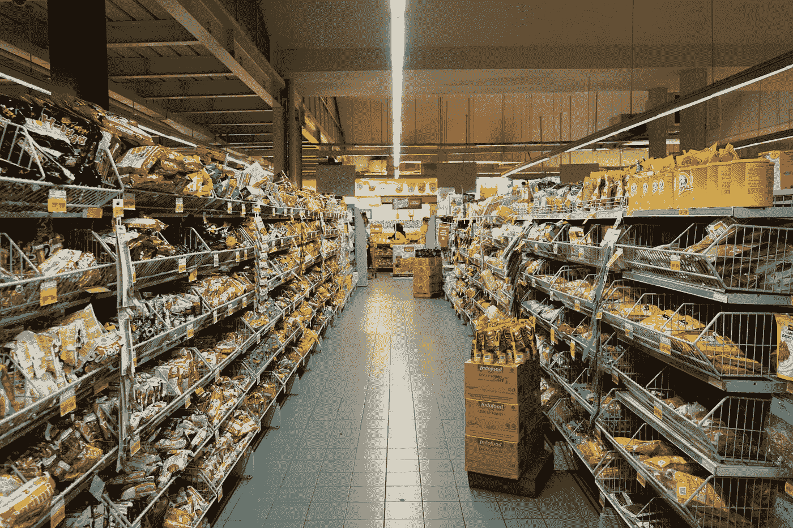

# 数字解决方案如何塑造下一代杂货业领导者

> 原文：<https://medium.datadriveninvestor.com/how-digital-solutions-are-shaping-the-next-grocery-leaders-230f20eb53fd?source=collection_archive---------31----------------------->

Photo by [Fikri Rasyid](https://unsplash.com/@fikrirasyid?utm_source=medium&utm_medium=referral) on [Unsplash](https://unsplash.com?utm_source=medium&utm_medium=referral)

2018 年的杂货价格战使技术与传统对立，便利与忠诚对立，自有品牌与深受喜爱的品牌对立。决定哪些品牌在这个快速发展的行业取得成功的因素很多。

然而，在宣布这场战斗的胜利者之前，有必要先回答一个基本问题。

# 什么构成了杂货价格战的成功？

答案比你最初想的要微妙得多，它远远超出了简单的低价。事实上，dunnhumby 在 2019 年 1 月发布的一份[零售商偏好指数报告](https://www.dunnhumby.com/sites/default/files/reports/dunnhumby%20Retailer%20Preference%20Index%202019-%20Grocery%20Edition.pdf)通过一个独特严格的镜头审视了杂货连锁店的 2018 年。下面的检查和排名主要是基于他们的发现。

根据该报告，客户偏好取决于两个不同但同样重要的因素:

*   **财务业绩** — *销售增长、市场份额、每平方英尺销售效率*
*   **情感联系** — *信任、满意度、忠诚度、推荐可能性*

这两个关键因素在不同程度上依赖于七个可衡量的“偏好驱动因素”，这些因素反映了在日益变化的杂货店格局中最近的客户需求和行业趋势。那些能够在这些支柱中最重要的支柱上优化业绩的零售商发现自己轻松地位居榜首。

**顾客偏好的七大支柱:**

*按整体影响顺序*

**定价。虽然其他支柱可能会更受关注，但价格仍然是重中之重。正如沃尔玛首席执行官道格·董明伦(Doug McMillon)雄辩地指出的那样，“价格仍然很重要。很多美国人都在数着每一分钱。”相对于其他零售商的价格透明度成本，自然/有机产品的价格对消费者来说理所当然很重要。下面，我们将进一步阐述*智能*定价的重要性。**

**质量。**它与定价齐头并进，是对客户影响最深的支柱。“质量”这个总括术语方便地涵盖了许多相互关联的方面:产品的新鲜度、熟食的味道、商店的卫生、购物者的待遇以及高端产品的可用性等等。就客户偏好而言，值得注意的是，价值认知与质量直接相关，与价格相反。

**数字**。正如围绕它的媒体炒作恰当地表明的那样，数字不再仅仅是一个拥有的好渠道。拥有数字平台的零售商最能抓住店内的探索感，并成功适应个人口味，将会胜出。也就是说，只要平台方便、直观，并且支持具有强烈价值观念的产品。

**作战。**回到基础:产品是如何组织的？物品的库存和价格是否一致？店家夸的是什么品种？所有这些基本问题仍然很重要，而且随着数字技术的兴起，这些问题正以越来越创新的方式得到解决。

**方便。**附近的位置和丰富的产品选择意味着顾客无需为任何购物需求转向别处。问题？随着电子商务和零售选择种类的增加，顾客们一如既往地愿意涉足多个领域。

**折扣、奖励、&信息。在超市荧光灯的照耀下，没有什么比有用的优惠券或独家销售更友好的了。做对了的商店看到了巨大的利润；那些不知道的人可以看到高达 71%的美元浪费。**

**速度。快速结账真是锦上添花。速度与财务成功没有正相关，许多最受欢迎的连锁店为了更高的支柱几乎牺牲了速度。也就是说，它肯定不会损害用户体验或一般光学。**

现在，需要注意的是，这些价值观不一定是普遍存在的。[例如，Market Force](https://www.marketforce.com/2018-americas-favorite-grocery-stores) 所做的一项研究将质量和运营支柱分为与用户体验相关的几个不同类别，并且没有将价格作为决定客户态度的重要因素。

也就是说，dunnhumby 的调查和其他调查一样经过了缜密的思考，其结论倾向于反映总体的行业发现(包括市场力量的发现)。

废话不多说…

# 2018 年最佳杂货零售商

列出支柱后，值得认识到的是，没有哪家零售商能在每个支柱上都遥遥领先。毕竟，每个食品连锁店都只有这么多资源。关键是以有利可图的方式战略性地分配这些有限的资源。

换句话说，每个零售商都必须在对这些支柱的承诺上做出某些权衡。有些人只是比其他人做得更好。

**乔氏。**这家不落俗套的杂货商之所以在价值认知上胜出，主要是因为其对低价和高品质的承诺。凭借其[最佳商店布局](https://www.fastcompany.com/40457417/heres-what-it-takes-to-win-the-grocery-wars)和完全避开数字和几个便利因素，Trader Joe's 已经能够将精力(和资金)集中在店内体验和顶级价格上。这一点，加上其独特的悠闲氛围和人情味，培养了一个特别小众的私人品牌，与全国各地的客户建立了牢不可破的情感联系。

**威格曼。**凭借最高的质量排名和较高的便利性得分，威格曼餐厅已跻身前五名。但事情变得有趣起来:威格曼的产品在其他任何一个支柱领域都不在第一位，而且在定价方面排名非常低。这就是权衡的概念最明显的地方:威格曼不需要无与伦比的价格，因为它的产品值得它们的成本。根据 Market Force 的说法，这种对高品质商品和店内体验的坚定承诺使威格曼一跃成为“美国最受欢迎的杂货零售商”。

**好事多。虽然威格曼证明了成功并不依赖于低价，但好市多证明了这一点。这家雄心勃勃的大宗零售商在四大支柱(价格、质量、数字和运营)中的每一项得分都很高，并特别承诺在定价方面领先。如果你去过好市多，你可能会亲眼目睹速度对销售增长的重要性。**

**亚马逊**。数字巨头[因其成本比较和 Prime 会员津贴而被称为](https://www.businessinsider.com/amazon-whole-foods-deal-effect-on-grocery-prices-2018-7)“[杂货]定价面临下行压力”。尽管在质量或便利性方面排名不高，但 [CNN Business 相信](https://money.cnn.com/2018/06/06/news/companies/costco-target-walmart-kroger/index.html)亚马逊的“经过测试的以低于现有竞争对手的价格夺取市场份额的战术[是它所需要的]。“凭借技术工具和创新的数据处理能力，亚马逊在未来几年都将稳坐榜单的位置。

**还有其他一些人……**

*   **HEB——这家总部位于得克萨斯州的零售商凭借高质量的客户定位产品和合理的定价方法赢得了一批忠实的追随者。**
*   **Aldi 和 Lidl**——两家德国折扣零售商，产品种类有限，但价格无与伦比[，甚至可以与](https://www.npr.org/sections/thesalt/2017/09/27/552384150/discount-grocers-aldi-and-lidl-give-u-s-stores-a-run-for-their-money)亚马逊在价格战中的影响力相媲美。
*   **WinCo**——尽管在西部是个小角色，但它得分很高，因为它“在正确的地方结合了价格和强调质量，并专注于零售基础”

然而，那些“正确的地方”到底是什么呢？零售商如何做出这些决定？

# 高价值感不仅仅取决于低价格

威格曼最近的成功清楚地证明了这一点。此外，仅仅关注某些支柱也是不够的。当然，在数字和折扣两方面都表现出色的零售商中，有一半在总体上排名前四分之一，但另一半在两个类别的得分都接近垫底。

因此，关键不一定在于你优先考虑哪些支柱，而是你如何优先考虑它们。你不能只是降价；你需要知道削减哪些价格以及削减多少。在产品决策方面向董事会扔飞镖，并希望有些东西能坚持下来，这就是你在第三和第四季度结束的原因。

由于类似的宏观方法可能会基于微观细节产生大不相同的结果，零售商正在仔细完善他们的计划，以保持竞争优势。在这个时代，当所有公司中亚马逊都处于前沿时，这意味着转向建立在先进技术基础上的解决方案。

# 赢得食品价格战需要注入数据和动态定价的技术策略

机器人收银员可能会成为头条新闻，但人工智能在优化杂货商的结果方面有更广泛的应用。

各种规模的公司(参见:WinCo)都在为[一系列前瞻性计划](https://www.digitaldoughnut.com/articles/2018/june/the-grocery-tech-landscape-2018)实施技术:“产品组合规划、大数据和数据处理、客户洞察、客户忠诚度、电子商务、店内分析、店内营销技术、价格优化、促销优化和促销目标。”

随着技术在分析杂货数据中的应用变得越来越普遍，Planer 星球零售总监 Boris Planer 的[宣言](https://www.reuters.com/article/us-retail-tech-explainer/why-are-grocery-retailers-teaming-up-with-tech-giants-idUSKBN1J9237)说“与客户联系和挖掘数据的能力将是未来的主要能力之一”听起来一如既往地真实。

例如，主要杂货巨头克罗格[因走在数字化进程的前沿而受到称赞](https://www.winsightgrocerybusiness.com/technology/kroger-making-its-mark-grocery-tech)，其中包括“战略投资”，如“以客户为中心的技术解决方案…空间优化商店…和智能定价产品。”

更重要的是，技术推动的动态定价已经成为[将亚马逊推向这场杂货战争前沿的主要驱动力之一。这种灵活的价格标签方法可以在为客户实时提供更好的报价的同时增加收入。此外，Plant Retail 的零售顾问发现，大约 78%的零售商正在寻找更好的方法来应用浮动价格和谨慎折扣。](https://www.pymnts.com/news/ecommerce/2018/dynamic-pricing-holiday-shopping-amazon/)

然而，正如 Planer 自己所意识到的，“零售商开始明白，认为他们可以自己做到这一点将是一个很大的错误。”

# 智能节点旨在帮助零售商采用技术解决方案

从定价策略的不同因素中收集无尽的数据是一项需要时间和精力以及高度技术警觉的任务。Intelligence Node 创建了解决方案来减轻您的负担，并简化整个流程以提高您的整体竞争优势。

例如，Inoptimizer 工具是一种注重效率的价格优化工具，旨在将零售商置于对其客户和相对于竞争对手的最佳位置。它自动化零售定价和库存管理，读取市场趋势以推荐最有利可图的价格，并跟踪产品历史以巩固未来的战略。

这还不算 360 Pricing，它检查价格弹性、库存水平、竞争性定价等，以更好地确定最佳加价和降价

对[智能节点解决方案](https://www.intelligencenode.com/solutions/)的进一步研究将突出众多有用的优势，如趋势跟踪、分类智能和用户友好的数据馈送。但所有这些都是为了强调一个简单的事实:最好的杂货零售商并不是偶然登顶的。Trader Joe's、Wegmans、Amazon、Costco 和 W-E-B 已经开发了卓越的商业模式，利用这些支柱来促进情感联系和财务业绩。

有了这些工具，攀上顾客偏好的顶峰就成为你的零售企业更容易实现的目标。

*原载于 2019 年 2 月 4 日*[*【www.intelligencenode.com】*](https://www.intelligencenode.com/blog/who-won-the-2018-grocery-price-wars/)*。*