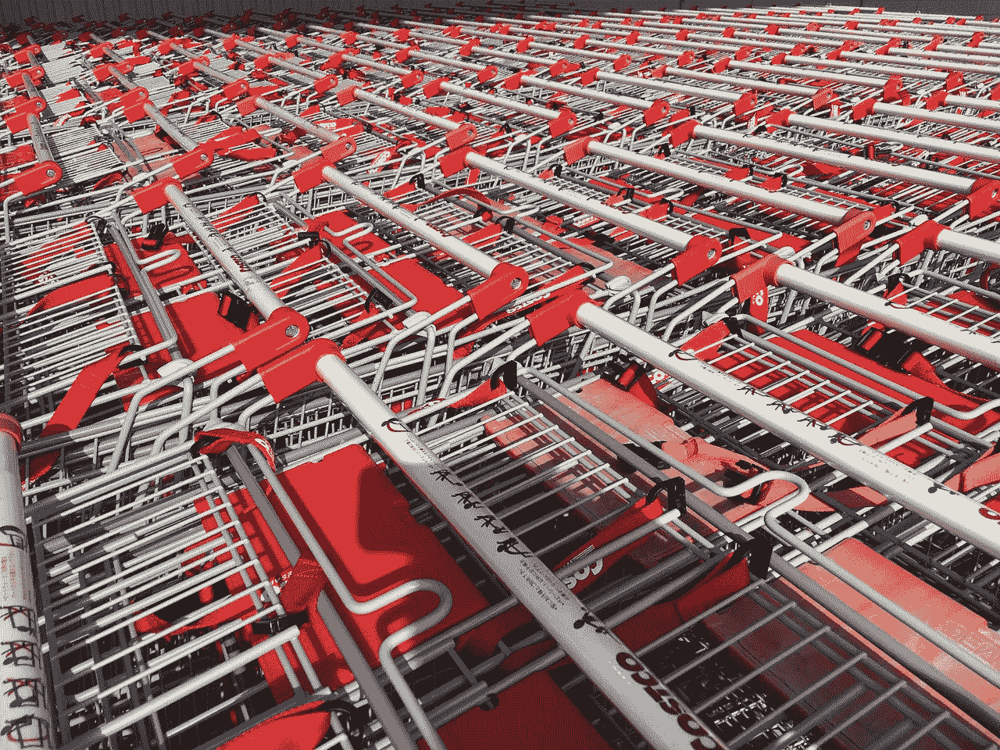

# 会员费如何驱动好市多(COST)赚钱机器

> 原文：<https://medium.datadriveninvestor.com/how-membership-fees-power-the-costco-cost-money-machine-8e575facf5c0?source=collection_archive---------7----------------------->

Costco(成本)赚钱机器是有史以来最简单也是最聪明的零售策略之一。本质上，Costco Wholesale(NASDAQ:COST)通过收取会员费，迫使消费者在它的商店购物。

事实上，会员费是好市多(COST)赚钱机器的核心。会员费以两种有趣的方式扩大了好事多的业务。

# **会员费如何驱动好市多(COST)赚钱机器**

首先，会员有义务在好市多购物。解释一下，一个花 60 或 120 美元购买好市多会员的人会多开 5 或 20 英里的车去好市多商店。

其次，会员费产生了现金流，好市多可以用它来发展业务。浮动；正如沃伦巴菲特(Warren Buffett)所证明的，权力是因为好市多可以用它来做几乎任何事情。

毫不奇怪，杰夫·贝索斯；好市多创始人[杰夫·布罗特曼](https://www.nytimes.com/2017/08/02/business/jeff-brotman-costco-founder-dead.html)的朋友兼崇拜者窃取了好市多亚马逊 Prime 的会员战略。关于贝佐斯和布拉德·斯通兄弟的关系，请参见布拉德·斯通的《万物商店:杰夫·贝索斯和亚马逊时代》。

解释一下，Prime 会员让消费者有义务在亚马逊购物。此外，亚马逊像好市多一样提供低价。

# **好市多(COST)赚钱机器能否在亚马逊时代存活？**

在这种情况下，我们必须问，好市多(COST)赚钱机器能在亚马逊时代幸存下来吗？

令人惊讶的是，数据显示，尽管亚马逊崛起，好市多赚钱机器仍然表现良好。例如，据 Statista [统计](https://www.statista.com/statistics/718406/costco-membership/)，好市多的会员数量从 2014 年的 7640 万增长到 2018 年 9 月的 9430 万。

因此，尽管亚马逊积极扩张，好市多在四年内售出了 1790 万新会员。因此，我得出结论，好市多的赚钱机器在不久的将来不会受到亚马逊的威胁。

解释一下，有足够多的人重视好市多的会员资格，以维持仓储俱乐部的运作。然而，好市多的增长可能会有极限。

# **好事多增长的极限**

值得注意的是，美国社会的两大趋势威胁着好市多的未来。这些趋势是婴儿潮一代的老龄化和中产阶级的工资停滞。

婴儿潮一代是 1945 年至 1964 年间出生的一代美国人。不幸的是，大约 7300 万婴儿潮一代构成了好市多的核心人口，他们正在快速老龄化。事实上，最年轻的婴儿潮一代现在已经 53 岁了。

婴儿潮一代的老龄化威胁着好市多，因为随着年龄的增长，人们买的越来越少。例如，退休的人没有那么多钱可以花，也没有理由成为好事多的会员。因此，未来几年，我们可能会看到好市多在美国和加拿大的会员数量下降。

# **工资停滞如何威胁好事多**

工资停滞对好市多来说是一个更大的威胁，因为越来越多的美国人没有钱花了。

例如，皮尤研究中心[声称](http://www.pewresearch.org/fact-tank/2018/08/07/for-most-us-workers-real-wages-have-barely-budged-for-decades/)美国人平均工资的购买力已经 40 年没有增加了。需要澄清的是，经通货膨胀调整后，美国人的平均收入相当于他父亲在 1978 年的收入。此外，大多数工资增长都流向了上层阶级。

工资停滞对好市多有利有弊。好市多从工资停滞中获利，因为手头拮据的工人更有可能抄底和批量购买。然而，工资停滞对好市多不利，因为工人的可支配收入减少了。

# **工资停滞如何损害好事多**

事实上，好市多面临的一个主要威胁是，足球妈妈必须在好市多会员和亚马逊 Prime 之间做出选择。这对好市多来说可能是个问题；特别是，如果人们将亚马逊 Prime 会员视为中产阶级身份的标志。

例如，足球妈妈说我想让邻居看到我家门口的亚马逊盒子。这位女士希望她家门口的亚马逊盒子向邻居展示她是中产阶级。

此外，美国大部分的收入增长都流向了上层阶级的消费者，他们没有动力去好市多购物。例如，上流社会的人更有可能住在远离好市多商店的时尚内城地区。因此，好市多在曼哈顿等地开店的策略是明智的。

此外，富人更没有理由精打细算和大量购买。因此好市多需要新的策略来吸引顾客。

# **好市多(COST)赚钱机器有多成功？**

幸运的是，财务数据显示，尽管面临生存威胁，好市多的股东没什么可担心的。

例如，好市多的毛利润为 44.46 亿美元；10.25%的收入增长率，2018 年第四季度的收入为 350.69 亿美元。此外，好市多批发公司报告同期营业收入为 9.49 亿美元，净收入为 7.67 亿美元。

因此，好市多赚钱机器正在运转，并产生大量现金。例如，好市多报告 2018 年第四季度的运营现金流为 21.77 亿美元，自由现金流为 14.47 亿美元。

最后，好市多在银行里有很多钱，是一家零售商。例如，好市多在 2018 年 11 月 25 日报告了 67.78 亿美元的现金和等价物，以及 11.75 亿美元的短期投资。

# **好事多股息是安全的**

因此，我得出结论，好市多的股息在可预见的未来是安全的。

这对好市多股东来说是个好消息，因为下一次成本股息是 57 英镑，计划于 2019 年 2 月 22 日发放。重要的是，好市多的股息在 2018 年增长了 7 美分，高于 2018 年 2 月的 50 美分。

因此，好市多的股息在 2019 年可能会增加几分。这种增长是可能的，因为好市多向股东提供了 15 年的股息增长。此外，2019 年 2 月 18 日，每股成本为投资者提供的股息收益率为 1.05%，年化股息为 2.28 美元，派息率为 33.5%。

我认为 2019 年 2 月 18 日好市多每股 216.47 美元还是价值投资。然而，好市多的价值可能会在一夜之间消失，因为它的基础是一种特定的行为。

该行为是中产阶级消费者每年购买一个 Costco 会员的意愿。如果这种行为改变，好市多将失去所有的价值。