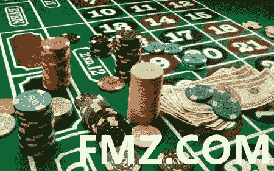
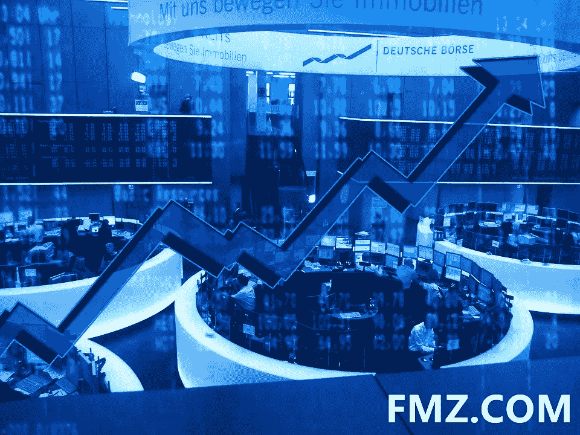

# 投资操作交易中如何把握趋势

> 原文：<https://medium.datadriveninvestor.com/how-to-grasp-the-trend-in-investment-operation-trading-607a62d4262c?source=collection_archive---------6----------------------->

www.fmz.com

第一，善于识别趋势。

有句话叫“趋势是你的朋友”。找到趋势的主线，有助于投资者整体把握市场，不会被短期的市场波动所迷惑。周趋势线和月趋势线的图形分析非常适合识别长期趋势。

第二，要认清支撑和阻力。

支撑位和阻力位是图表中不断受到向下或向上压力的点。支撑位通常是图表中的最低点(小时，周或年)，而阻力是图表中的最高点。当这些点呈现出可以再现的趋势时，就认为是支撑和阻力。买入或卖出的最佳时机是在不易被突破的支撑或阻力附近。但是，这些点一旦被打破，往往就是反向壁垒。也就是说，在上升趋势中，已经被突破的阻力位可能成为此后上升趋势的支撑位；在下跌趋势中，一旦支撑位被突破，就会转为阻力位。(www.fmz.com)

1.另外，趋势线也是判断市场方向的一个简单实用的工具。连接两个连续低点或高点的直线，延长线将帮助投资者判断市场的运行路径，延长线也将成为支撑线或阻力线。

趋势线的一种特殊形式是通道，它由两条平行的趋势线组成。两条线代表价格趋势上升、下降或水平的通道。

2.在认识到趋势的有效性后，均线就成为技术分析中的重要指标之一，它反映了特定时期特定时间的平均价格。(www.fmz.com)

当然，均线有它的缺点，那就是滞后，所以它不一定是趋势转变的标志。解决这个问题的方法是使用较短周期的移动平均线，而不是较长周期的移动平均线。例如，5 日移动平均线将比 30 日移动平均线更能反映最近的价格趋势。

但更常用的方法是比较不同时期的移动平均线。当短期均线向上穿越长期均线时，发出买入信号；同样，当短期移动平均线向下穿过长期移动平均线时，会发出卖出信号。(www.fmz.com)

数学中有三种不同的移动平均线:简单算术移动平均线、加权移动平均线和平方系数加权平均线(EMA)。最后一种方法是首选方法，因为它赋予最新数据更大的权重。

第三，趋势线的使用

趋势线其实是道氏理论的精髓。技术分析大师墨菲在了解了大部分技术分析后，发现利用趋势线和简单均线，MACD 指标可以很好的操作。按理说，只要掌握了趋势线，就能很好的获利。但现在的问题是，假突破和趋势的缓慢导致我们在使用中出现了问题。我先说说我个人使用趋势线的一些方法。趋势线有三个作用。(www.fmz.com)

1.是趋势的标志。这是最基本的方面。几乎每个做过这行的朋友都知道。它是高点和低点之间的连接。表示趋势的完成。其中，两条趋势线可以形成通道、三角形、楔形、喇叭形等。；四条趋势线可以形成一个菱形。

2.它是一个指示区，可以认为是在一个通道中运行，但区域大多较窄，小时图上振幅通常在 10-50 点之间，日图上在 100-400 点之间。而且往往无法突破，一旦突破，就会形成一波趋势性的行情。这种蹲区类似于箱子的尖，但不能简单说是箱子。这是一个多空头寸争执的区域，通常是在一些重要数据出来之前，或者是节假日的时候。只要突破破了，就是跟进的时候了。这可以说是一个非常有效的方法。(www.fmz.com)

3.这预示着一个转折点。这里的转折有两种，一种是空间上的趋势转折，一种是时间和空间上的转折。

第四，准确判断大势的六大要素

根据经济金融的研究分析，判断股市的多空走势，把握其发展趋势，至少有以下迹象可供参考:(www.fmz.com)

1.根据政府相关部门发布的各项经济指标和经济对策信号，分析经济增长是否趋于下降，如政府相关部门发布的经济增长预测、工业生产月度增速、失业率、各项先行指标等。所有重要的信息都暴露了。如果经济出现衰退迹象，股市将缺乏力量支撑，即使是所谓的“资金市场”，也不可持续。(www.fmz.com)

2.通货膨胀有上升趋势吗？

通货膨胀不仅使企业因物价和工资上涨而上升，也降低了大多数低收入和固定收入人群的购买力，从而间接影响企业利润。虽然在通货膨胀初期，企业有原材料和产成品的低成本库存优势，还有房地产，可以保证盈利，甚至终究是盈利，但很短暂。一旦通胀恶化，股市必然陷入熊市。(www.fmz.com)

3.利率是否大幅上升？

当国际利率大幅上升时，各国必须被迫采取加息措施，以防止本国资金大量外流。在过去几年中，由于美国美联储把再贴现率提高了 0.5 个百分点，从原来的 6.5%提高到 7%，美国各大银行立即把利率提高到 11%以上，以至于欧洲工业国家也在考虑提高其再贴现率。如果欧洲国家跟进，全球利率势必攀升，可以预见全球经济发展将受到影响。(www.fmz.com)

此外，如果通胀继续上升，政府将收紧金融措施，迫使利率上升，以稳定民生，抑制金融投机。利率上升，企业经营成本上升，盈利能力相对较弱，现货当然不利。这就是为什么美国美联储宣布提高再贴现率，华尔街立即大幅下跌。(www.fmz.com)

4.国际原油价格是否大幅上涨？

迄今为止，还没有更经济高效的能源足以取代石油的地位。一旦油价大幅上涨，整个世界经济势必受到明显影响。

目前国际油价，随着产油国和非产油国组织其产油国逐渐趋于一致，油价有望保持稳定，但如果国际原油价格无序上涨，情况可能发生变化，对全球股市势必产生重大影响，两次中东石油危机就足够了。(www.fmz.com)

5.劳工和环境问题是否正在恶化

劳工和环保这两大问题确实纠结了经济发展，降低了企业的投资意愿。(www.fmz.com)

6.**社会是否持续稳定

繁荣的市场依赖于稳定的**和稳定的社会。如果政局动荡，经济发展受到影响，社会秩序混乱，就会降低企业的投资意愿，市场不可避免。(www.fmz.com)

第五判断趋势线突破

趋势线的突破对于买卖时机的选择具有重要的分析意义，甚至市场的做市商也常常根据趋势线的变化来进行市场操作；所以搞清楚趋势线什么时候突破是有效突破还是无效突破，对投资者来说至关重要。实际上，汇率趋于走下坡路的情况经常发生。判断的错误就意味着市场操作的错误。下面提供一些判断方法和市场原则，但具体情况还是要结合。(www.fmz.com)

对当时市场形势的详细分析。

收盘价的突破是真正的突破

技术分析师通过研究发现，收盘价突破趋势线是有效突破，因而是进场信号。取下降趋势线，即反压线。比如，如果市场价格已经突破了反压力线，但是收盘价仍然低于反压力线，这证明市场确实想试高，但是买盘没有继续，市场在泛滥。因此汇率最终在收盘时回落。这样的突破，专家认为不是有效突破，也就是说反压力线仍然有效，市场的弱势趋势仍然是最终的改变。(www.fmz.com)

同理，上升趋势线的突破也要以收盘价是否跌破趋势线为前提。图表记录中经常出现这种情况:趋势线突破后，汇率回到原来的位置。这种情况效果不好。相反的往往是市场的陷阱。(www.fmz.com)

判断突破的原则

为了避免入市失误，技术分析专家总结了几个判断真假突破的原则:

1.发现突破后，多观察一天。

如果突破后汇率连续两天向突破的方向发展，这样的突破就是有效突破，是安全的进场时机。当然，仅仅过了两天，汇率就有了很大的变化:买入的汇率高；交易所的换手率低，但即使这样，因为方向明确，趋势已定，投资者还是会有很多事情要做，冲进市场要好得多。(www.fmz.com)

2.注意突破后两天价格的高低

如果某一天的收盘价突破了下降趋势线(阻力线)，第二天，如果交易价格能越过他的最高价，说明突破阻力线后有大量买入跟进。相反，当汇率在上升趋势线中向下移动时，如果第二天的交易是在低于其最低价的情况下进行的，那么在突破支撑线后，抛压很大，值得跟随卖出。(www.fmz.com)