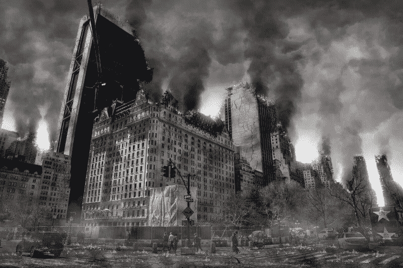
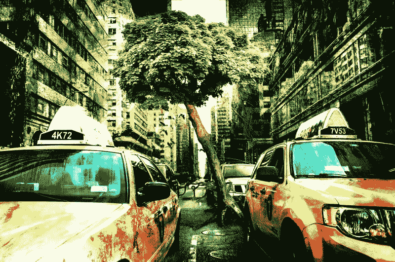
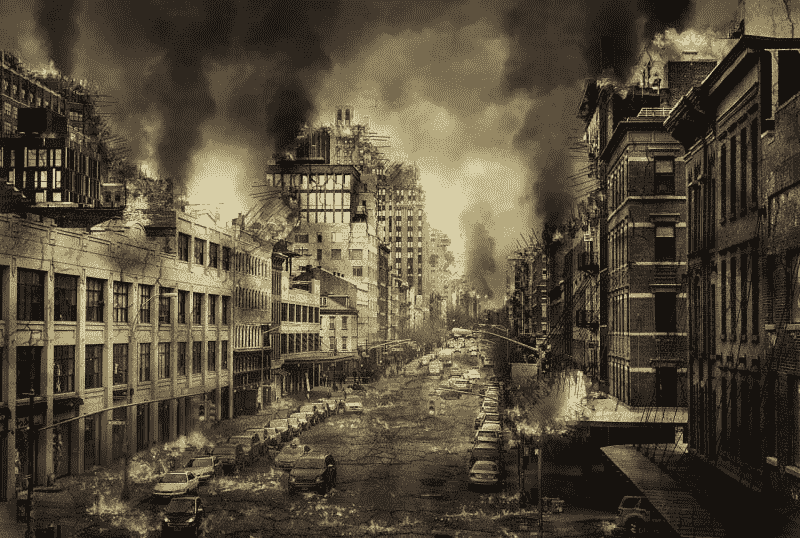

# 如何投资零售启示录——市场疯人院

> 原文：<https://medium.datadriveninvestor.com/how-to-invest-for-the-retail-apocalypse-market-mad-house-ddd5f30776af?source=collection_archive---------6----------------------->

那些投资零售业末日的人将会赚很多钱，因为零售商的大消亡是真实的，而且越来越严重。

Coresight Research [估计](https://coresight.com/research/weekly-us-and-uk-store-openings-and-closures-tracker-2019-week-25/)截至 2019 年 6 月 21 日，美国零售商宣布 2019 年关闭 6986 家店铺。相比之下，美国零售商在 2018 年全年关闭了 5864 家店铺。

 [## 算法交易的机器学习|数据驱动的投资者

### 当你的一个朋友在脸书上传你的新海滩照，平台建议给你的脸加上标签，这是…

www.datadriveninvestor.com](https://www.datadriveninvestor.com/2019/01/30/machine-learning-for-stock-market-investing/) 

与此同时，据 Coresight 计算，美国零售商计划在 2019 年开设 2985 家店铺。因此，在美国，每新开一家零售店，就有两家以上的商店关门。

# 2019 年，美国可能会有超过 12，000 家商店关门

令人震惊的是，事情很快会变得更糟。Coresight 的分析师认为，2019 年可能会有 12000 家店铺关闭。因此，2019 年美国的关店率可能会增加一倍以上。

鉴于这些现实，所有投资者都需要密切关注散户投资者的末日，并做出相应的投资。幸运的是，投资零售末日很容易。

为了帮助你，作为这一现象的长期观察者，我将为零售末日的投资提出一些建议。我对零售启示投资的建议包括:

# 投资基础设施，而不是商店

不要试图挑选赢家和输家，而是寻找向零售商提供商品、服务和技术的公司。请记住，无论在哪里购物，人们仍然需要吃饭、洗衣服和抽烟。

因此，聪明的投资者会效仿沃伦·巴菲特和杰夫·贝索斯投资零售基础设施。**亚马逊(NASDAQ: AMZN)** 拥有零售机器人公司 Kiva Robotics、履行中心和亚马逊网络服务(AWS)，后者为零售商提供云服务。与此同时，**伯克希尔哈撒韦公司(纽约证券交易所代码:BRK。B)** 拥有 [McLane](https://www.mclaneco.com/) 向许多零售商提供物流服务和各种商品。

有趣的是，可以投资的零售基础设施提供商包括英国杂货商和软件供应商 **Ocado Group PLC (LON: OCDO)** 。Ocado 建立了操作数百个机器人的平台，这些机器人在巨大的履行中心挑选和拉动商品进行交付。

Ocado 在英国经营着几个履行中心，并已同意在几个国家建立类似的设施。例如，Ocado 和美国最大的独立杂货商 **Kroger (NYSE: KR)** 想要在美国建立 20 个机器人履行中心。

另一个值得研究的基础设施提供商是租赁履行中心的 **Prologis(纽约证券交易所代码:PLD)** 。像 Ocado 和 McLane 一样，Prologis 为零售商提供物流和供应服务。

# 为什么您需要投资零售基础设施

投资那些为零售商提供或投资基础设施的公司是避免零售业末日的一种方式。所有在线零售商都将需要履行中心来支持交付，机器人来挑选和拉动订单，云服务来托管他们的网站。

从而投资亚马逊、克罗格这样的零售商；拥有奥卡多 6%的股份，以及**沃尔玛(纽约证券交易所:WMT)** 大量投资基础设施，这是一个明智之举。例如，沃尔玛目前在全球运营着 150 多个配送中心。

这种基础设施的价值在于:它可以为在线零售商和实体零售商供货。例如，Kroger 未来的业务可能是将食品从生产工厂直接运送到你家。值得注意的是，克罗格现在拥有家庭厨师送餐服务。

# 投资零售幸存者

幸存者是那些在零售业末日中成长并赚钱的品牌。幸运的是，这些品牌比大多数人想象的要多。

奇怪的是，甚至一些标志性的零售品牌也没有获得幸存者的地位。**塔吉特(纽约证券交易所:TGT)**；例如，2019 年 5 月 4 日报告的收入增长率为 3.63%。然而，Target 在同一天报告了负的自由现金流-3.27 亿美元。

另一方面，一些大牌在零售业末日中蒸蒸日上。值得注意的是，**Costco Wholesale(NASDAQ:COST)**在截至 2019 年 5 月 31 日的季度中，同比收入增长率为 7.35%，macro trends[估计](https://www.macrotrends.net/stocks/charts/COST/costco/revenue)。此外，Macrotrends 给予好市多截至 2019 年 5 月 31 日的 12 个月的收入增长率为 7.28%。

# 如何找到零售幸存者

更重要的是，好市多正在零售业的末日中赚钱。具体来说，好市多在 2019 年 5 月 12 日报告的毛利为 45.07 亿美元，营业收入为 11.22 亿美元，净收入为 9.06 亿美元。此外，好市多当天的运营现金流为 21.05 亿美元，自由现金流为 14.33 亿美元。

最后，好市多在 2019 年 5 月 12 日有 81.67 亿美元的现金和短期投资。因此，好市多在 2019 年 5 月 24 日支付其 65₵ a 股股息没有问题。

找到像好市多和塔吉特这样的零售幸存者很容易。看看他们在 stockrow.com 和 ycharts 等网站上发布的零售商财务数据就知道了。只需查看现金流、毛利、营业收入和收入等数字，就能知道哪些零售商赚了很多钱。

不要轻信任何东西的表面价值，也不要相信你在金融媒体上读到的任何东西。取而代之的是，在接触股票之前，先多看几遍财务数据。只有数字能告诉你一个公司是否赚钱。

# 增长是零售业生存的秘诀

“增长和价值投资紧密相连。”——沃伦·巴菲特。

另一个要看的数字是收入增长率。这个数字可以显示零售商的销售额增长了多少。

在目前的情况下，我对长期投资者的建议是购买快速增长的零售商。亚马逊表明，大规模的在线零售增长是有利可图和可持续的。

特别是，亚马逊报告截至 2019 年 3 月 31 日的季度收入为 597 亿美元，毛利为 257.8 亿美元，营业收入为 44.2 亿美元，净收入为 35.61 亿美元。更重要的是，截至 2019 年 3 月 31 日，亚马逊的现金和短期投资为 370.2 亿美元。

亚马逊以 16.69%的季度零售增长率实现了这些数字。因此，如果增长是可持续的，它将带来零售业的现金。

# 你可以从零售业的末日中赚钱

投资者可以从零售末日中学到的最重要的一课是，你可以从中赚钱。然而，你需要仔细研究实体启示录及其影响，以了解如何赚钱。

*原载于 2019 年 7 月 16 日*[*【https://marketmadhouse.com*](https://marketmadhouse.com/how-to-invest-for-the-retail-apocalypse/)*。*