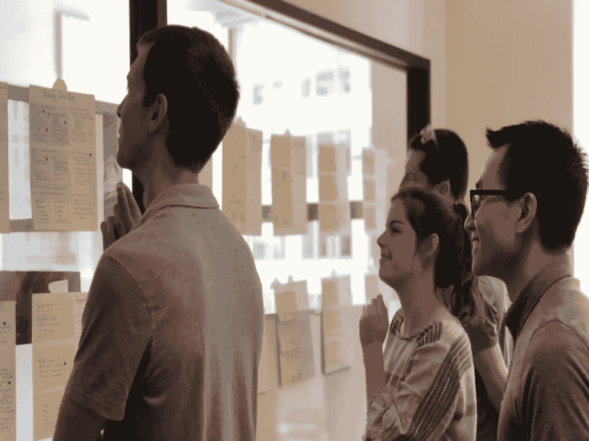

# 如何在团队中记下有见地的笔记，并使之具有可操作性

> 原文：<https://medium.datadriveninvestor.com/how-to-take-insightful-notes-as-a-team-and-make-them-actionable-97bf320cda87?source=collection_archive---------18----------------------->

Solaria Labs — a Liberty Mutual endeavor

聪明人的团队不一定是聪明的团队。回复:谷歌的工作发表了关于高效团队动态的[有见地的研究](https://rework.withgoogle.com/blog/five-keys-to-a-successful-google-team/)，强调心理安全是一个关键因素，但也有基本的团队机制，其中简单的调整可以带来巨大的进步。一个例子是团队记笔记。

这是我和我的团队在[使用结果驱动创新方法](https://medium.com/@JakeAuch/the-mechanics-of-outcome-driven-innovation-at-solaria-labs-6e3268bef932)时做笔记的过程。我们有一个次级研究的区块，接着是四个区块，每个区块有五个访谈。不管每个区块致力于什么类型的研究，这种方法有助于提取关键的见解。当这些区块用于主要研究时，我们认为一个区块是五次访谈。当这些区块专门用于二级研究时，我们认为一个区块是五个“学习单元”，例如，听关于该主题的播客、阅读行业白皮书等。

对于每个面试或学习单元

1.  使用 [KJ 法](https://articles.uie.com/kj_technique/)集体创建一个问题指南，对小组最重要的未知因素进行优先排序
2.  对于每个面试或学习单元，每个人都单独在电脑上做笔记。这个方法取决于每个人的喜好。
3.  在面试或学习单元结束时，每个人都会自行编辑笔记，以确保清晰和完整。他们在便利贴上写下 5-10 条关键见解(每张便利贴一条)。每个人都应该使用相同颜色的便利贴(稍后你会明白为什么。)他们*也*将这些见解和文字输入到一个小组电子表格中，其中行是每个贡献者，列是研究来源。我推荐 Airtable 作为团队的协作工具——它有许多不同的字段类型，可以包含图片、附件、复选框等。这个电子表格将成为你的团队研究的活的、不断发展的文档。
4.  将每个人的便利贴贴在一张大牛皮纸上，在顶部写上研究来源的名称。对纸上的便利贴做一个简单的主题组织，去掉重复的。
5.  在每组五个面试或学习单元结束时，团队应该有五张大牛皮纸，每张都有不同颜色的便利贴。(例如，一张纸的便利贴全是蓝色，一张纸的便利贴全是黄色，等等)。该团队还应该有一个电子表格，其中有五列见解、言辞和每个贡献者填写的其他材料。
6.  把所有棕色的纸挂在一个房间里，按主题整理所有的便利贴(KJ 方法指南适用于此)。这个过程是动态的——每个人都可以移动任何便利贴。这个过程不会停止，直到有停滞期。然后，每个人都应该用一个名词组来命名每个主题组。投票选出最具描述性的名字，这样每个主题组就只剩下一个名字(如果有不同意见，这是一个好迹象，表明这个组可能需要拆分。)
7.  现在你应该有主题组了，每个主题组都有一个名字。将他们作为一个群体进行检查。哪些是“彩虹”——有五种颜色的便利贴？这表明了广泛的相关性。哪些比较集中？进行[什么，所以什么，现在什么](http://www.liberatingstructures.com/9-what-so-what-now-what-w/)一起总结发现。
8.  用另一种 KJ 方法更新问题指南，这样你的共同学习就可以用于下一个研究。