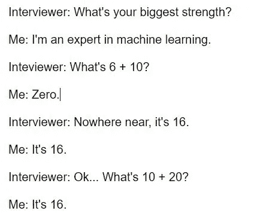

# 如何用简单的代码例子理解机器学习

> 原文：<https://medium.datadriveninvestor.com/how-to-understand-machine-learning-with-simple-code-examples-a0508dae212b?source=collection_archive---------0----------------------->

[](http://www.track.datadriveninvestor.com/1B9E)

使用简单的代码示例理解机器学习。


**“机器学习**、**人工智能**、**深度学习**、**数据科学、神经网络**

你一定在哪里读到过这些东西将如何夺走未来的工作，推翻我们在地球上的统治地位，以及我们如何找到阿诺德·施瓦辛格和约翰·康纳来拯救人类。

[](https://www.datadriveninvestor.com/2019/03/03/editors-pick-5-machine-learning-books/) [## DDI 编辑推荐:5 本机器学习书籍，让你从新手变成数据驱动专家…

### 机器学习行业的蓬勃发展重新引起了人们对人工智能的兴趣

www.datadriveninvestor.com](https://www.datadriveninvestor.com/2019/03/03/editors-pick-5-machine-learning-books/) 

随着**当前的炒作**，你可能会有**没有**的惊喜。

但是，什么是**机器学习**什么是**人工智能**？

> **机器学习**是对**算法**和**统计模型**的科学研究，计算机系统使用这些算法和模型来有效地执行一项**特定任务** **，而不使用显式指令**，而是依靠**模式和推理来代替**。它被视为人工智能的**子集。**

而什么是**神经网络**？

> 人工**神经网络**或连接主义系统是受构成动物大脑的**生物神经网络**启发的**计算系统**。神经网络本身**不是算法**，而是许多不同的机器学习算法一起工作的*框架，并且**处理复杂的数据输入**。*

是的，机器学习是人工智能的一个子集，不，人工智能并不意味着**终结者**使用互联网传播，并有一个称为天网的枢纽。

传统形式的编程依赖于一套特定语言的**特定指令集**，编译器将这些指令转化为汇编和机器码，CPU **理解并执行这些代码**。

所以，我们决定计算机会给我们什么样的输出。在这个过程中，我们是大脑，我们告诉计算机确切地做什么和什么时候做。

这是传统编程的一般前提。

这里的机器学习有点不一样。你使用**数据来训练**你的机器学习**模型**，让机器根据这种训练的结果做出决策。

**迷茫**？这里有一个例子:

作为一个人，你如何理解任何新的概念？你**看**这个概念，**试着弄清楚**它在说什么，看**一些例子**并理解如何做**类似的例子**使用相同的概念。

对吗？

这就是机器学习的确切含义，除了这里我们给出了我们的模型的例子，这个模型基于数据中找到的先前的输出(T21)得出输出(T19)。



是的，这个笑话有点粗糙地代表了机器学习是如何工作的。

现在你已经简单地理解了机器学习的概念，让我们来看一些简单的代码例子。

在这里，我将使用机器学习库' **brain.js** '和 **JavaScript 和 Node.js.**

对于这个例子，我们将**使用一个简单和非常少量的数据**。

所以我们有 4 支**足球队作为输入**，分别是 1、2、3、4。
为什么这些不是有趣的名字，只是数字？

嗯，我没那么有创意，怪我没创意。

因此，如果**输出为 0** ，则意味着**第一队赢了**，如果**输出为 1** ，则意味着**第二队赢了**。
例如输入:[1，3]，输出:[1] →团队“3”获胜。

所以，现在让我们来编码。

```
// Here we used the brain.js library to get a ready neural network
const brain = require('brain.js');
const network = new brain.NeuralNetwork();// Now let's train the data
network.train([  
     { input: [1, 2], output: [1] }, // team 2 wins  
     { input: [1, 3], output: [1] }, // team 3 wins  
     { input: [2, 3], output: [0] }, // team 2 wins  
     { input: [2, 4], output: [1] }, // team 4 wins  
     { input: [1, 2], output: [0] }, // team 1 wins  
     { input: [1, 3], output: [0] }, // team 3 wins  
     { input: [3, 4], output: [0] }  // team 3 wins
]);
```

这段代码根据提供的数据训练**你的神经网络**。现在，你可以使用机器学习获得任何团队获胜的**可能输出**。

怎么会？嗯，像这样:

```
const output = network.run([1, 4]); 
console.log(`Prob: ${output}`);
```

是的，你已经为自己建立了一个**机器学习模型**，它已经使用你的数据进行了训练，它可以**根据这些数据预测哪个队会赢**。

但当然，现实世界的机器学习**不能依赖 7 行输入数据**。**大量数据**用于获得最大可能精度的理想结果。

那么让我们进入**另一个例子**用更大量的**数据**。

我们将使用这个**数据文件**作为我们的输入数据。将文件命名为(data.json)。

```
[  
     {    "text": "my unit test failed",    
          "category": "software"  
     },  
     {    "text": "tried the program, but it was buggy", 
          "category": "software"  
     },  
     {    "text": "i need a new power supply",    
          "category": "hardware"  
     },  
     {    "text": "the drive has a 2TB capacity",    
          "category": "hardware"  
     },  
     {    "text": "unit-tests",    
          "category": "software"  
     },  
     {    "text": "program",    
          "category": "software"  
     },  
     {    "text": "power supply",    
          "category": "hardware"  
     },  
     {    "text": "drive",    
          "category": "hardware"  
     },  
     {    "text": "it needs more memory",    
          "category": "hardware"  
     },  
     {    "text": "code",    
          "category": "software"  
     },  
     {    "text": "i found some bugs in the code",    
          "category": "software"  
     },  
     {    "text": "i swapped the memory",    
          "category": "hardware"  
     },  
     {    "text": "i tested the code",    
          "category": "software"  
     }
]
```

上面的 **JSON** 数据文件有一些句子，已经给它分配了一个类别。

我们的**机器学习模型**会以一行作为输入，说出它所属的类别。

所以让我们进入一些**代码**。

```
const brain = require('brain.js');
const data = require('./data.json'); const network = new brain.recurrent.LSTM(); const trainingData = data.map(item => ({  
   input: item.text,  
   output: item.category
})); network.train(trainingData, {  iterations: 2000});
```

上面的代码使用库来创建一个[**【LSTM】**](https://en.wikipedia.org/wiki/Long_short-term_memory)**神经网络，该网络使用大约 2000 次迭代的数据来训练。**

**为了获得更好的结果，我们用相同的数据多次训练我们的模型**，以获得更准确的结果。把它想象成多次做同一个例题，直到你做得完美无缺，没有任何错误。****

**你可以像这样测试你的网络:**

```
const output = network.run('I fixed the power suppy'); 
// Category: hardware const output = network.run('The code has some bugs'); 
// Category: software console.log(`Category: ${output}`);
```

**是的，你已经为自己建立了一个**更复杂的**机器学习模型，其中**基于**语句计算类别。**

****你还等什么？****

**去炫耀你的神经网络吧！！**

**假设我们是第一次在这里见面， [**我是 Pradyuman Dixit**](https://medium.com/m/signin?operation=register&source=profile-5b4f50298fc3-------------------------follow_profile-) ，我主要写关于**机器学习、Android 开发**，有时也写关于 **Web 开发**。**

**你可以在这里阅读我的其他**机器学习**帖子:**

**[**如何从零开始做一个简单的机器学习网站**](https://hackernoon.com/how-to-make-a-simple-machine-learning-website-from-scratch-1ae4756c8b04)**

**[**如何作为初学者制作一款机器学习安卓游戏**](https://hackernoon.com/how-to-make-a-machine-learning-android-game-from-scratch-82d9406a7635)**