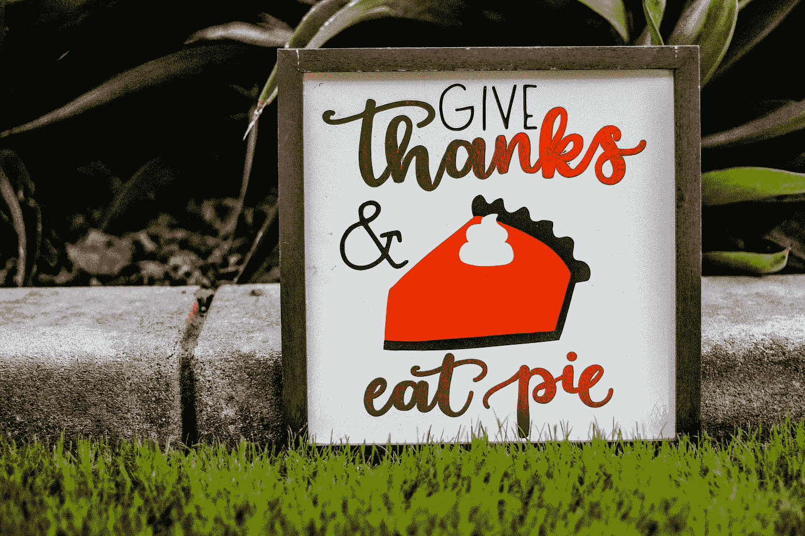

# 如何与任何人谈论任何事情(包括假期中的家人)

> 原文：<https://medium.datadriveninvestor.com/how-to-use-customer-research-tactics-to-talk-to-anyone-about-anything-2111681d773d?source=collection_archive---------14----------------------->

Photo by [Todd Ruth](https://unsplash.com/@toddruth?utm_source=medium&utm_medium=referral) on [Unsplash](https://unsplash.com?utm_source=medium&utm_medium=referral)

几周前，我在《福布斯》上发表了一篇文章，介绍了如何向你最难缠的客户学习的技巧。

在一年的大部分时间里，这些“客户”倾向于购买我们的产品或使用我们的服务的人——这些人不明白为什么我们的产品或服务如此昂贵，如此难以理解，或者为什么他们应该选择它们而不是其他选择。

 [## 动荡迫使暴风雨中的平静|数据驱动的投资者

### 自然界中很少有东西是直线行进的，尤其是经济。当投资者和消费者希望平静时…

www.datadriveninvestor.com](https://www.datadriveninvestor.com/2019/03/25/volatility-compels-calm-amid-the-storm/) 

然而，在节日期间，这些人往往是我们的家庭成员——这些人不理解我们为什么离家这么远，不经常打电话或拜访，也不理解我们为什么支持某个政党、政治家或事业。

幸运的是，我们用来了解我们企业的客户并制定解决方案以帮助他们解决问题或实现他们寻求的进步(根据哈佛商学院教授克莱顿·克里斯滕森的说法，他们的工作是要做的)的技术，也可以用于在你的下一次家庭聚会中保持和平。

## 以下是一些客户调查的注意事项，可以帮助你在下次拜访家人时找到方向:

**1。** **做确立谈话的话题。不要以你的观点**:当你开始对客户进行深入的定性采访时，你不要以“我认为我们做的很棒，如果你不同意我的观点，你就是一个可怕的人”开始对话你可以这样开头，“谢谢你今天抽出时间和我谈话。听到你们对我的业务的看法，我非常兴奋。”

我们都知道你并不乐意听到莱尼叔叔对枪支管制的看法，但是以你的观点开始谈话并不会有所帮助。所以，当莱尼叔叔提起这个话题时，简单地承认这个话题，并询问其他人是否有兴趣进行对话。谁知道呢，也许珍妮阿姨会在谈话开始前就把它关掉。

**2。** **多听少说。不要试图赢得这场争论。客户访谈的目的是向你的客户学习，而不是说服他们做某事。这就是为什么你试图只说 20%的时间，听 80%的时间。**

当莱尼叔叔没有被珍妮阿姨的请求所吓倒，继续阐述他为什么相信枪支管制时，不要试图淹没他，用数据淹没他，或者把他争取到你这边来。相反，听听他要说什么，问一些开放式的问题，并不时附和你的观点。

**3。** **保持好奇心。不要做假设。**在与客户面谈时，你不能只看表面。当顾客说某件事很容易时，你会问是什么让它变得容易。当客户说他们想要更方便的东西时，你会问“更方便”是什么样的。你不会假设你知道顾客的意思，你会问。

当乔爷爷说任何相信(填空题)的人都是 a(填负面刻板印象)的时候，不要假设他说的是你。问他为什么认为相信 X 的人是 y，也许他从来没有遇到过相信 X 的人，只是在重复他听到的一些事情。因此，他可能会惊讶于他所爱的不符合刻板印象的家庭成员确实相信 X。也许他遇到了相信 X 的人，他们确实符合刻板印象。然后，你可以提醒他，一个人并不能代表一个团队中的所有人，虽然这个人可能不是他喜欢的那杯茶，但也有其他人(比如你)是他喜欢的。

**4。** **分享你的观点。不要对此武断。**在极少数情况下，当客户开始断言明显错误的事情时——一家公司有邪恶的根源，一种产品杀死了宠物，一名高管犯了罪——你有责任说出来并纠正错误。当你纠正顾客时，你不会站起来当着他们的面大喊大叫，你会慢慢地、平静地说话，在分享事实之前温和地承认他们的观点，在进入下一个话题之前，你只会这样做几次。

当乔爷爷拒绝放松他的“任何相信 X 是 Y 的人”的立场时，你完全有权利不同意，但是用同样绝对的语言和激烈的情绪不会改变他的想法。相反，考虑将你的观点框定为一个问题，“爷爷，如果我相信 x，你会怎么想？”如果他坚持，那么委婉地解释你听到了他的话，恭敬地不同意他的观点，并相信 X，理由如下。

**5。** **确实知道自己的极限。当他们到达时，不要害怕离开。**客户访谈有时间限制，无论你的客户多么健谈、有趣或迷人，当时间限制到达时，你就结束了谈话。也许你会安排时间进行后续谈话，但更多的时候，你会感谢他们的时间，递给他们支票，然后送他们出门。

家庭时间也是有限制的。当你达到你的耐心、精力、礼貌或理智的极限时，感谢每个人的时间，并把自己送出大门。是的，你可能会错过奶奶的馅饼或你兄弟姐妹的度假照片，但这是维持和平的小小代价。你也可以安排时间晚些时候与特定的家庭成员交谈。

## 最后

与顾客交谈并不容易。和家人说话也不是。但是，通过使用你用来理解和同情你的顾客的同样的技术，你可以在家庭聚会的雷区中航行，保持你的理智，甚至可能吃到甜点。

Photo by [Preslie Hirsch](https://unsplash.com/@heypreslie?utm_source=medium&utm_medium=referral) on [Unsplash](https://unsplash.com?utm_source=medium&utm_medium=referral)

如果您喜欢这篇文章，请与朋友分享，单击👏很多次，跟着我在媒体上。

如果你想了解我在创新上阅读和喜欢的更多内容，请在 LinkedIn 上关注我。

要了解我如何与企业创新者合作，超越理论和戏剧，创造持久的变化和切实的商业成果，请访问我在 [MileZero](http://www.milezero.io/) 。