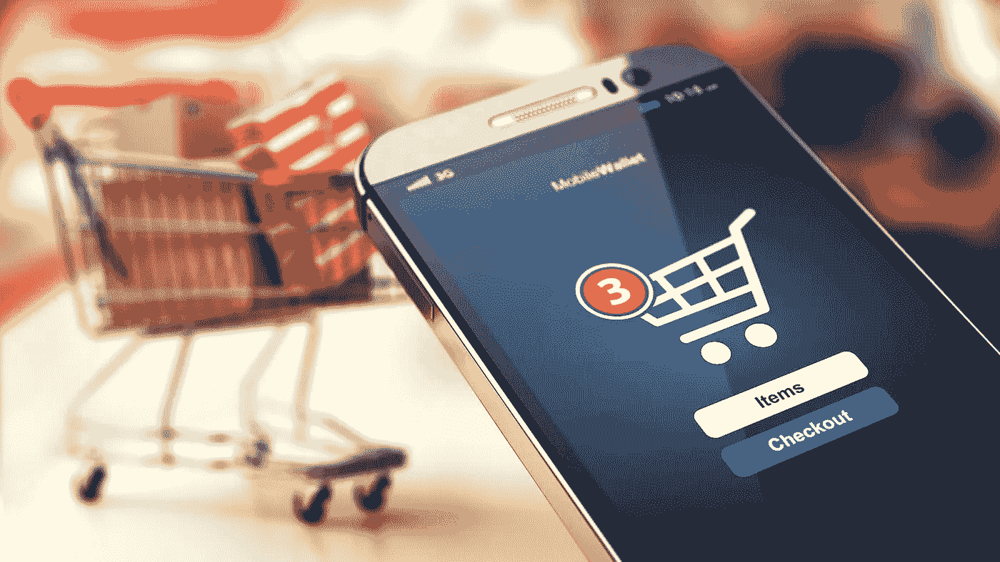

# 我们如何通过基于位置的通知将移动零售平台与实体店连接起来，从而增加线下销售

> 原文：<https://medium.datadriveninvestor.com/how-we-increased-offline-sales-by-connecting-a-mobile-retail-platform-to-brick-and-mortar-stores-29276bef9c69?source=collection_archive---------11----------------------->

*为了通过移动应用体验推动线下销售，我们为零售客户端实施了基于位置的推送通知。了解我们是如何实现这一特性的，以及我们遇到了哪些挑战。感谢我们的质量保证专家和我们开发人员的大量研究，我们能够增加花在应用程序上的时间和保留率。*

 [## DDI 编辑推荐:5 本机器学习书籍，让你从新手变成数据驱动专家…

### 机器学习行业的蓬勃发展重新引起了人们对人工智能的兴趣

go.datadriveninvestor.com](http://go.datadriveninvestor.com/5ML1) 

我们已经与一家大型电子产品零售商合作了三年多，开发了两款原生 Android 和 iOS 应用。为了通过移动应用体验推动线下销售，我们决定实施基于位置的推送通知。在这个案例研究中，我们描述了我们是如何实现这个特性的，以及我们遇到了哪些挑战。感谢我们的质量保证专家和我们开发人员的大量研究，我们能够增加花在应用程序上的时间和保留率。

# 背景

大约四年前，我们为客户推出了第一个应用程序。我们客户的目标是加强公司在电子零售市场的在线地位，并超越竞争对手。

多年来，我们创建了一个庞大而复杂的电子商务应用程序，并逐渐添加了特定于移动设备的功能，以便为客户创造更多价值。实现富推送通知为我们提供了最好的结果。你可以在这里阅读更多关于我们的经验。

**阅读还:** [***我们如何为一家大型电子商务领军企业创建零售应用***](https://www.mobindustry.net/how-we-created-a-retail-app-for-a-large-ecommerce-leader/)

最近，我们决定在地理围栏服务的帮助下，通过添加基于位置的推送通知来改进功能，这将允许我们向靠近实体店的用户发送通知。一开始，这个想法只是通知用户他们在商店附近；但后来我们想出了一个主意，在每个通知中提供特别优惠。

# 我们的目标

我们希望通过此功能实现几个目标:

*   将我们客户的在线业务与乌克兰 250 多家实体店联系起来
*   借助移动应用推动线下销售
*   提高应用留存率

为了实现这些目标，我们决定在地理围栏的帮助下实现推送通知。基于位置的推送通知与用户的位置相关联。用户只有在靠近某个位置时才会收到通知:在我们的例子中，是一家实体零售店。

我们设定了前三个月的 KPI，这样我们就可以跟踪这项新功能的进展。为了了解它是否有潜力，我们决定在部署的第一个月关注打开率，然后相应地调整我们的 KPI。

> 我们的目标是将客户的在线业务与 250 多家实体店联系起来，并推动线下销售。我们使用了基于位置的推送通知，一旦顾客靠近实体店就会被触发

# 挑战

在规划和实现这一功能时，我们面临着几个挑战。

*   我们需要鼓励人们给予必要的权限，以便该功能能够在他们的设备上运行。
*   在我们开始通过分析获取数据之前，我们需要考虑我们将用来提高推送通知打开率的策略。
*   为推送通知找到一个健康的频率是一个挑战，因为我们需要避免用户阻止这个功能，但仍然提醒他们使用应用程序，并鼓励他们在实体店购买。同时，我们需要考虑所有其他不基于位置的推送通知。
*   我们需要确保基于位置的通知功能不会因为不断检查 GPS 而消耗过多的设备电池。
*   该功能起初无法正常工作，因此我们需要对其进行配置。我们的一些测试设备并不总是收到推送通知，所以我们的开发和 QA 团队需要尽可能精确地让该功能工作，并对其进行测试。

> *最大的挑战是让用户为基于位置的推送通知提供必要的权限，并计算出发送推送的频率，以避免用户选择退出*

# 我们的解决方案

我们选择了地理围栏工具来实现基于位置的功能，并通过原生 Android 和 iOS 库来使用它。由于我们已经有了关于商店位置的所有数据，我们将我们的数据库与地理围栏服务连接起来，以检测城市中商店附近的每个用户。

地理围栏工具允许我们设定每个商店周围的半径。当用户进入这个半径时，服务将在 GPS 的帮助下定位他们。由于地理围栏服务只有在用户的位置被其算法 100%确认的情况下才会发送通知，因此需要对其稳定性进行调整。

> *一项地理围栏服务，用于检测城市内商店附近的每个用户*

为了确保用户收到通知，我们的开发人员首先设置了 100 米的半径，这是一个推荐的距离。但通知没有到达一些设备，因为系统无法足够精确地确定位置。我们通过将半径增加到 200 米解决了这个问题。

我们还添加了两种工作模式来触发地理围栏服务:进入和在半径范围内移动。通过这种方式，我们使该功能更加稳定，地理围栏可以随时发送推送通知。

为了防止过度使用电池，我们使用了 Android 库并优化了电池消耗。我们的开发人员减少了位置检查的频率，并使用替代方法来确定位置:地理围栏功能取代了 GPS，从 Wi-Fi 和移动网络获取数据。

> *我们增加了两种工作模式并增加了半径，这样地理围栏工具肯定会被触发*

为了从用户那里获得必要的权限，我们在发行说明中介绍了这一特性，并解释了用户选择加入会得到什么。我们也把推送通知做得很吸引人。我们不是仅仅通知用户他们在一家商店附近，而是显示与特定商店相关的特别优惠。

为了提高打开率，我们丰富了推送通知，增加了横幅和地图。打开后，推送通知会导致一个地图和一个特别优惠，以激励用户进入商店。

> *为了获得必要的许可并提高打开率，我们建议在推送通知中加入特别优惠，以吸引用户到实体店*

当用户在城市里走动时，我们不想用太多的推送通知来打扰他们，我们将推送通知的频率限制为每七天一次。

# 结果呢

我们的开发人员和质量保证工程师团队花了 45 个小时在 Android 上实现地理围栏功能，花了 40 个小时在 iOS 上实现。致力于此功能的团队包括:

*   1 名 Android 开发人员
*   1 名 iOS 开发人员
*   1 名质量保证工程师
*   1 名业务分析师

在我们实现基于位置的推送通知后的第一个月，我们看到了相当黯淡的结果:只有 15%的用户打开了他们的推送通知。然而，在我们加入富媒体和推广文本后，打开率增加到了 35%。

因为用户很少收到通知，所以卸载率没有增加。

地理围栏工具允许我们的客户将他们的在线业务与线下商店联系起来，并分别推广每个商店，发送促销信息并优化他们在特定商店的库存。例如，如果某个商店需要提高他们库存产品的销量，基于位置的推送通知是促销活动的有效推广工具。

我们现在正在寻找最有效的方法来跟踪线上和线下销售之间的联系。

**你想为你的企业创建一个 React Native 或 Flutter 应用吗？获得免费咨询！**
sales@mobindustry.net

[https://www . mob industry . net/how-we-increased-offline-sales-by-connecting-a-mobile-retail-platform-to-brick-mortar-stores-with-location-based-notifications/](https://www.mobindustry.net/how-we-increased-offline-sales-by-connecting-a-mobile-retail-platform-to-brick-and-mortar-stores-with-location-based-notifications/)