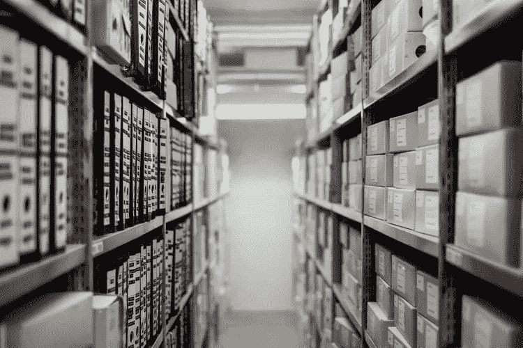

# 世界商业巨头如何利用企业物联网

> 原文：<https://medium.datadriveninvestor.com/how-world-commercial-giants-leverage-enterprise-internet-of-things-e6e23f133ada?source=collection_archive---------9----------------------->

今天，我们到处都能看到基于物联网的设备。这是一项新兴技术，它由一个连接我们的小工具并允许它们相互通信的网络组成。我们大多数人可能都拥有这样的设备，有些人甚至把他们的家变成了智能微型生态系统，可以自我维持和半自主。

我们经常听说基于消费者的物联网，因为这是我们使用最多的东西。然而，全球物联网市场收入为2120 亿美元，而且还不止这些。

这种新兴技术已经占领了许多行业，甚至进入了制造流程。你可能听说过“[工业 4.0](https://www.gtai.de/GTAI/Navigation/EN/Invest/Industries/Industrie-4-0/Industrie-4-0/industrie-4-0-what-is-it.html) ”，也被称为第四次工业革命。它承诺将生产和网络连接的世界结合起来。工业物联网(IIoT)无法让这一切成为现实。

IIoT 承诺通过自动化、分析，当然还有连接性来提高运营效率。这是一个充满信息和通信技术的物理对象网络。借助这种先进的方法，制造商可以获得对生产阶段和流程的出色可见性，找出任何差距并加以解决。它减少了停工时间，同时提高了生产质量。

现实情况是，许多公司无法利用其互联系统中所有数据的真正价值。麦肯锡的这份报告发现， [54%的人](https://www.business-reporter.co.uk/2019/07/15/how-to-succeed-with-industrial-iot-in-manufacturing/#gsc.tab=0)使用了不到 10%的数据。

在这里，我们将指出一些现在是 IIoT 领导者和先驱的世界商业巨头，以及他们如何有效地应用创新方法。这些公司已经开始了他们的[工业物联网实施](https://www.cognitiveclouds.com/insights/industrial-iot-implementation-8-places-you-cant-afford-to-go-wrong/)，以便其技术和应用推动他们的业务向前发展。

# 亚马逊的智能仓储

亚马逊是世界领先的公司之一。一份报告显示，在假日购物热潮期间，它的一些仓库每天装运超过 100 万件商品。他们通常每天运送约 40，000 件商品，这本身就已经很多了。

如果没有技术的帮助，处理巨大的仓库和数百万份订单可能会非常困难。它让亚马逊成为仓储和物流领域的创新者。它目前正在测试自动化和人机合作的极限。

你可能听说过该公司使用无人机送货的臭名昭著的想法。然而，在这吸引媒体关注的同时，亚马逊的仓库里堆满了 Wi-Fi 连接的 Kiva 机器人。Kiva 技术背后的主要想法是让机器人定位货架上的产品，并将其带给工人，而不是浪费员工的时间来搜索产品。

据亚马逊高管戴夫·克拉克称，这项技术已经削减了 20%的运营费用。

# 空客的智能工厂

说制造最广泛使用的商用喷气式飞机是一个复杂的过程是一种保守的说法。它包括数以百万计的部件，在数千个阶段组装而成。此外，一个小小的错误就可能导致数百人丧生。不幸的是，人都会犯错。

另一方面，好消息是，它们现在终于可以避免，或者至少可以大幅减少。为了利用技术进步提供的可能性，空中客车公司启动了未来的工厂[。这是一项简化运营和提高产能的制造计划。](https://internetofbusiness.com/airbus-engineering-intelligent-factories/)

空中客车公司已经将传感器集成到工具中，并为工人配备了可穿戴技术，如智能眼镜，在提供安全的同时减少了错误。它将[客舱座椅营销流程的整体生产率提高了 500%](https://www.accenture.com/gb-en/success-airbus-wearable-technology) ，错误率降至零。

# 日立的 IIoT 方法

日立是一家领先的日本工业公司，以其在运营和信息技术方面的经验和整合而闻名。许多类似的公司都考虑通过合作来填补物联网知识的空白。然而，日立选择保持独立。

它拥有超过 16，000 名员工，主要从事技术工作。 [Lumada](https://www.hitachi.com/products/it/lumada/global/en/about/index.html) 是日立提供的物联网平台。他们还制造许多利用互联技术的产品，比如火车。他们现在把它们作为一种服务来销售。

该公司开发了一种物联网增强的生产模式，据称已经将 Omika Works 部门的生产提前期缩短了一半。它为钢铁、电力、交通和其他行业制造基础设施。

# 卡特彼勒 IIoT 先锋

卡特彼勒是一家重型设备制造商。该公司一直是物联网项目的先驱。最近，我们开始看到他们物联网技术投资的成果。

卡特彼勒正在使用增强现实和物联网应用程序，让机器操作员了解机器的整体状况，包括燃油油位和一般的预测性维护。例如，如果空气过滤器过期，该公司会通过 AR 应用程序发送如何更换的指令。

《福布斯》甚至有一篇[的专题文章](https://www.forbes.com/sites/bernardmarr/2017/02/07/iot-and-big-data-at-caterpillar-how-predictive-maintenance-saves-millions-of-dollars/#3d55fa9e7240)，讲述了卡特彼勒如何利用传感器驱动的分析在船只上省钱。

# 博世的跟踪和追踪计划

[博世的跟踪和追溯](https://www.bosch.com/stories/nexeed-track-and-trace/)项目背后的主要灵感是，工人会花太多时间寻找工具。这让该公司产生了在工具中添加传感器的想法，这样它们就可以被跟踪。他们从无绳跑步机开始。

随着教学程序变得越来越精确，博世也准备用它来指导装配操作。

# IIoT:制造业的未来

工业物联网涵盖许多用例，就像一般的物联网一样。主要目标是优化运营效率和自动化制造流程。领先的商业巨头已经在其工作流程中实施了 IIoT 解决方案。

我们列出了来自不同行业的大公司名单，向您展示 IIoT 可以用于任何事情。这些都是一些很好的例子，说明了老牌公司如何利用新技术来优化他们的流程，同时削减成本并降低人为错误导致的风险。工业 4.0 所暗示的智能技术是下一次工业革命的途径，正如你所看到的，它已经开始了。