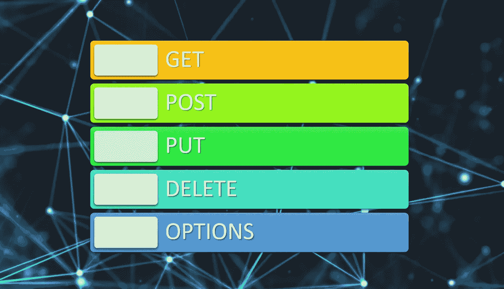

# HTTP —请求和差异

> 原文：<https://medium.datadriveninvestor.com/http-requests-differences-47ebd9a23105?source=collection_archive---------18----------------------->



HTTP 代表**H**yper**T**ext**T**transfer**P**rotocol。这是互联网上数据通信的基础。数据通信以客户端发送的请求开始，以从 web 服务器收到的响应结束。

# 请求方法

## **获取**

该方法用于**从服务器检索**信息。

*   这对数据没有影响。
*   **获取方法是** [**等幂**](https://en.wikipedia.org/wiki/Idempotence)
*   可缓冲的

— — — — — — — — — — — — — — — — — — — — — — — — — — — — — —-

## **帖子**

该方法用于**向网络服务器发送**用户生成的数据…

*   如果不知道具体的网址，也可以使用
*   ****Post 方法不是** [**幂等**](https://en.wikipedia.org/wiki/Idempotence) **:** 如果我们多次发送同一个 Post 请求，会收到各种结果**
*   **可缓存，仅当包含新鲜度信息时**
*   **以下请求将导致“*资源未找到*”错误，因为`<new_question>`尚不存在。您应该首先将`<new_question>`资源放在服务器上。**

```
POST /questions/<new_question> HTTP/1.1
Host: www.example.com/
```

*   **正确使用请求不需要指定名称:**

```
POST /questions HTTP/1.1
Host: www.example.com/
```

**— — — — — — — — — — — — — — — — — — — — — — — — — — — — — — -**

## ****放****

**此方法用于在特定 URL 创建或覆盖资源。**

*   **你应该**知道具体网址****
*   ****PUT 方法是幂等的:**无论我们发送多少次相同的请求，结果总是一样的**
*   **不可缓存**
*   **要使用上传请求创建新资源，请执行以下操作:**

```
PUT /questions/<new_question> HTTP/1.1
Host: www.example.com/
```

**— — — — — — — — — — — — — — — — — — — — — — — — — — — — — — -**

## ****删除****

**移除 URI 给定的目标资源的所有当前表示形式。**

*   ****删除方法是** [**等幂**](https://en.wikipedia.org/wiki/Idempotence)**
*   **不可缓存**

**— — — — — — — — — — — — — — — — — — — — — — — — — — — — — — -**

## ****选项****

**描述目标资源的通信选项。**

*   ****选项方法是幂等的****
*   **不可缓存**