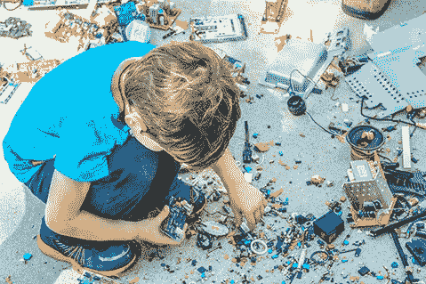

# 成为更优秀的数据科学家的 9 个必备技巧

> 原文：<https://medium.datadriveninvestor.com/https-medium-com-inesrosete-9-must-have-tips-to-be-an-even-better-data-scientist-c18d02ee72c3?source=collection_archive---------31----------------------->

## 是的，你没看错标题，我将帮助你成为一名更好的数据科学家(至少对日常问题有更多的认识)。自从我开始走上成为一名数据科学家的道路，我有机会与一些人交谈和学习。到目前为止，这是 9 个漫长而有趣的月深入到这个神奇的世界。但是，和其他任何领域一样，要学的东西太多，课程太多，教程太多，要专注于真正重要的东西并不容易。因此，我决定与您分享我对任何数据科学家日常工作中最重要的事情的印象和建议。

当我开始进入数据科学领域时，我觉得有必要首先了解基础知识，只研究主要信息(类似于广度搜索)，然后开始深化知识(深度搜索)。因此，我决定会见不同背景的数据科学家，收集重要的提示和步骤，作为开始学习该领域的人。因此，在这里你可以找到我收到的主要提示和一些我添加的关于我们在项目中犯的主要错误的提示。

## **1。从定义和理解目标**开始

无论是什么项目，先花些时间了解你想要解决的问题，并正确定义目标，也就是说，你想存档/解决什么？

考虑我的第一个 Kaggle 挑战:[航班延误](https://github.com/inesrosete/DataScience/blob/master/flight_delays_exploration.ipynb)。这个挑战可以作为回归或分类问题来解决，选择哪一个呢？取决于你试图回答的问题。如果你想预测航班是否会延误，这可能是一个分类问题。另一方面，如果你想估计延迟的时间，这是一个回归问题。如果我们决定讨论分类问题，那么延误航班(目标变量)的定义是什么，即所有在预计时间后到达的航班都被视为延误或有一定的容差？

## 2.定义管道

定义目标后，你需要尽快建立一个端到端的管道。我这么说是什么意思？我指的是读取原始数据、预处理数据、构建新特性、生成训练、验证和测试集、创建模型以及评估模型性能的代码。这个想法是，在你有了这个管道之后，你可以只改变它的一部分，剩下的仍然可以工作。例如，通常你不需要进行特性工程来构建基线，因此要构建“模型版本 1 ”,你只需要将该部分添加到管道中，剩下的代码就可以工作了。相信我，通常是立即开始编码，生成一个模型，迭代它，当截止日期临近时，处理细节(例如 NaNs)的时间到了，而我们错过了截止日期:

## 3.尽快建立基线

这个想法是通过一次解决一些小问题来快速迭代，我们通常会忽略这些小问题，但这很耗时。这样，在建立基线(解决那些小问题)之后，我们对我们有一个工作管道感到满意。此外，我们知道我们离目标有多远，有了它，我们可以有效地管理我们的时间和精力。

## 4.定义要使用的模型

试着选择一个你觉得舒服的模型和一个适合手头问题的模型(也就是说，不要选择一个主流模型，因为每个人都使用它，你不知道它的细节，因此，增加了出错的可能性)。当你解决更多的挑战时，你可以通过学习别人的技术来扩大你的模型库。正如你在我的 [GitHub](https://github.com/inesrosete/DataScience) 页面上看到的，我的第一选择是基于非常相似的模型，我觉得很舒服(决策树和随机森林)。

## 5.定义适当的评估标准

当你研究你的问题和定义你的目标时，你也需要注意评估度量定义。例如，如果您有一个不平衡的分类问题(例如，一个类的例子比另一个多得多)，您需要仔细选择评估度量。例如，如果您有一个问题，目标是预测航班是否会延误(只有 25%的航班会延误)，您决定使用准确性作为评估指标，一个预测所有航班都准时的哑模型，您将有 80%的准确性，这似乎是一个好结果，但在这种情况下，您会错过您的目标:检测延误的航班。因此，在定义评估指标时，您需要记住这些约束。请记住，您可能需要在工作过程中重新定义它。但愿不会:)

## 6.不要使用任何你不了解的技术或方法

这是我听到的主要消息。当你开始使用你没有深入知识的技术或模型时，很可能你会在这个过程中出错。例如，当你深刻理解一项技术或一个模型时，你可以更快地识别和解决问题，因此首先学习，然后使用它。不要忘记，在商业环境中，这是一个大问题，因为它会影响所有依赖你工作的人的理解。

## 7.如果可能的话，找一个导师

开始时，很难定义目标和任务来实现这些目标。更难的是，花掉我们为每项任务估计的时间，主要是因为我们对时间表的定义过于乐观，因为有很多我们不知道的事情。导师是在这个过程中帮助和指导你的人。有了导师，你可以快速实现目标，并更专注于最重要和最相关的信息。他可能还会讨论和回顾您编写的代码。

## 8.参加聚会

去参加聚会，和尽可能多的人交谈，这样你就会明白你应该关注哪些书籍、播客、博客和挑战。然后，停止这样做，建立一个 2/3 周的锻炼计划，尽可能地专注于此。在你感觉舒服之后，去一些更高级的聚会，重复这个过程。

## 9.不要把所有时间都花在学习上！

最后，在我看来，最相关的提示。许多人开始把所有时间都花在学习上，而不是平衡学习和实践。然后，当他们试图实践理论知识时，他们通常会在第一次尝试时就放弃。例如，当你学习做蛋糕时，你开始花大约 80%的时间做蛋糕，但是你会犯很多错误。第二次你花的时间更少，犯的错误更少。经过几次反复，你就可以完美地烹饪蛋糕了，你可以开始掌握细节，比如配料。话虽如此，还是尽量多练吧！显然，你应该学习，我想传达的是，你应该学习和实践并举，给予实践更多的权重。

欢迎关注我的[网站](http://www.inesrosete.com)、 [GitHub 库](https://github.com/inesrosete/DataScience)，以及[媒体](https://medium.com/@inesrosete)的帖子！

 [## inês Rosete——热情的数据科学家

### 在世界上最大的职业社区 LinkedIn 上查看 Inês Rosete 的个人资料。Inês 有 7 个工作列在他们的…

www.linkedin.com](https://www.linkedin.com/in/inesrosete/)