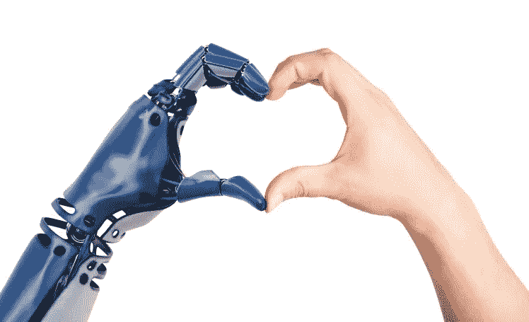

# 定义人工智能伦理——幻觉还是急需的一步？第一部分

> 原文：<https://medium.datadriveninvestor.com/https-medium-com-katiaray-ai-ethical-guidelines-c2d436dd365c?source=collection_archive---------8----------------------->

最近我看了一部纪录片，讲述了亚特兰蒂斯这个神话般的文明，它变得非常繁荣，但后来却因为滥用尖端技术而毁灭了自己。我情不自禁地将它与我们现在经历的指数级技术进步进行了一些有趣的对比。三十年前，我们生活在工业社会，现在我们正快速进入一个全新的时代——技术官僚文明，人类与世界互动的本质正在发生变化。包括人工智能在内的技术不仅提高了我们的身体素质，还提高了认知能力和决策技能。智能设备成为我们自身的延伸，这就提出了一个问题:我们是生物还是生物技术生物。就像亚特兰蒂斯的居民一样，我们正在推进技术的极限——向可能潜伏着大规模破坏和虐待的危险区域推进。

巧合的是，一份非常有趣的文件引起了我的注意——可信人工智能的[道德准则](https://ec.europa.eu/digital-single-market/en/news/ethics-guidelines-trustworthy-ai)，其中欧盟委员会试图定义驱动人工智能开发和实施的普遍道德原则。这些原则取决于可信人工智能的七个关键要求:(1)人类代理和监督，(2)技术稳健性和安全性，(3)隐私和数据治理，(4)透明度，(5)多样性，非歧视和公平，(6)环境和社会福祉，以及(7)问责制。

对人工智能伦理的担忧已经在科学界和商业界广为流传(见[埃隆·马斯克关于人工超级智能失控的警告](https://www.washingtonpost.com/news/innovations/wp/2018/04/06/elon-musks-nightmarish-warning-ai-could-become-an-immortal-dictator-from-which-we-would-never-escape/?utm_term=.ad4fc68697bc))。它们也在政府一级得到承认。然而，在人工智能方面，几乎完全的法律和政治真空仍然存在，因为政府难以完全掌握技术发展的形式，更不用说达成任何普遍共识了。欧盟关于可信人工智能的道德准则绝对是向前迈出的一步，而且有一个逻辑是，它来自目前的冷板凳队员，他们大多在观察美国和中国等新兴人工智能超级大国之间的战斗。欧盟试图将自己定位为一个独立的政党，也许能够将人工智能伦理话语带到一个新的水平。前提是这种论述包含实质内容，而不仅仅是“捕风捉影的花言巧语”。

我们为什么要关心？

我相信人工智能伦理指南是一个非常及时的努力。智能机器造成伤害的大多数例子看起来仍然是假设的，但我们不要忘记，我们不知道我们正在处理的时间尺度。我们在这里谈论的智能可以[根据环境](https://hbr.org/podcast/2019/04/designing-responsible-ai)做出适当的行为，并以非预编程的方式做出反应。这涉及到在数据处理和基于这些数据做出决策方面的一定程度的自主性。具有重大伦理影响的人工智能决策的例子包括一个[目标识别算法](https://www.linkedin.com/pulse/ai-weapons-ethical-enough-used-without-human-naveen-joshi)(已经在使用中)，它决定一个物体是武装分子还是平民；或者一辆自动驾驶汽车(即将推出)，在[不可避免的事故情况下](https://www.weforum.org/agenda/2018/10/how-should-autonomous-vehicles-be-programmed)需要做出选择，例如，在造成重大财产损失或撞击生物之间做出选择。即使是无害的简历筛选算法，当它基于一些纯粹的统计标准拒绝好的简历时，也可能导致对基本人权的侵犯。换句话说，在做出影响人类的决策时，伦理支撑着每一项号称“智能”的技术应用。这项技术已经投入使用，而对其原理和局限性的研究仍在缓慢前进。

支撑人工智能伦理话语的主要担忧是**人工智能将把国家和大公司相对于个人的权力提高到前所未有的水平**。笼罩在人工智能技术中的个人在面对部署这些技术的人时将变得完全无助。著名的技术怀疑论者 Evgeny Morozov 预测，未来数据丰富的公司将专注于开发通用人工智能，并将其出租给企业和政府，而不太考虑为人工智能训练提供初始数据的消费者的利益。人工智能将被垄断并被用于以“不公平的操纵、欺骗、羊群效应和条件作用”(可信人工智能的道德准则)的形式攻击个人自主权，这是一种真正的危险。因此，确保人工智能的应用维护和促进公民的自主权和社会的可持续发展应该是任何伦理话语的出发点。

另一个担忧是，人工智能可能会扩大发达国家和发展中国家之间的差距，发展中国家在未来被定义为拥有大规模人工智能的国家和不拥有大规模人工智能的国家。我们已经目睹了全球范围内的许多不平等，但随着人工智能的独家权利，这可能会变得更糟。历史表明，当技术变革发生时，明显的赢家很快出现(就像第一次工业革命期间的英国和信息革命期间的美国)。人工智能伦理应该解决赢家和输家之间的技术差距问题，以便人类作为一个整体可以从新技术中受益。

我相信现在是时候明确定义人工智能伦理应该基于的原则了。从这些原则出发，应该建立立法和执行机制，以确保任何政府、公司或团体都不会开发和部署“流氓”人工智能。另一方面，开发和部署人工智能的公司将通过坚持这些原则而受益匪浅，因为他们将获得信任并培养忠诚的客户关系。

那么，人工智能的伦理原则是关于什么的？

**1。人工智能应用的领域应该接受伦理审查。**

截至目前，人工智能应用开始渗透到我们生活的许多领域。然而，我认为人工智能的使用应该被限制或者完全禁止。例如，我希望禁止在自主战斗车辆中使用人工智能，因为我发现算法将直接决定某人的生命这一事实非常令人不安。受限用途可能包括医疗保健、心理学、个人评分、犯罪调查、大众媒体(受到严格的公共控制)。我同意，即使在这些复杂的领域，人工智能的错误率最终也可能低于人类。但是对个人和社会来说，错误(如犯罪调查或医疗保健)或操纵技术(如大众媒体)的部署的成本是非常高的。因此，使用人工智能的好处应该远远超过甚至轻微的潜在损害，才能让我们接受机器出错的风险。最终，我们的行为往往不是基于“实现目标的最佳方式是什么？”而是基于“什么是正确的做法？”不同的人和不同的社会对“权利”的理解有很大的不同。在不可避免的道路交通事故的困境中，对于一个普通人和一个耆那教信徒来说，选择是撞 10 万美元的美洲虎还是一只小猫的“正确”答案将是不同的，他们宁愿在今生为一只撞坏的美洲虎买单，而不是在来世为一只被杀的猫买单。对这种道德困境的科学研究表明，不同的国家和文化之间的道德有着巨大的差异。这对那些为设计值得信赖的人工智能而困惑的人工智能开发者来说是一个严峻的挑战。教机器在现实生活中什么是“正确的”可能是一项几乎不可能完成的任务，所以最终的决策(仍然不完美)取决于人类。

**2。问责:AI 受制于社会控制**

几乎在每一次人工智能伦理辩论中，人工智能的责任性都得到了积极的讨论。但是责任到底是什么意思呢？对谁负责？人工智能道德准则很难回答这个问题，它指出“人工智能系统应该能够被独立审计”。我认为会有一些公共机构来监督人工智能，他们应该能够进入“黑匣子”并看到决策是如何做出的。这些权力机构的问题是，他们往往不代表真正的利益相关者，他们的决定是闭门作出的。在我看来，重要的是要认识到，社会是最终的利益相关者，它面临着人工智能不道德应用的最有害后果。尼克·博斯特罗姆在他已经具有历史意义的关于伦理人工智能的论文中看到了人工智能的主要危险，即将其目标局限于服务于某些群体(即其创造者、公司或国家政府)，而不是整个社会。在这种情况下，人工智能可以完美地对这个小团体负责，但对所有其他人保密。

问责制的问题最终是谁拥有 AI 的问题，以及我们是否首先证明对 AI 的绝对产权。企业巨头或国家应该拥有从我们丰富的数据中孕育出来的人工智能，还是应该将其视为一种公共利益？围绕这个问题会有争斗，就像现在围绕数据所有权的圣战一样。没有人否认人工智能的发展需要大量的资本投资，但社会应该有公平的份额，在如何使用人工智能，谁受益以及谁承担责任方面有发言权。为贪婪和精英利益服务的技术摧毁了亚特兰蒂斯，所以我们应该对这种观点保持警惕。

故事在这里继续…