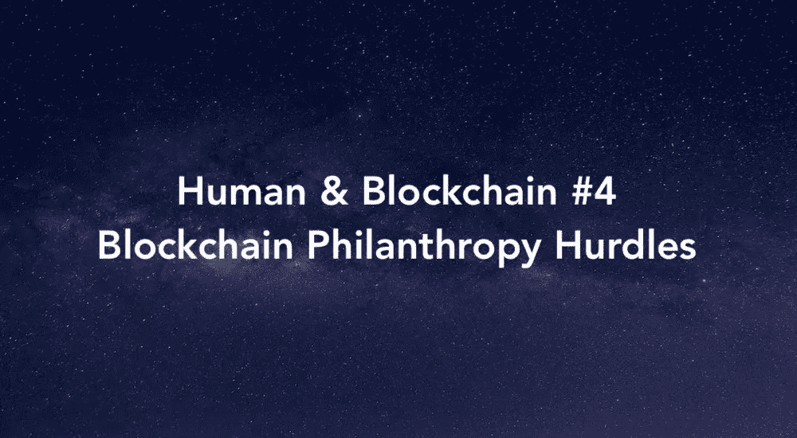
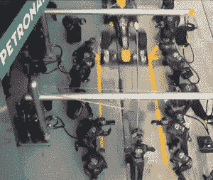
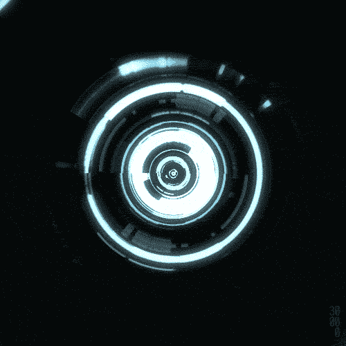

# 人与区块链#4:区块链慈善障碍

> 原文：<https://medium.datadriveninvestor.com/human-blockchain-4-blockchain-philanthropy-hurdles-fa4e8cb4a991?source=collection_archive---------31----------------------->

效率、整合和透明——这三个词解释了区块链是如何像咆哮的海浪一样翻转当前的艾滋病生态系统的。不仅是相信技术的个人，还有一些全球性的非盈利组织，如红十字会和国际救助儿童会也逐渐涉足推出区块链驱动的捐赠解决方案。然而，将新技术应用到传统领域会产生一些不可避免的障碍，更不用说分布式账本了。

[BlockImpact](http://blockimpact.tech/) 整理了非营利组织和区块链工程师在将分布式账本整合到慈善捐赠中时会遇到的两大障碍——**效率和可访问性**。因此，我们将概述我们对慈善事业未来的预期，作为结束语。

# 我们需要更高的效率

毫无疑问，区块链与慈善生态系统的整合，让个人通过[智能合约](https://en.wikipedia.org/wiki/Smart_contract)有效地将捐款交付给收款人，迈出了一大步。好像很方便吧？尽管如此，我们不应该忘记新技术的根本缺陷——可扩展性，这会严重降低慈善捐赠的效率。

自 2017 年以来，区块链及其首次应用——加密货币日益成为主流，并吸引了很多关注。对于每个事务，区块链[在其事务记录](https://medium.com/@bitrewards/blockchain-scalability-the-issues-and-proposed-solutions-2ec2c7ac98f0)中增加一个具有更多数据的块，因为它包含其之前的块的历史。当网络变得越来越大时，区块链的当务之急是可扩展性。简而言之，区块链将越来越难扩张和支持交易数量的飙升。

由于所有实时交易都需要在区块链网络中进行验证，涉及的块数会使整个过程更加耗时。例如，比特币需要几分钟来验证或创建一个区块。当用户数量和交易量激增时，我们需要更长的时间进行验证，尤其是在高峰时期。同样，为了处理越来越多的传输，我们需要更多的节点以更高的费用对它们进行身份验证，这对于效率来说是一个很大的不确定性。已经起草了一些提案来解决这个重要的问题，例如第二层解决方案、闪电网络、新的共识算法等等。一旦在这方面取得成功突破，我们可以保证分布式分类账和慈善捐赠在未来的效率方面将会产生协同效应。

# 我们需要更好的可达性

区块链是一个开源工具，每个人都可以访问它。然而，从零开始在一个历史悠久的领域采用一种全新的技术绝非易事。毫无疑问，从基本理解到执行，做好一切准备需要很长时间。

采用的一个关键障碍是技术本身不容易理解和解释。一些人将它与 90 年代早期解释互联网的尝试相提并论，当时只有几个网站和工具来帮助普通用户更好地了解正在发生的事情。对区块链来说，这听起来更抽象。尽管有大量来源解释分布式账本的概念，如博客、媒体和 Youtube 频道，但它永远不足以涵盖慈善组织中人们的教育，尤其是管理层。与此同时，在当今这个科技狂热的世界中，分布式账本目前只是革命的一部分。因此，对于慈善机构来说，提高知识教育的可及性还有很长的路要走。非营利组织和慈善机构通常不会专注于分析新兴技术，而是执行人道主义目标。因此，除了他们的基础知识，组织应该积极建立技术合作伙伴关系，以利用现有的技术和咨询，如区块链慈善基金会。

从技术上讲，让事情变得更糟的是开发人员缺乏高水平的可访问性。分布式分类帐目前仍处于起步阶段，有许多基本的瓶颈，如可伸缩性和安全性。虽然区块链可能是一个理想的开源技术基础设施，但对于开发者来说，用智能合约语言(即 [Solidity](https://github.com/ethereum/solidity) 、 [Lity](https://github.com/cybermiles) 等)的创造力和编码技能来构建他们想要的任何东西仍然不容易。)来生成此刻令人信服的去中心化应用。与此同时，为了让一切变得容易理解，在未来的几年里，需要对用户体验和界面进行更多的研究，给我们一些时间吧！

# 我们未来的蓝图

## 一个包罗万象的生态系统

我们应该为慈善领域做的不是简单透明的慈善跟踪平台，而是构建一个由分布式账本充分授权的包容一切的生态系统。目前，我们通常看到传统非营利组织积极采取措施，将技术引入他们已建立的系统。尽管如此，通过用户友好的界面提供完全透明和可追溯性的捐赠的服务生态系统可以连接非营利社区。

让我们来谈谈 [AidChain](https://www.aidchain.co/) 。AidChain 是一个鼓励慈善机构用区块链货币支付服务提供商的平台，目的是提高捐款的可追踪性。AidCoin 是 ERC20 令牌，用于通过 AIDChain 生态系统中的以太坊区块链进行透明捐赠。此外， [AIDPay](https://www.aidchain.co/aidpay) 是一个支付网关，使非营利组织能够登录 AidChain 平台，在 AidCoins 的帮助下进行加密捐款。最重要的是，上述项目由风险投资支持的经验丰富的慈善筹款公司领导— [CharityStar](https://www.charitystars.com/?lang=en) 。由于 CharityStar 广泛而专业的网络，他们不断在慈善机构、名人和知名企业之间建立战略伙伴关系，以使整个生态系统落到实处。

此外，越来越多的自发慈善项目成立，以实现不同的社会使命，他们自己的加密货币。为了促进基金会和项目之间的合作和协同作用，可以考虑一种新的可持续的慈善模式，如建立一个慈善代币交易所，以交换代币。

## 保持创造力

我们的世界因创造力而变得更美好。也许以后像投资象征性的社会影响债券这样抽象的东西会成为一种趋势！四周内的三篇文章涵盖了去中心化世界中慈善事业的可能性、障碍和未来，这对我们大多数人来说都是非常激动人心的。但是，我们需要时间来证明。

⋯

网址:[https://block impact . tech](https://blockimpact.tech/?p=395)/