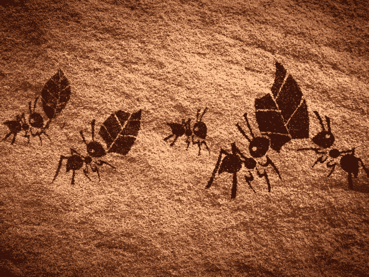

# “人类的智力是深具社会性的东西”

> 原文：<https://medium.datadriveninvestor.com/human-intelligence-is-something-deeply-social-601fbf82819f?source=collection_archive---------8----------------------->

## 谈一谈社会和多主体学习在人工智能研究中的重要性

DeepMind artwork of cooperating ants. DeepMind

我们倾向于认为智力是一种自我创造的东西，是我们思想的产物，这种与生俱来的高水平智力使人类在我们所知的其他生物中获得了如此重要的地位。这种思维模式也经常出现在机器智能领域，其中利用深度学习的单个代理框架的最新进展被证明在以前认为机器无法实现的技能(即图像识别)方面表现出色。然而，由于在特定任务中有所帮助，它是否会成为匹配人类认知能力的完整解决方案，从而创造出一种“通用人工智能”仍然令人怀疑。

这些机器经常发现特别具有挑战性的是社交互动，包括互惠或通信等对人类来说似乎微不足道的事情。其中一个原因是，在建立系统和算法时，我们经常忽略人类智能的社会方面，以及它在一千多年的进化中不断变化和重新塑造的事实，试图适应环境。事实上，最近的研究表明，让我们比其他物种更有优势的既不是我们的身体能力，也不是思维敏锐度，而是我们在大群体中形成和有效合作的能力。使我们能够有效地划分任务和分担责任。从而建立起庞大的知识体系。这种系统的一个例子是维基百科——一个不断发展的知识的巨大数据库，每个人都可以从中受益。试图跟上一门学科(如机器学习)可能很难，但跟上许多学科几乎是可能的。幸运的是，维基百科可以帮忙，提供支持，比如写这篇文章。

但是有效的合作并不是人类独有的，自然界充满了成功合作的例子。事实证明，蚂蚁、狼、蜜蜂和其他一些物种擅长合作。让我们不同的是，我们不一定需要通过血缘关系联系在一起，也不需要通过领土来有效地合作。相反，我们找到了另一种方法——通过形成所谓的主体间现实。这种主体间性，被定义为人们之间对一组给定的意义和定义的相互一致，是几乎所有人类社会的基石。第一个例子是人权法，我们认为它是客观的，应该给予每个人，但如果这些权利在中世纪以类似的形式形成，其内容肯定会有很大不同。这条定律只不过是世界现状的反映，更重要的是，它也是有争议的，因为今天的许多社会不会完全同意这些定律。一个更实际的例子是建立公司和机构。就拿可口可乐来说吧，我们都认同有这么一家专门生产汽水饮料的公司，但如果我们拆开一罐这种饮料，就能看到它不过是一组化学物质混在一起而已。可口可乐、其他品牌、机构和人权法的存在仅仅是因为我们同意它们的存在。这个列表可以进一步扩展到宗教、足球队，最后是国家。归根结底，是什么让柏林人和伦敦人有所不同？从生物学上来说，所有人之间的差异并不显著，如果不是一套在相当长的时间里形成和保持的规则和仪式，那传统和文化是什么？最终，我们的文化不是天生的。

这导致了这样一个事实，即人类的智力并不是孤立地进化的，而是不断竞争与合作中产生的文化进化累积的结果。我们的世界本质上是一个多智能体的世界，如果我们希望创造更多的通用智能体，这些系统应该封装它。开发多代理系统的另一个原因和好处是它潜在的健壮性和可伸缩性。由于本质上是动态的，多智能体环境是最复杂的，并且可能提供尖端的架构来部署在更一般的任务中。最后，世界的现状是多主体的，我们周围的各种制度设计，如政府、经济或本地市场也是多主体的。

多智能体框架的引入可以为我们提供具有更高概括能力的系统，从而可能在社会互动方面表现得更好。但是为了能够达到这样的复杂性，我们需要一个智力的定义，让我们能够测试和衡量结果。这是非常困难的，因为情报问题仍然是一个开放的问题，正如上文所述，由于它的不确定性，目前不可能完全抓住它。然而，Legg & Hutter 提出了一个目前被许多研究人员使用的定义的尝试，这个定义可能对这个问题有更多的解释:

智能衡量的是一个代理人在各种环境中实现目标的能力

这个非正式的定义是有争议的，但是，它的优点是可以用一个相对简单的等式来表达，很好地描述了概括的重要性:

definition of intelligence by Legg & Hutter (2007)

该公式背后的思想是测量一个代理人 **𝜋** 的智力，将其定义为代理人 **𝜋** 在环境**𝜇**中获得的值**t5v**；

summed over all environments

其中在环境中实现的每个值由加权因子调整。

weighting factor

权重因子在这里起着关键的作用，因为它对代理在环境中实现的价值进行加权，与环境的复杂性成反比。这反映了这样一个事实，即我们希望该系统是通用的，并涵盖大量简单的任务，以便以后处理更复杂的任务。权重因子中的环境复杂性通过 *Kolmogorov 复杂性* K 来衡量，K 定义为使环境中实现的价值最大化的最短计算机程序的长度。重要的是， *Kolmogorov 复杂性*概括了被称为*奥卡姆剃刀*的规则，该规则本质上是说，有许多可能的解决方案，应该优先选择最简单的。这被广泛认为是一件理性的事情，并经常反映在智商测试中，测试考察一个人利用*奥卡姆剃刀的能力。*

Legg & Hutter 提出的一个例子是智商测试中预测一系列 *2，4，6，8* 中的下一个数字的常见问题。平均而言，随着数字每次增加 2，人类会发现解决方案是显而易见的，因此序列中的第 *n* 项由 2 *n* 给出，下一项将是 10。问题是多项式*2n 4–20 n3+70 N2–98n+48*也符合该模式，在这种情况下，序列中的下一个数字将是 58，而不是 10。对于人类来说，选择 10 几乎是自然而然的，因为潜意识里我们会运用*奥卡姆剃刀。*然而，如果没有 *Kolmogorov 复杂性*，计算机可能看不出这两种解决方案之间的差异，因为它们确实都符合目标。

通过这种方式，我们概述了智能的一般定义，测量代理在广泛的环境中实现目标的一般能力，并考虑将解决方案与环境的复杂性联系起来的方法。然而，定义的一般性也可以被视为一种限制，没有提及主要的技术缺陷，即 *Kolmogorov 复杂度 K* 无法计算，而只能近似计算(更多详细信息，请参考 Fortnow (2001))。

对机器智能定义的这种简要介绍，提供了对多智能体和智能系统总体目标的理解。然而，不幸的是，并没有让我们更接近建立一个。为此，我们首先需要面对一些挑战。其中之一是这些系统的计算复杂性，尤其适用于多智能体设计。

回到进化的社会方面的问题，以及智力与人类一起进化了一千多年的论点。主要的瓶颈是，如果它看起来是真的，我们离掌握智能是如何进化的还很远。原因是什么，意味着什么，以及我们如何利用它来构建一个更普遍的人工智能？这方面的一个例子是语言——对我们来说，它是人类经验不可或缺的一部分，在多年的交流和互动中不断进化。不需要任何正式的反馈或训练就能学会的东西。然而，无论我们如何努力去研究它，我们都还远未完全理解它是如何工作的，也远未重建它。

这只是一个理论，它陈述了社会在智力中的重要性，它的定义，以及我们可以做些什么来更好地理解它。但正如这一领域的著名研究人员、讨论多智能体设计的“思想社会”的作者明斯基所说:“我们对自己了解得越多，智能的概念就注定要改变，就像“*世界未探索区域”的概念一样，“*一旦我们发现它，它就消失了。”

**注**:非常欢迎反馈，欢迎讨论。这篇文章是我个人观点的反映。