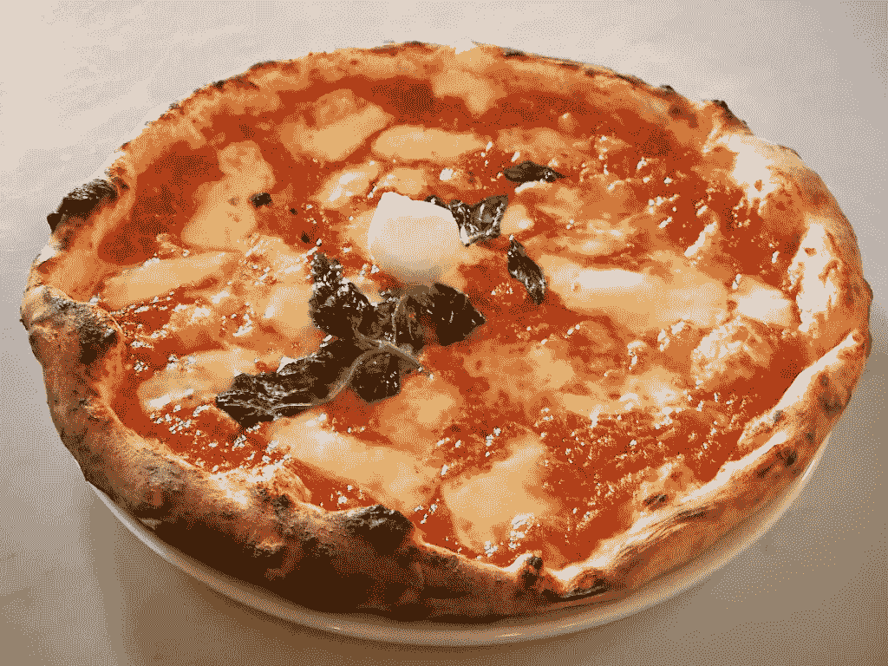

# 我是一个比萨饼

> 原文：<https://medium.datadriveninvestor.com/i-am-a-pizza-c75b97290935?source=collection_archive---------11----------------------->

Photo by Valerio Capello at English Wikipedia [CC BY-SA 3.0 ([http://creativecommons.org/licenses/by-sa/3.0/](http://creativecommons.org/licenses/by-sa/3.0/))]

周末，我的大女儿正在与 Alexa 互动，一遍又一遍地要求播放歌曲“我是披萨”。这首歌让我们有点喜欢，我们喜欢它是双语的。它有一个忧郁的结局…关于比萨饼结束了一个热混乱。

我开始习惯的是我的孩子如何成为家庭文化的来源，特别是高度传播的流行文化和迷因。更重要的是，我们接触到了我从未通过 YouTube 或 Spotify 接触过的儿童歌曲。小鲨鱼…嘀嘀嘀嘀。在那之前，手指爸爸…

 [## 人工智能与创造力:作为创意引擎的比根——数据驱动的投资者

### 的确，2018 年可以被视为人工智能创造的创造力全盛时期的开始。当然可以…

www.datadriveninvestor.com](https://www.datadriveninvestor.com/2019/02/13/ai-creativity-biggan-as-a-creative-engine/) 

然而，我担心这种文化与那些没有接触到儿童迷因的人有很大不同，我们接触到的东西甚至与我们的邻居都不一样。更具体地说，我担心我们正在从一个更明确的、分割的文化走向一个无限的文化，在这个文化中，我们最终与足够多的人分享很少的东西来关心或分享。

人们可能会担心，我们实际上正朝着相反的方向前进——走向单一文化。全世界的人们穿着越来越相似，看同样的新闻，听同样的东西。然而，我认为内容如何被消费，何时被消费，消费者的信仰，他们的社会经济构成之间存在如此大的差异，以至于我们可以在个体之间看到更多的区别而不是相似之处。

那会让我们容易被虐待吗？这是否意味着人工智能增强系统会利用我们的不安全感而不被发现？

也许为了应对这些潜在的威胁，我们将在未来十年看到真实的线下活动和俱乐部的复兴，尤其是那些建立在发展积极文化基础上的活动和俱乐部。