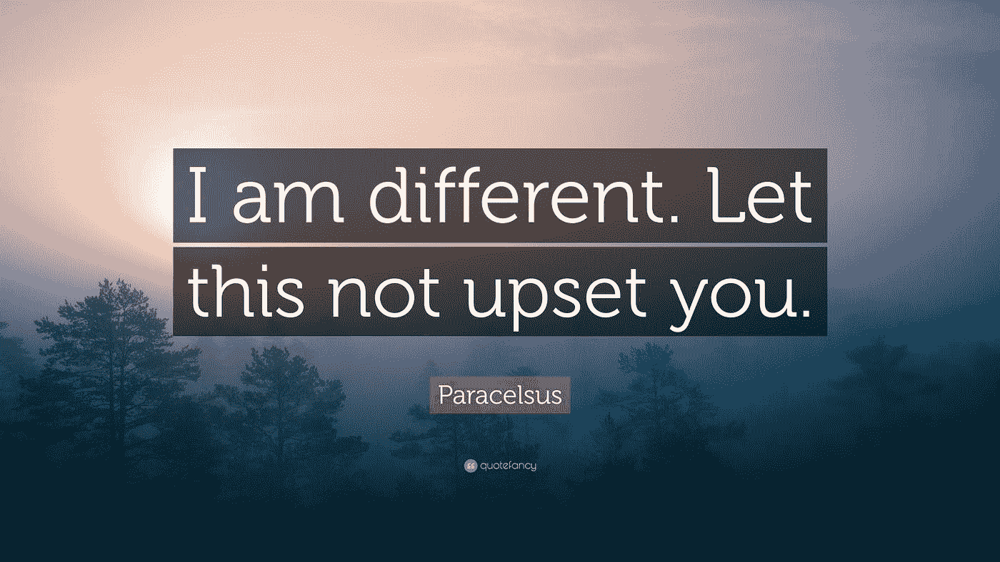

# 我是不同的。“不要为此烦恼，”

> 原文：<https://medium.datadriveninvestor.com/i-am-different-let-this-not-upset-you-a685358cb1c9?source=collection_archive---------41----------------------->

## 多元化和包容性有助于企业与社区联系

一位 [瑞士](https://en.wikipedia.org/wiki/Old_Swiss_Confederacy%22%20%5Co%20%22Old%20Swiss%20Confederacy)医师、炼金术士和[德国文艺复兴时期的占星家](https://en.wikipedia.org/wiki/German_Renaissance%22%20%5Co%20%22German%20Renaissance)、[帕拉塞尔苏斯](https://en.wikipedia.org/wiki/Paracelsus)似乎不太可能成为当今多元化运动的参照物。然而，他的话引起了共鸣:“我是不同的。请不要为此烦恼。”

帕拉塞尔苏斯不能谈论工作场所的多样性和包容性，但特雷西·韦恩和乔·格斯坦德却可以。

韦恩是 G 合伙人公司犹他州办事处的高级人力资源顾问。该公司是一家人力资源和行政外包公司，提供关于公司文化、工作场所动态和福利的专业知识和见解。

作为一名演讲者、作家和海军陆战队老兵，格斯坦德曾与财富 100 强企业、小型非营利组织以及介于两者之间的任何组织合作，以影响组织的多样性和包容性。

多样性和包容性对于企业保持与社区的联系，避免因固守陈旧过时的商业方式而导致的停滞不前至关重要。

 [## 寻求多样性是必须的，而且永无止境

### 许多员工觉得他们不属于自己的公司

medium.com](https://medium.com/datadriveninvestor/diversity-quest-is-a-must-and-never-ending-901eb9a73257) 

韦恩说:“多样性对商业发展和繁荣至关重要。”。“它推动创新，提高团队绩效。如今，公司必须拥有 D & I，才能吸引并留住顶尖人才。”

这些元素相互补充。

“人才是多样化的，”格斯坦特说。“市场是多样化的。想法来自不同的地方。正确理解的话，多样性是一个组织所做的许多事情的基础。

“商业案例很大，”他说。“不幸的是，商业案例并不能激励行为。至少在我的经历中没有。”

# 寂静之声

多元化和包容性经常用于合作伙伴关系。一家公司可能是多元化的，但如果多元化的员工没有发言权，那就毫无意义。让人们说话并倾听他们所说的话就完成了包容。

“多元化关注的是差异和拥有一个由许多不同背景的人组成的团队，”Winn 说。“包容是一种有意识的行为，旨在欢迎多元化，营造一种让员工感到受欢迎和自在的环境。”

 [## 在董事会中敞开心胸接受偏见

### 警惕餐桌上隐藏的偏执

medium.com](https://medium.com/datadriveninvestor/open-your-mind-to-bias-in-the-boardroom-9f77924bca7d) 

格斯坦特致力于解决复杂问题。

“多样性和包容性是复杂的概念，”他说。“在不同的组织中，它们可能有不同的含义。我使用它们的方式非常简单。多样性意味着不同。这是人的特点。包容是一种体验的结果——感受被包容。”

不明确的定义增加了理解的障碍。

“组织中最常见和最基本的问题是没有共同的语言，”格斯坦特说。“人们在使用多元化和包容性这两个词，但他们谈论的都是不同的东西。

“你能做的最有价值的事情之一是确保你的组织有一种共同的语言，”他说。“除非你能随机问 10 个人什么是多元化和包容性，它们为什么有价值，我们如何捕捉这种价值，并得到一致的答案，否则你就是在打一堆你不应该打的仗。”

格斯坦特解释说，由此看来，看似抵抗的东西往往缺乏明确性。

企业领导人必须接受多样性和包容性的概念，将其作为一种生活方式，而不是强制性的填方块。他们的精神[渗透到整个组织](https://www.datadriveninvestor.com/2018/10/09/changing-workforce-demands-diversity-and-flexibility/)。

“公司应该明确承诺建立一种多元化和包容性的文化，”温说。“在公司网站和其他应聘者肯定能看到的地方宣传。

“同样重要的是，要确保现在的员工也知道你的使命，”她说。

# 渐进的进展

这意味着一步一步地去理解。

“最有价值的起点是为你的组织开发清晰、简洁、通用的语言，尤其是在包容性方面，”格斯坦特说。“被收录在这里意味着什么？那是什么感觉和样子？

“一旦你定义或描述了包容性的体验结果，就很容易确定需要到位的行为、做法和政策，”他说。

 [## 你对你的员工做出公正的决定了吗？

### 雇主需要随时了解信息

medium.com](https://medium.com/datadriveninvestor/are-you-making-fair-decisions-about-your-people-4ac54f425749) 

清晰的愿景将阐明目标。

“我接到的最常见的电话是来自那些希望变得更加包容，但又不知道该怎么做的组织，”格斯坦特说。“他们很难想出该做什么，因为他们不清楚自己想要生产什么。

“如果包容性是你的产品，你应该能够说出它的特点，”他说。“它看起来像什么，听起来像什么，感觉起来像什么？我们如何知道它何时发生？大多数组织无法回答这些问题。他们在追逐一个模糊、抽象的想法。”

# 单词是什么意思

这又回到了单词和意义。对于那些没有任何清晰简洁的语言来说明被包括在内意味着什么的组织，Gerstandt 有几个想法:

*   包容意味着我可以说出真相，不管我是谁。
*   包容意味着我可以成为圈内人，但仍然是独一无二的——或与众不同的。我可以做一个正直的圈内人。我不必为了归属而截断自己的身份。

 [## “工作场所多元化”仍然是一个难以实现的梦想

### 企业面临着改变文化的挑战

medium.com](https://medium.com/datadriveninvestor/workplace-diversity-still-an-elusive-dream-858e45baec91) 

“这些都是简单、直观的想法，可以从更清晰地了解加入你的组织意味着什么开始，”格斯坦德说。“除非你能简明扼要地告诉我加入贵公司意味着什么，否则我不相信你能做到。”

公司可能认为他们可以自己实现多样性和包容性，而不需要任何外部建议或帮助。最好的结果来自于从别人的教训中学习。

“他们最大的错误是相信采取一个行动就能解决所有问题，”温说。" D&I 的努力必须是持续的和灵活的."

格斯坦德指出，没有一种多样性和包容性的共同语言是错误的。

“还不清楚包容是如何体现在行为中的，”他说。"这些是包容性领导和包容性工作场所的能力、行为和实践."

他列举了其他常见的错误:

*   公司在人力资源方面采取多元化和包容性措施。
*   高级和中级经理没有行为或结果责任。
*   企业不会主动让白人参与对话。

“我不知道应该包容多样性和包容性，”格斯坦特说。"然而，他们确实需要整个组织的指导和支持."

 [## 和每个人一起实现梦想

### 透过人的潜力来看品牌和盈利能力

medium.com](https://medium.com/datadriveninvestor/live-the-dream-with-everyone-2a379716f071) 

一些公司已经成为如何正确实现多元化和包容性的范例。

“达美航空和联邦快递都被认为是多元化的前 20 名最佳工作场所，”温说。“两家公司都投入了大量资金来培训和教育他们的领导了解 D&I 的重要性。

“达美航空称他们的项目为包容精神，”她说。"它代表了公司重视所有个人的态度."

# 非凡的胜利

格斯坦特还特别提到了公司的成功。

“Atlassian 和 Twitter 一直在内部做很酷的事情，”他说。“我非常喜欢 Atlassian 对团队平衡的关注。奥马哈的 ONEOK 和 Mutual 正在与员工资源小组一起做一些很酷的事情。

除此之外，他还补充了《福布斯》一篇文章中认可的公司，“四家正在实现多元化和包容性的公司——以及他们是如何做到的 ”

 [## 为他人敞开大门

### 包容性意味着所有参赛作品都有新鲜的欢迎垫

medium.com](https://medium.com/datadriveninvestor/throw-open-the-door-for-others-328b1eb2cbbf) 

你可以雇佣尽可能多样化的员工，但除非每个员工都知道他们如何为公司的成功做出贡献，并且他们的意见被倾听，否则这一点都没用。

“雇佣多样化的员工是不够的，”韦恩说。“还必须有包容性。如果员工没有被包括在内，没有因为他们的不同而感到受欢迎和受重视，你的多元化努力就会失败。”

# 说一件事…

多样性取决于言行一致的行动。

“如今，许多公司将日益多样化的员工带入了一种实际上并不重视多样性的文化，”格斯坦特说。“这对任何人都没有好处。

“如果你想从多样性中受益，你必须创造一个重视多样性的容器，”他说。"组织需要发展他们的文化，他们的关系技巧，他们的领导能力和他们与冲突的关系."

 [## 企业文化的未来就在现在

### 想窥探未来的工作吗？吉姆·奈特说没那么快。企业家应该认真看看哪里…

medium.com](https://medium.com/datadriveninvestor/corporate-cultures-future-is-now-2f7fd6bfcaa1) 

一个领域取得进展，另一个领域就会停滞不前。

“许多组织正在多元化方面取得进展，”格斯坦特说。“除了说些好听的话，很少有人采取任何与包容相关的实际行动。”

另一篇文章着眼于[对与众不同的恐惧是如何扼杀才华的。](https://hbr.org/2014/03/fear-of-being-different-stifles-talent)

公司可以创建日常实践来提高多样性和包容性，这也有助于更大的努力。

从员工那里了解什么实践和惯例对他们来说是重要的。让活动和事件从基层产生，而不是从上面那些没有头绪的人那里强加。

“为你的员工创造一个交流工具，”韦恩说。“然后，他们可以很容易地就公司的 D&I 计划提出建议和分享想法。一定要听听那些想法。”

行动需要公司上下的承诺。

“为管理者培养能力和行为，并让他们负起责任，”格斯坦特说。“在面试和晋升决策中引入多元化和包容性问题。使非正式网络多样化。天天讲。”

他补充了其他良好做法:

*   采取一种更有意识的方法来做决策，并很好地解决分歧。
*   [培训冲突管理经理](https://www.datadriveninvestor.com/2018/10/09/snuff-out-conflicts-before-they-explode/)。
*   奖励说真话。
*   有偏见地训练每个人。
*   蔻驰和[培训员工讲故事](https://medium.com/@JKatzaman/we-tell-our-own-best-stories-8a07ec5ab760)，并给他们讲故事的场地。
*   停止雇用不愿意或不能以包容的方式表现和领导的人。

 [## 科技攻击偏见，但不完全是

### 人类影响工作场所数据的准确性

medium.com](https://medium.com/datadriveninvestor/tech-attacks-bias-but-not-totally-6343973c6665) 

公司可以通过多种方式来衡量其多元化和包容性战略的有效性。

“数字并不能说明全部情况，”韦恩说。“公司需要检查关键决策过程是否涉及不同的员工群体。

“他们应该问问自己，公司的所有领域是否都存在多样性，尤其是在做出重大决策的高层，”她说。

让员工验证你使用的语言是他们使用的语言。

“如果你对被包括在内的含义有一个明确的定义或描述，可能你最大的衡量标准是问你的员工这种描述是否符合他们的经历，”格斯坦特说。"同样，大多数组织都没有这样做."

他补充说，企业家应该看看不同社会群体的保留率、参与率和晋升率是否具有可比性。

“最能说明问题的事情之一是你的组织如何看待冲突和分歧，”格斯坦德说。“如果你真的重视差异和多样性，你就必须有意识地、积极主动地表达不同意见。很少有公司是这样的。”

**关于作者**

吉姆·卡扎曼是拉戈金融服务公司的经理，曾在空军和联邦政府的公共事务部门工作。你可以在[推特](https://twitter.com/JKatzaman)、[脸书](https://www.facebook.com/jim.katzaman)和 [LinkedIn](https://www.linkedin.com/in/jim-katzaman-33641b21/) 上和他联系。

*原载于 2019 年 1 月 9 日*[*www.datadriveninvestor.com*](https://www.datadriveninvestor.com/2019/01/09/i-am-different-let-this-not-upset-you/)*。*